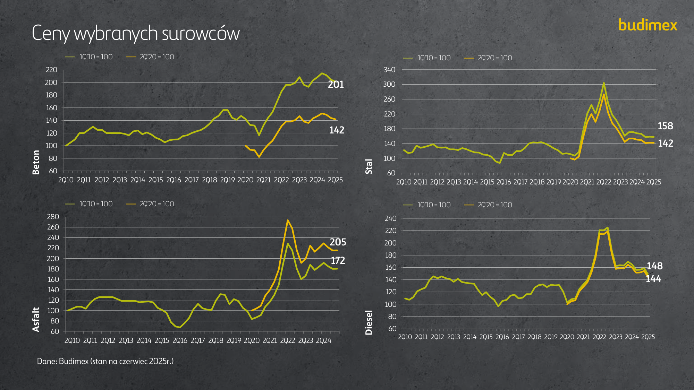
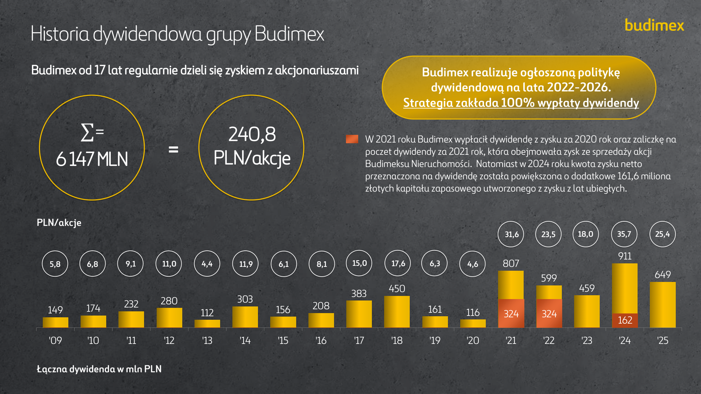
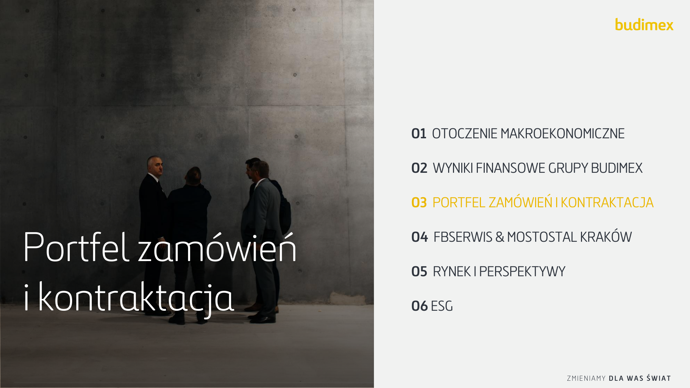
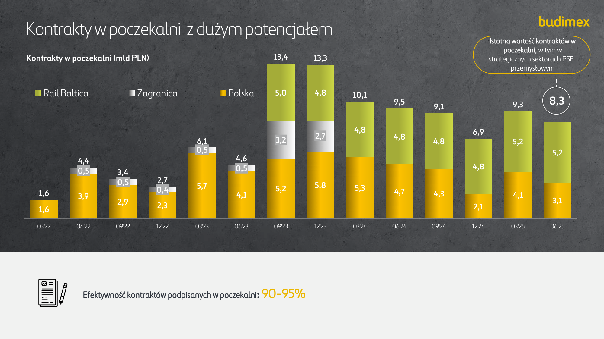
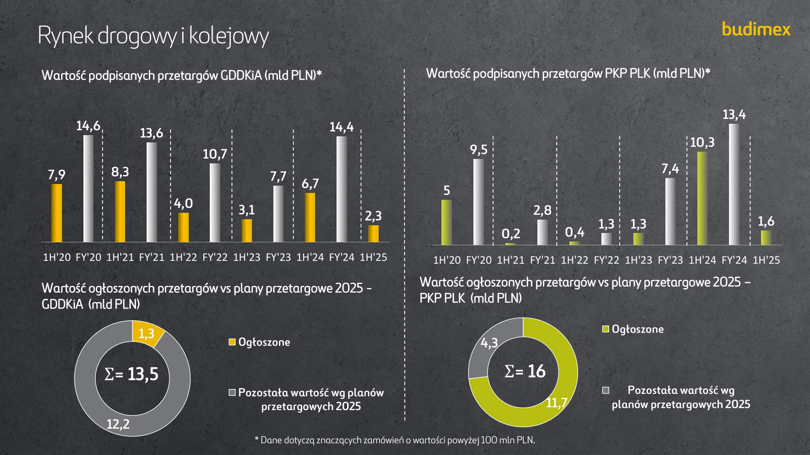
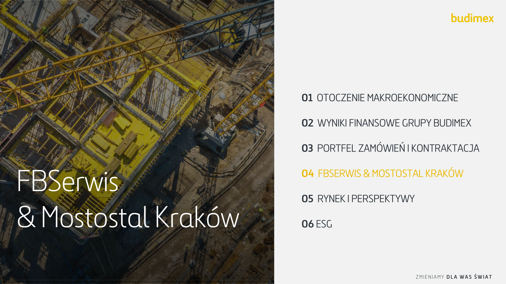
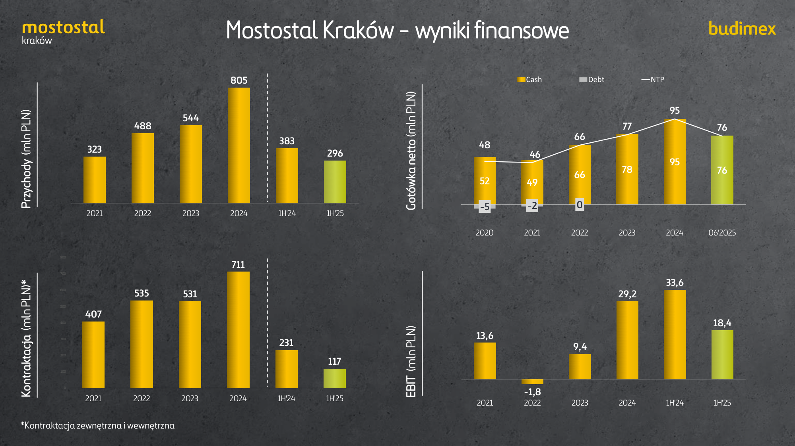
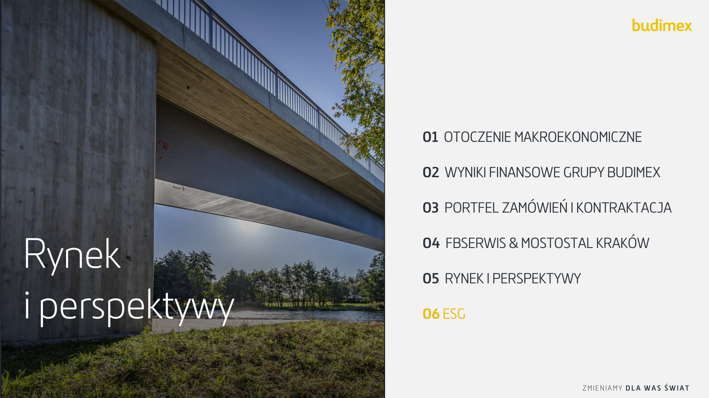
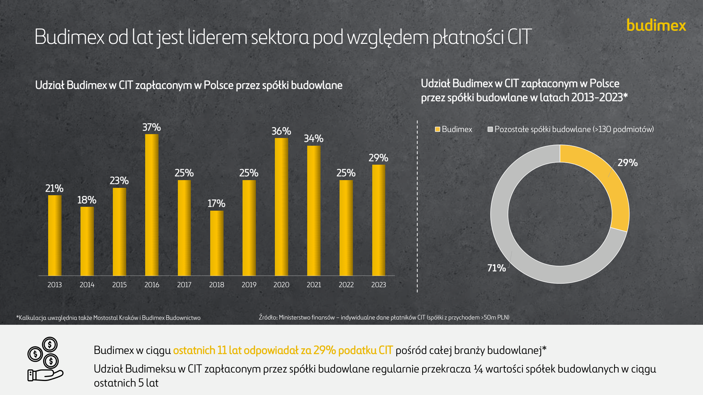

---

## Page 2

#### Prezentacja inwestorska za 1 półrocze 2025

---

## Page 3

###### Portfel zamówień i kontraktacja kluczowymi KPI

do 10,3% (+2,0 p.p. rdr)

podpisanie umowy
konsorcjum o wartości 1,4

mld PLN

do 7,6% (+0,3 p.p. rdr)

---

## Page 4

---

## Page 5

###### Otoczenie makroekonomiczne

**Inflacja (%, r/r), stopa referencyjna w Polsce (%)**

|Inflacja (%, r/r) Stopa referencyjna (%) 16,2 5,00 ,00 1,00 4,1 0,50 1,7 - 1,6 13 2014 2015 2016 2017 2018 2019 2020 2021 2022 2023 2024 2025|Col2|
|---|---|
|Inflacja (%, r/r) Stopa referencyjna (%) ,00 1,00 0,50 5,00 13 2014 2015 2016 2017 2018 2019 2020 2021 2022 2023 2024 2025 ~~1,7~~ - 1,6 16,2 4,1|Inflacja (%, r/r) Stopa referencyjna (%) ,00 1,00 0,50 5,00 13 2014 2015 2016 2017 2018 2019 2020 2021 2022 2023 2024 2025 ~~1,7~~ - 1,6 16,2 4,1|
|Inflacja (%, r/r) Stopa referencyjna (%) ,00 1,00 0,50 5,00 13 2014 2015 2016 2017 2018 2019 2020 2021 2022 2023 2024 2025 ~~1,7~~ - 1,6 16,2 4,1||

---

## Page 6

###### Otoczenie makroekonomiczne

**Wskaźnik PMI dla Polski**

**Dynamika produkcji budowlano-montażowej (%, r/r, ceny stałe)**

---

## Page 7

###### Elementy produkcji budowlano-montażowej

**Prognoza produkcji budowlano-montażowej (wartości nominalne mld PLN)***

**Drogi**

**Budowa**
**budynków**

**-0,7%**

**Dynamika produkcji budowlano-montażowej (%, r/r, ceny stałe)**

**17,9%**

**12,1%**

**6,2%**
**5,0%**

**2,8%**

**2,6%**

**3,2%**

**-2,2%**

**-7,7%**
**-8,7%**

**-14,1%**

I-XII 2015 I-XII 2016 I-XII 2017 I-XII 2018 I-XII 2019 I-XII 2020 I-XII 2021 I-XII 2022 I-XII 2023 I-XII 2024 I-VI 2024 I-VI 2025

*Dane dla przedsiębiorstw powyżej 9 pracowników

Dane: GUS, analizy Budimex

---

## Page 8

###### Marże firm budowlanych według wielkości

**Marże na rynku zostały ustabilizowane poprzez wprowadzenie mechanizmów waloryzacyjnych.**

Dane: GUS (grudzień 2024)

---

## Page 9

###### Ceny wybranych surowców

Dane: Budimex (stan na czerwiec 2025r.)

---

## Page 10

---

## Page 11

###### Wyniki finansowe za I półrocze 2025

**Przychody**

**(mlnPLN)**
**EBIT**

**Zysk netto***

- Zysk netto dla akcjonariuszy jednostki dominującej

---

## Page 12

###### Wyniki finansowe według segmentów

**Przychody (mln PLN)**

**3 885**
**3 590** **3 590**

1H'23 1H'24 1H'25

**Przychody (mln PLN)**

**463**
**440** **444**

1H'23 1H'24 1H'25

- Przychody segmentu usługowego uwzględniają również działalność spółek z obszaru OZE oraz Budimex Parking Wrocław

---

## Page 13

###### Ewolucja pozycji gotówkowej netto

---

## Page 14

###### Historia dywidendowa grupy Budimex

Budimex od 17 lat regularnie dzieli się zyskiem z akcjonariuszami

poczet dywidendy za 2021 rok, która obejmowała zysk ze sprzedaży akcji
##### **=**

przeznaczona na dywidendę została powiększona o dodatkowe 161,6 miliona
złotych kapitału zapasowego utworzonego z zysku z lat ubiegłych.

**Łączna dywidenda w mln PLN**

---

## Page 15

---

## Page 16

---

## Page 17

###### Kontrakty w poczekalni z dużym potencjałem

Istotna wartość kontraktów w

poczekalni, w tym w
strategicznych sektorach PSE i

przemysłowym

**Kontrakty w poczekalni (mld PLN)**

Rail Baltica Zagranica Polska

**6,1**

**0,5**

**13,4**
**13,3**

**5,0** **4,8**

**2,7**
**3,2**

**10,1**

**4,8**

**9,5**
**9,1**

**4,8**
**4,8**

**6,9**

**4,8**

**2,1**

**9,3**

**5,2**

**5,2**

**4,1**
**3,1**

**4,4**

**0,5**

**3,4**

**0,5**

**2,7**

**0,4**

**5,7**

**4,6**

**0,5**

**5,8**
**5,2** **5,3**
**4,7**
**4,3**
**4,1**

**1,6**

**1,6**

**3,9**
**2,9**
**2,3**

03'22 06'22 09'22 12'22 03'23 06'23 09'23 12'23 03'24 06'24 09'24 12'24 03'25 06'25

---

## Page 18

###### Portfel zamówień (mld PLN)

Około 220 czynnych kontraktów

**17,8**

4%

**13** **13,3**
**13,1**

2%

22%

2%

17%

7%

4%

2%

2%

2%

22%

26%

18%

3%

6%

3%

25%

25%

18%

9%

4%

15%

2%

18%

3%

57%

6%

57%

49%

39%

42%

12'21 12'22 12'23 12'24 06'25

---

## Page 19

###### Rynek drogowy i kolejowy

Wartość podpisanych przetargów GDDKiA (mld PLN)*

Wartość podpisanych przetargów PKP PLK (mld PLN)*

**14,6**

**13,6**

**13,4**

**14,4**

**10,3**

**10,7**

**9,5**

**7,7**
**6,7**

**7,9**

**8,3**

**5**

**7,4**

**4,0**

**3,1**

**2,3**

**2,8**

**1,6**

**0,2**

**1,3** **1,3**
**0,4**

1H'20 FY'20 1H'21 FY'21 1H'22 FY'22 1H'23 FY'23 1H'24 FY'24 1H'25

Wartość ogłoszonych przetargów vs plany przetargowe 2025 GDDKiA (mld PLN)

1H'20 FY'20 1H'21 FY'21 1H'22 FY'22 1H'23 FY'23 1H'24 FY'24 1H'25

Wartość ogłoszonych przetargów vs plany przetargowe 2025 –

**Ogłoszone**

**Pozostała wartość wg planów**

**przetargowych 2025**

**Pozostała wartość wg planów**

**przetargowych 2025**

---

## Page 20

###### Rynek drogowy

Wartość podpisanych kontraktów na krajowym rynku drogowym (mld zł)*

**18,7**

**15,9**

**14,6 13,6**

**14,4**

**10,7**

**6,7**

**7,0**
**5,1**

**4,3**

**7,7**

**2,3**

'15 '16 '17 '18 '19 '20 '21 '22 '23 '24 1H'24 1H'25

|Kontraktacja Budimex – segment drogowy (mld PLN)*|Col2|
|---|---|
|**4,6** **2,4** **2,5** **3,4** **1,2** **4,1** **2,9** **3,1** **3,2** **6,2** **1,7** **0,6** '15 '16 '17 '18 '19 '20 '21 '22 '23 '24 1H'24 1H'25 |**4,6** **2,4** **2,5** **3,4** **1,2** **4,1** **2,9** **3,1** **3,2** **6,2** **1,7** **0,6** '15 '16 '17 '18 '19 '20 '21 '22 '23 '24 1H'24 1H'25 |

Źródła: GDDKiA

- Dane dotyczą znaczących zamówień GDDKiA o wartości powyżej 100 mln PLN.

---

## Page 21

###### Rynek kolejowy

Wartość podpisanych kontraktów na krajowym rynku kolejowym (mld zł)*

**14,8**

**13,1**

**12,8**

**9,5**

**10,3**

**7,4**

**3,4**

**2,8**
**1,3**

**1,6**

**0,9**
**0,2**

'15 '16 '17 '18 '19 '20 '21 '22 '23 '24 1H'24 1H'25

|Kontraktacja Budimex – segment kolejowy (mld PLN)*|Col2|
|---|---|
|||
|**0,2** **0,1** **1,3** **0,5** **3,2** **1,8** **0,5** **0,7** **2,2** **2,8** **1,5** **0,0** '15 '16 '17 '18 '19 '20 '21 '22 '23 '24 H1'24 H1'25|**0,2** **0,1** **1,3** **0,5** **3,2** **1,8** **0,5** **0,7** **2,2** **2,8** **1,5** **0,0** '15 '16 '17 '18 '19 '20 '21 '22 '23 '24 H1'24 H1'25|

Źródła: PKP PLK

- Dane dotyczą znaczących zamówień PKP PLK o wartości powyżej 100 mln PLN.

---

## Page 22

---

## Page 23

'19 '20 '21 '22 '23 '24 HY'24 HY'25

**205**

**241**

**204**
**194**

**89**

'20 '21 '22 '23 '24 HY'25

**163**

|FBSerwis – wy 937 903 832 780 PLN) 610 498 456 435 (mln Przychody '19 '20 '21 '22 '23 '24 HY'24 HY'25|Col2|
|---|---|
|**44** **75** **83** **87** **81** **94** **42** **52** 8,9% 12,2% 10,6% 10,4% 9,0% 10,0% 9,2% 11,8% '19 '20 '21 '22 '23 '24 HY'24 HY'25 % EBIT EBIT(mln PLN) **Gotówka netto od czasu konsolidacji 100% akcji FBSerwis Pozycja gotówkowa(mln PLN)||

---

## Page 24

Podpisane umowy na odbiór i zagospodarowanie odpadów komunalnych od
mieszkańców:

- Gmina Środa Śląska: 12,7 mln zł netto

- Gmina Stronie Śląskie: 9,6 mln zł netto

Podpisane umowy na odbiór, transport i zagospodarowanie odpadów z
Zakładu Utylizacji Odpadów w Siedlcach o wartości 10,6 mln zł netto.

Podpisano umowy na wsparcie operacyjne i utrzymanie techniczne systemów i
instalacji w Kompleksie Urbanistycznym Wymiaru Sprawiedliwości o wartości
11,7 mln zł netto.

Oferta wybrana jako najkorzystniejsza dla dwóch zadań w przetargu
Generalnej Dyrekcji Dróg Krajowych i Autostrad na całoroczne utrzymanie dróg
w województwie pomorskim w latach 2024-2028 o łącznej wartości 287,8 mln
zł netto:

- Zadanie 1: 208,5 mln zł netto (Gdańsk)

- Zadanie 2: 79,3 mln zł netto (Człuchów)

---

## Page 25

###### Mostostal Kraków - wyniki finansowe

**805**

**488**

**544**

**323**

**383**

**296**

2021 2022 2023 2024 1H'24 1H'25

*Kontraktacja zewnętrzna i wewnętrzna

---

## Page 26

###### Portfel zamówień

Nowe Kontrakty
Podpisane kontrakty o łącznej wartości 107 mln PLN, min.:

Dostawa i montaż konstrukcji stalowej :

  - myjni tramwajowej w Warszawie

Zakończone Inwestycje
Zakończenie budowy malarni WKS1
Zakończenie inwestycji wartej ? mln PLN. Inwestycja obejmowała modernizację i budowę
powierzchnia użytkowa hali malarni, powierzchnia części biurowo – socjalnej oraz dwóch
nowoczesnych komór śrutowniczych.

Fotowoltaika
Zakończono rozbudowę instalacji na WKS1 oraz WKS2 – pracująca łączna moc instalacji
1,500 kWp. W Konstalex trwa rozbudowa instalacji 2x100 kWp, której docelowa moc osiągnie
300 kWp.

Atom
Zakończenie Fazy 1 polegającej na wdrożenia normy jądrowej NQA-1. Obejmuje on
przygotowanie **Księgi Jakości (Quality Manual)** oraz zestawu procedur i instrukcji opisujących
cały proces – od przyjęcia zamówienia, przez produkcję, aż po wysyłkę elementów.
Przygotowania do fazy 2 –przygotowania projektu warsztatowego próbki typu mock-up o masie
26,5 tony, opracowanie i zatwierdzenie technologii wykonania, przeszkolenie zespołu
produkcyjnego.

---

## Page 27

---

## Page 28

---

## Page 29

###### Finansowanie z UE na rekordowym poziomie (mld EUR)

Dane: Komisja Europejska, Ministerstwo Finansów (stan na grudzień 2024).

---

## Page 30

---

## Page 31

###### Realizacja celów ESG z obszaru E

    - Dążenie do: 100% energii pozyskanej z rynku pochodzi z OZE → Na

1H2025 zostało zakupione 15 000 MWh GP z OZE

    - Odzysk i recykling odpadów gleby i ziemi przetworzonych przez Budimex

zrealizowano na poziomie 76% a odpadów innych niż niebezpieczne na
poziomie 32%

    - 93% floty, której właścicielem jest Budimex (ciężkiego sprzętu,

maszynowego) spełnia najwyższe normy emisyjności

    - Akcja sadzenia 6000 drzew w Nadleśnictwie Celestynów – 40 osób

    - Kampania Energia pod Kontrolą – przeszkolono 142 osób

    - Uzyskanie pozytywnej rekomendacji podtrzymującej na kolejny rok

certyfikację Systemów ISO

    - Opracowanie i wdrażanie narzędzia ESRS do agregacji danych

ilościowych do sprawozdawczości zrównoważonego rozwoju

    - Wydano 3 Newslettery ESG

    - Opublikowanie Sprawozdawczości Zrównoważonego Rozwoju za rok 2024

---

## Page 32

###### Realizacja celów ESG z obszaru S

SZKOLENIA, ROZWÓJ I RÓŻNORODNOŚĆ

   - Wspieranie różnorodności

     - Tydzień Kobiet i Mężczyzn w Budownictwie – łącznie około 15 aktywności –
ok. 4 397 osób

     - Miesiąc Różnorodności – łącznie zorganizowano 37 aktywności
(video, 2 webinary, 15 artykułów, 17 mailingów, quiz oraz konkurs)

   - Program stypendialny i staży letnich dla studentów z Ukrainy - 27 studentów

   - Łącznie w 1H2025 przeprowadzono 80 wydarzeń dla około 2 200 studentów

i uczniów techników

   - Realizacja programów rozwojowych:

    - Akademia Przywództwa: 150 osób

    - Akademia Kierownika Kontraktu: 54 osoby

    - Akademia Brygadzisty: 35 osób

     - Akademia Inżyniera (część teoretyczna i praktyczna): 255 osób

    - Ekonomiczna strona produkcji – poziom podstawowy 56 osób, poziom
zaawansowany 25 osób

---

## Page 33

###### Realizacja celów ESG z obszaru S

BHP i WELLBEING

    - Tydzień Bezpieczeństwa

     - 635 aktywności na 283 kontraktach dla 13 307 osób w tym

4573 pracowników podwykonawców

    - 153 wizyty bezpieczeństwa na kontraktach

    - Szkolenie z pie rwszej pomocy     - 637 osób

    - Szkolenie przeciwpożarowe     - 174 osób

    - 6 Kampanii Bezpieczeństwa

    - Strefa Rodzica w Bratysławie     - planowe oddanie do użytku w Q3.25

    - Hello ICE – działania edukacyjne w 7 lokalizacjach (m.in. W Warszawie,

Otwocku i Zabrzu)

    - Kampanie informacyjne dla interesariuszy wewnętrznych –

w 5 lokalizacjach

    - W ramach Fundamentów Zdrowia – Dni Doceniania

---

## Page 34

###### Realizacja celów z obszaru G

    - Szkolenia Compliance

     - dla nowozatrudnionych pracowników „Witaj w Grupie”

     - dla Akademii Kierownika Kontraktu – 52 uczestników

    - dla Zarządu i członków Komitetu Wykonawczego

    - Powołano Komitet Zgodności

    - Podręcznik Kierownika Kontraktu     - zaktualizowanie informacji

dotyczących Compliance

    - Publikacja procedur Compliance w języku czeskim i słowackim

    - Udział Compliance w konferencji Compliance & Integrity Days

20-21.05. 2025

    - Realizowanie Rocznego Planu Audytu:

     - Zintegrowany System Zarządzania: 9

     - Zakładowa Kontrola Produkcji: 5

     - System Oceny Budów: 30

    - Audyt Korporacyjny: zakończenie 1 z 6 zadań, drugie zadanie na

poziomie 95%

---

## Page 35

###### Wartość podatku CIT zapłaconego w Polsce za lata 2012-2023 przez wybrane spółki budowlane (dane w m PLN)*

---

## Page 36

###### Budimex od lat jest liderem sektora pod względem płatności CIT

Udział Budimex w CIT zapłaconym w Polsce przez spółki budowlane

Udział Budimex w CIT zapłaconym w Polsce

|Col1|przez spółki budowlane w latach 2013-2023* Budimex Pozostałe spółki budowlane (>130 podmiotów) 29% 71%|Col3|
|---|---|---|
|21% 18% 23% 37% 25% 17% 25% 36% 34% 25% 29% 2013 2014 2015 2016 2017 2018 2019 2020 2021 2022 2023|21% 18% 23% 37% 25% 17% 25% 36% 34% 25% 29% 2013 2014 2015 2016 2017 2018 2019 2020 2021 2022 2023|21% 18% 23% 37% 25% 17% 25% 36% 34% 25% 29% 2013 2014 2015 2016 2017 2018 2019 2020 2021 2022 2023|
||||

*Kalkulacja uwzględnia także Mostostal Kraków i Budimex Budownictwo Źródło: Ministerstwo finansów – indywidualne dane płatników CIT (spółki z przychodem >50m PLN)

---

## Page 37

###### Wzrost z korzyścią dla kraju -Budimex wspiera rozwój Polski i inwestuje w kapitał ludzki

Inwestycje w gospodarkę

Część inwestycyjna od 2021 roku w krajową

infrastrukturę i zieloną energię – 0,5 mld PLN

Wydatki na tabor kolejowy polskich producentów

Budowa krytycznej infrastruktury narodowej

(zmobilizowany i certyfikowany wykonawca).

Inwestycje w kapitał ludzki

- Zatrudniamy 7836 osoby z czego 7588 to Polacy

- Inwestujemy w rozwój i szkolenia ludzi 10 mln rocznie

- Współpracujemy z ponad 50 uczelniami wyższymi i technikami.

- Co roku zatrudniamy ponad 300 studentów i uczniów techników

na płatne praktyki

- W ciągu dekady otworzyliśmy ponad 40 stref dla rodziców i dzieci

w placówkach medycznych

- Rocznie przekazujemy ponad 3 mln PLN na cele dobroczynne

---

## Page 39
