---

## Page 2

---

## Page 3

---

## Page 4

---

## Page 5

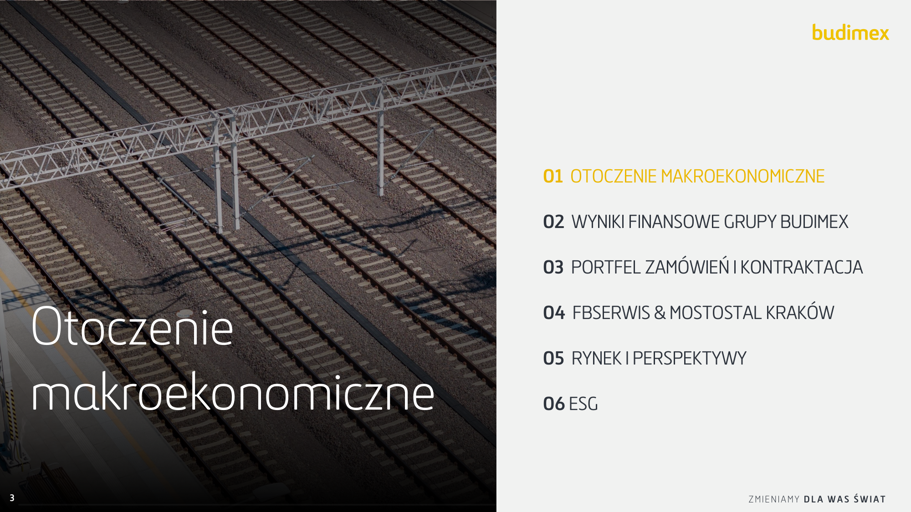

###### Portfel zamówień i kontraktacja kluczowymi KPI

budowlanej (605 m PLN
odprowadzonego podatku
Grupy w ciągu ostatnich 3 lat)

(+2 mld kw/kw), w tym
2,5 mld PLN w kolei

do 8,1% (+0,5 p.p. rdr)

---

## Page 6

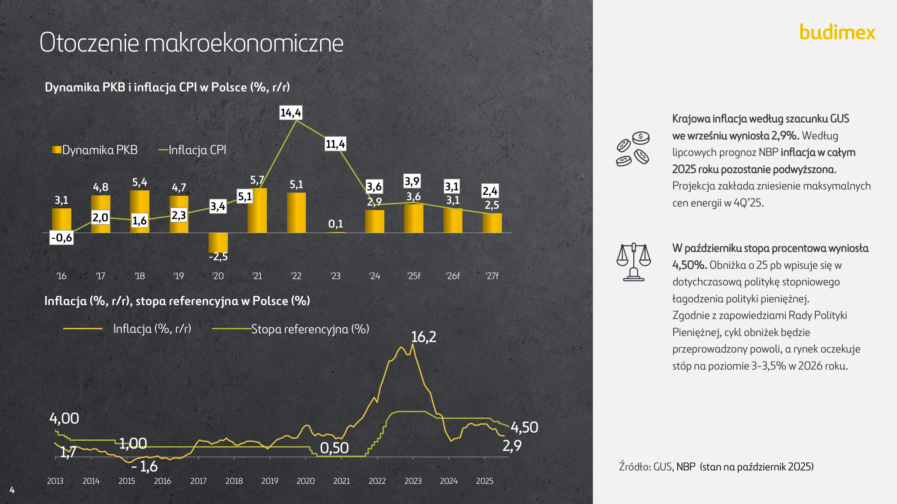

---

## Page 7

###### Otoczenie makroekonomiczne

**Inflacja (%, r/r), stopa referencyjna w Polsce (%)**

|Col1|Inflacja (%, r/r) Stopa referencyjna (%) 16,2 4,00 4,50 1,00 2,9 0,50 1,7 - 1,6 013 2014 2015 2016 2017 2018 2019 2020 2021 2022 2023 2024 2025|Col3|
|---|---|---|
|4,00 1,00 0,50 4,50 2013 2014 2015 2016 2017 2018 2019 2020 2021 2022 2023 2024 2025 1,7 - 1,6 16,2 2,9 Inflacja (%, r/r) ~~S~~topa referencyjna (%) **4**|4,00 1,00 0,50 4,50 13 2014 2015 2016 2017 2018 2019 2020 2021 2022 2023 2024 2025 1,7 - 1,6 16,2 2,9 Inflacja (%, r/r) ~~S~~topa referencyjna (%)|4,00 1,00 0,50 4,50 13 2014 2015 2016 2017 2018 2019 2020 2021 2022 2023 2024 2025 1,7 - 1,6 16,2 2,9 Inflacja (%, r/r) ~~S~~topa referencyjna (%)|
|4,00 1,00 0,50 4,50 2013 2014 2015 2016 2017 2018 2019 2020 2021 2022 2023 2024 2025 1,7 - 1,6 16,2 2,9 Inflacja (%, r/r) ~~S~~topa referencyjna (%) **4**|4,00 1,00 0,50 4,50 13 2014 2015 2016 2017 2018 2019 2020 2021 2022 2023 2024 2025 1,7 - 1,6 16,2 2,9 Inflacja (%, r/r) ~~S~~topa referencyjna (%)||

---

## Page 8

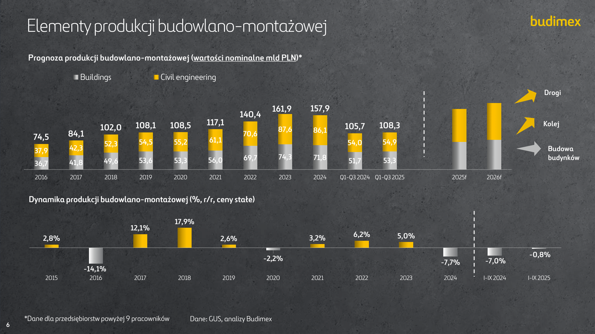

###### Otoczenie makroekonomiczne

**Dynamika produkcji budowlano-montażowej (%, r/r, ceny stałe)**

**5**

---

## Page 9

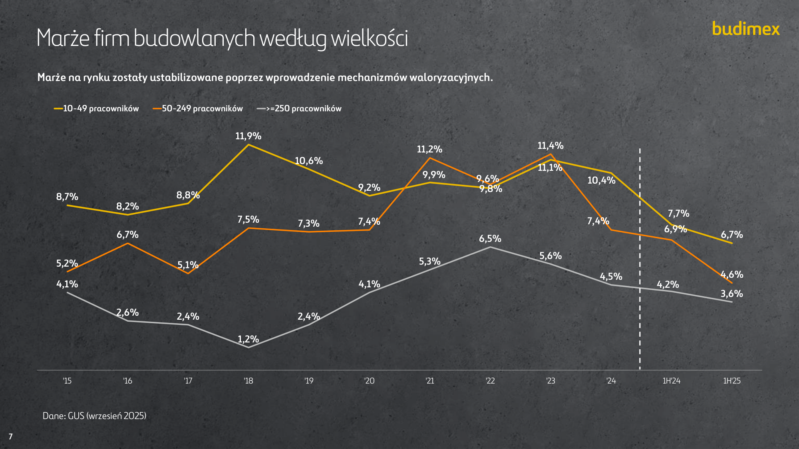

###### Elementy produkcji budowlano-montażowej

**Prognoza produkcji budowlano-montażowej (wartości nominalne mld PLN)***

Buildings Civil engineering

**161,9** **157,9**
**140,4**

**117,1**
**108,1** **108,5** **105,7** **108,3**
**102,0**

**87,6**
**86,1**

**84,1** **70,6**
**74,5**

**61,1**
**54,5** **55,2** **54,0** **54,9**
**52,3**

**87,6**
**86,1**
**70,6**

**105,7** **108,3**

**61,1**
**54,5** **55,2** **54,0** **54,9**
**52,3**
**42,3**
**37,9**
**69,7** **74,3** **71,8**
**49,6** **53,6** **53,3** **56,0** **51,7** **53,3**
**36,7** **41,8**

2016 2017 2018 2019 2020 2021 2022 2023 2024 Q1-Q3 2024 Q1-Q3 2025 2025f 2026f

**Dynamika produkcji budowlano-montażowej (%, r/r, ceny stałe)**

**Drogi**

**Kolej**

**Budowa**
**budynków**

|Col1|Col2|
|---|---|
|**2,8%** **-14,1%** **12,1%** **17,9%** **2,6%** **-2,2%** **3,2%** **6,2%** **5,0%** **-7,7%** **-7,0%** **-0,8%** 2015 2016 2017 2018 2019 2020 2021 2022 2023 2024 I-IX 2024 I-IX 2025|**2,8%** **-14,1%** **12,1%** **17,9%** **2,6%** **-2,2%** **3,2%** **6,2%** **5,0%** **-7,7%** **-7,0%** **-0,8%** 2015 2016 2017 2018 2019 2020 2021 2022 2023 2024 I-IX 2024 I-IX 2025|

Dane: GUS, analizy Budimex

**6**

*Dane dla przedsiębiorstw powyżej 9 pracowników

---

## Page 10

###### Marże firm budowlanych według wielkości

**Marże na rynku zostały ustabilizowane poprzez wprowadzenie mechanizmów waloryzacyjnych.**

Dane: GUS (wrzesień 2025)

**7**

---

## Page 11

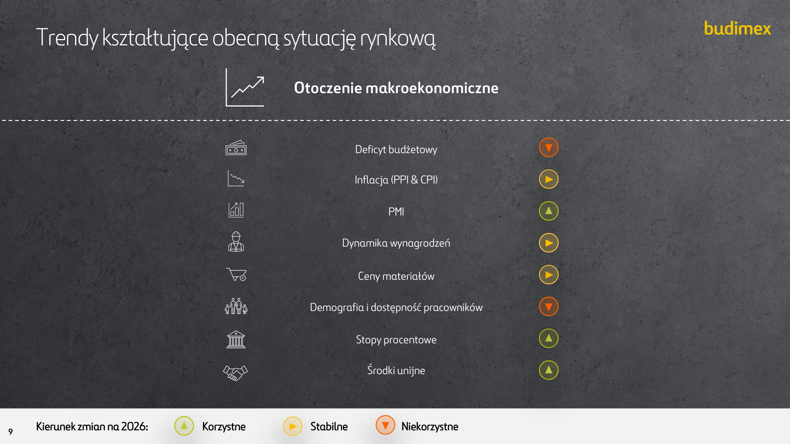

###### Ceny wybranych surowców

1Q’10= 100 2Q’20= 100

Dane: Budimex (stan na październik 2025r.), LOTOS

---

## Page 12

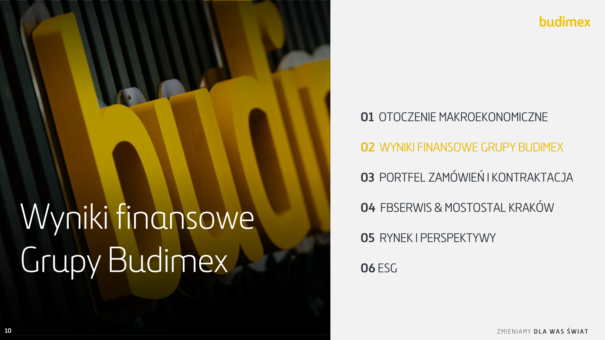

###### Trendy kształtujące obecną sytuację rynkową

**Otoczenie makroekonomiczne**

Deficyt budżetowy

Inflacja (PPI & CPI)

PMI

Dynamika wynagrodzeń

Ceny materiałów

Demografia i dostępność pracowników

Stopy procentowe

Środki unijne

---

## Page 13

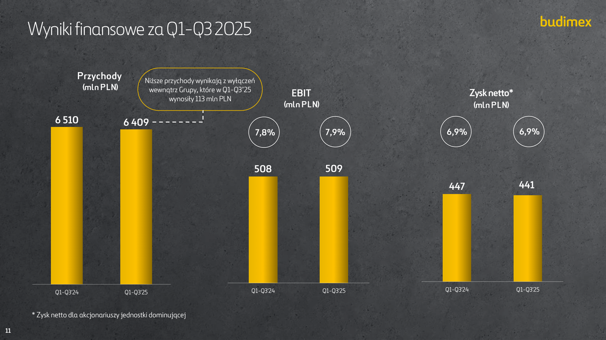

---

## Page 14

###### Wyniki finansowe za Q1-Q3 2025

**Przychody**

Niższe przychody wynikają z wyłączeń

**(mlnPLN)**

wewnątrz Grupy, które w Q1-Q3’25

**EBIT**

wynosiły 113 mln PLN

**(mln PLN)**

**Zysk netto***

**(mlnPLN)**

wewnątrz Grupy, które w Q1-Q3’25

wynosiły 113 mln PLN

|6 510 6 409 Q1-Q3'24 Q1-Q3'25|Col2|Col3|
|---|---|---|
|**6 510** **6 409** Q1-Q3'24 Q1-Q3'25|||

- Zysk netto dla akcjonariuszy jednostki dominującej

**11**

---

## Page 15

###### Wyniki finansowe według segmentów

**Przychody (mln PLN)**

**6 346**
**5 875** **5 852**

Q1-Q3'23 Q1-Q3'24 Q1-Q3'25

**Przychody (mln PLN)**

**686**
**670** **670**

Q1-Q3'23 Q1-Q3'24 Q1-Q3'25

**12**

- Przychody segmentu usługowego uwzględniają również działalność spółek z obszaru OZE oraz Budimex Parking Wrocław

---

## Page 16

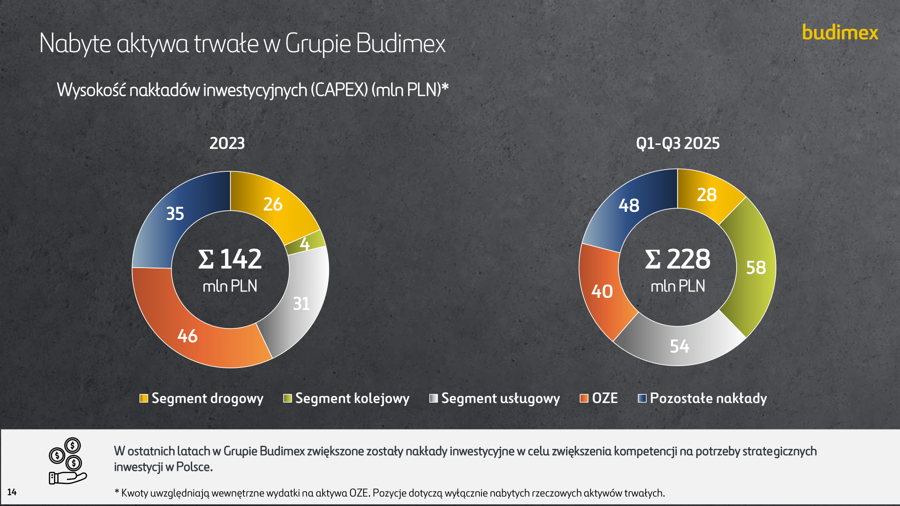

###### Ewolucja pozycji gotówkowej netto

Pozycja gotówkowa netto w grupie Budimex (mld PLN)

**2,3**

**2,1**

**3,8** **[3,9]**

**3,1**

**3,1** **[3,3]**

**2,7** **[2,9]**

**2,6**

**2,8** **[2,8]**
**2,7**

**3,0**

**2,4**

**2,8**

**2,0**

**2,2**

**1,8** **[1,9]**

**2,0**

**1,7**

**1,9**

**1,8**

**1,5**

**1,7**

**1,4**

**1,61,6**

**1,41,4**

**1,1** **[1,2]**

**1,2**

**1,0**

**1,2**

**0,50,5**

**0,5**

**0,4**

**0,1**

**09'15** **09'16** **09'17** **09'18** **09'19** **09'20** **09'21** **09'22** **09'23** **09'24** **09'25**

---

## Page 17

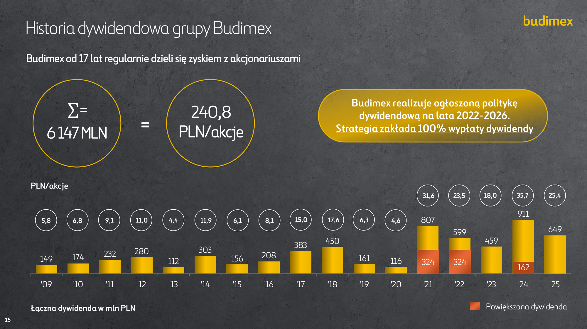

###### Nabyte aktywa trwałe w Grupie Budimex

Wysokość nakładów inwestycyjnych (CAPEX) (mln PLN)*

2025

|2023 26 35 4 Σ 142 mln PLN 31 46|Col2|
|---|---|
|**26** **4** **31** **46** **35** **2023** **Σ 142** mln PLN|**26** **4** **31** **46** **35** **2023** **Σ 142** mln PLN|
|||

---

## Page 18

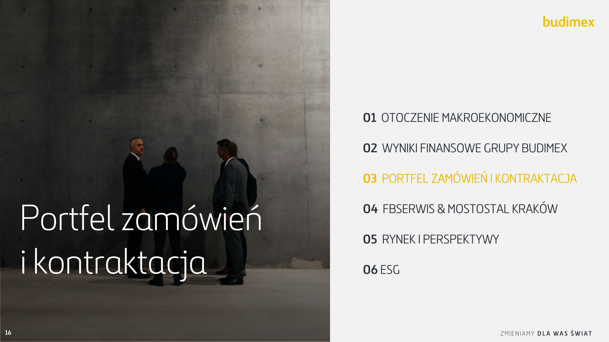

###### Historia dywidendowa grupy Budimex

Budimex od 17 lat regularnie dzieli się zyskiem z akcjonariuszami

##### **=**

**Łączna dywidenda w mln PLN**

Powiększona dywidenda

**15**

---

## Page 19

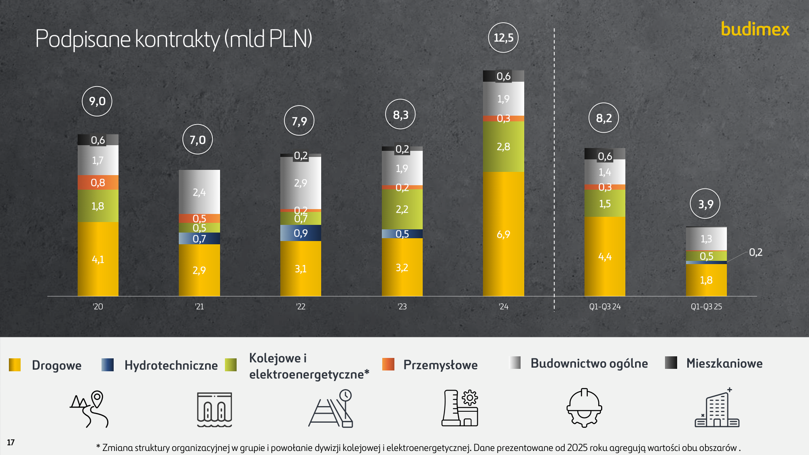

---

## Page 20

---

## Page 21

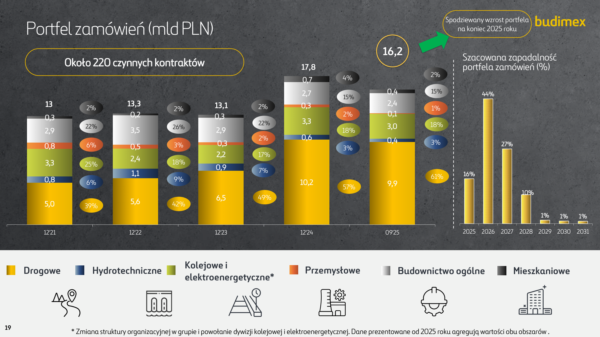

###### Kontrakty w poczekalni z dużym potencjałem

**Kontrakty w poczekalni (mld PLN)**

Istotna wartość kontraktów w

poczekalni

**4,1**

**4,1**

**5,8**

**5,2**

**5,3**

**2,1**

**2,1**

**4,7**

**4,3**

**5,8**
**5,3**
**5,2**
**4,7**
**4,3**

**3,1**

**3,1**

**2,9**

**2,3**

**2,9**
**2,3**

**5,7**

**5,7**

**4,1**

**4,1**

**5,1**

09'22 12'22 03'23 06'23 09'23 12'23 03'24 06'24 09'24 12'24 03'25 06'25 09'25

---

## Page 22

---

## Page 23

###### Rynek drogowy

Wartość podpisanych kontraktów na krajowym rynku drogowym (mld zł)*

**18,7**

**15,9**

**14,6 13,6**

**14,4**

**10,7**

**11,5**

**7,0**
**5,1**

**4,3**

**7,7**

**4,2**

'15 '16 '17 '18 '19 '20 '21 '22 '23 '24 1-3Q'24 1-3Q'25

|Kontraktacja Budimex – segment drogowy (mld PLN)*|Col2|
|---|---|
|**4,6** **2,4** **2,5** **3,4** **1,2** **4,1** **2,9** **3,1** **3,2** **6,9** **4,4** **1,7** '15 '16 '17 '18 '19 '20 '21 '22 '23 '24 1-3Q'24 1-3Q'25 |**4,6** **2,4** **2,5** **3,4** **1,2** **4,1** **2,9** **3,1** **3,2** **6,9** **4,4** **1,7** '15 '16 '17 '18 '19 '20 '21 '22 '23 '24 1-3Q'24 1-3Q'25 |

Źródło: GDDKiA

- Dane dotyczą znaczących zamówień GDDKiA o wartości powyżej 100 mln PLN.

**20**

---

## Page 24

###### Rynek kolejowy

Wartość podpisanych kontraktów na krajowym rynku kolejowym (mld zł)*

**14,8**

**13,1**

**12,8**
**11,6**

**9,5**

**7,4**

**3,4**

**2,8**
**1,3**

**4,4**

**0,9**
**0,2**

'15 '16 '17 '18 '19 '20 '21 '22 '23 '24 1-3Q'24 1-3Q'25

|Kontraktacja Budimex – segment kolejowy (mld PLN)*|Col2|
|---|---|
|||
|**0,2** **0,1** **1,3** **0,5** **3,2** **1,8** **0,5** **0,7** **2,2** **2,8** **1,5** **0,2** '15 '16 '17 '18 '19 '20 '21 '22 '23 '24 1-3Q'24 1-3Q'25|**0,2** **0,1** **1,3** **0,5** **3,2** **1,8** **0,5** **0,7** **2,2** **2,8** **1,5** **0,2** '15 '16 '17 '18 '19 '20 '21 '22 '23 '24 1-3Q'24 1-3Q'25|

Źródło: PKP PLK

- Dane dotyczą znaczących zamówień PKP PLK o wartości powyżej 100 mln PLN.

**21**

---

## Page 25

###### Budownictwo ogólne (mld PLN)*

Produkcja

Kontraktacja

**2,4**
**2,2**

**2,3**
**2,1**

**2,0**

**1,7**

**1,7**
**1,6**

**1,3**

2018 2019 2020 2021 2022 2023 2024 Q1-Q3'24 Q1-Q3'25

Portfel

**3,6**

**2,9** **2,9**

**3,3**

**3,1**

**2,4**

**2,3**
**2,0**

**2,7**

2018 2019 2020 2021 2022 2023 2024 Q1-Q3'24 Q1-Q3'25

*Dane uwzględniają wyłącznie dywizję budownictwa ogólnego, w tym zamówienia wewnętrzne (bez Mostostal Kraków)

**22**

---

## Page 26

###### Rynek sieci elektroenergetycznych

**Wartość ogłoszonych oraz planowanych kontraktów PSE (mln zł)***

**1 225**

**1 755**

**855**

**892**

**936**

**600**

**348**

**150**
**134**

**0**

**0**

**23**

Q1'24 Q2'24 Q3'24 Q4'24 Q1'25 Q2'25 Q3'25 Q4'25p Q1'26p Q2'26p Q3'26p

Źródło: PSE

*przetargi o wartości powyżej 50 mln PLN

---

## Page 27

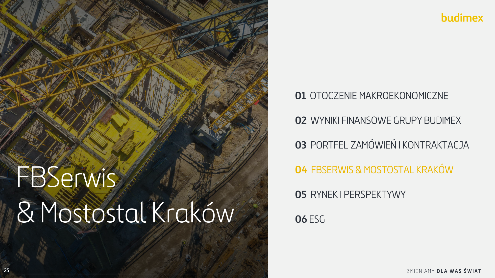

###### Budownictwo przemysłowe

---

## Page 28

---

## Page 29

'19 '20 '21 '22 '23 '24 09'24 09'25

**241**

**173**

**204**
**194**

**163**

**89**

**104**

'20 '21 '22 '23 '24 09'24 09'25

**26**

|FBSerwis – wyn 937 903 832 780 675 655 610 PLN) 498 (M Przychody '19 '20 '21 '22 '23 '24 09'24 09'25|Col2|
|---|---|
|**44** **75** **83** **87** **81** **94** **70** **70** 8,9% 12,2% 10,6% 10,4% 9,0% 10,0% 10,3% 10,7% '19 '20 '21 '22 '23 '24 09'24 09'25 Gotówka(M PLN) EBIT(M PLN) * *Gotówka netto od momentu konsolidacji 100% akcji FBSerwis % EBIT||

---

## Page 30

###### Portfel zamówień

Podpisano umowę z Generalną Dyrekcją Dróg Krajowych i Autostrad na
całoroczne utrzymanie dróg obejmujące dwa zadania w regionie pomorskim w
latach 2024-2028, o łącznej wartości netto 205,6 mln zł (287,8 mln zł z
zakresem opcjonalnym):

      - Zadanie 1: 149,0 mln zł netto (Gdańsk)

      - Zadanie 2: 56,6 mln PLN netto (Człuchów)

Oferta wybrana jako najkorzystniejsza w trzech przetargach Generalnej
Dyrekcji Dróg Krajowych i Autostrad na całoroczne utrzymanie dróg w regionie
łódzkim, o łącznej wartości netto 136,3 mln zł (218,1 mln zł z zakresem
opcjonalnym):

      - Autostrada A1 (powiat łowicki): 54,9 mln PLN netto (2026–2029)

      - Droga ekspresowa S8 (powiat wieluński): 49,4 mln PLN netto (2026–2030)

      - Drogi krajowe (powiat wieluński): 32,0 mln PLN netto (2026–2029)

Podpisano umowę z MPO Łódź na zbiórkę, transport i zagospodarowanie
odpadów o wartości netto 9,8 mln zł.

Podpisano umowy na wsparcie operacyjne i konserwację techniczną systemów i
instalacji w obiektach Oddziału Regionalnego TVP w Krakowie o wartości netto
3,6 mln zł.

Zakończenie budowy nowej oczyszczalni ścieków w Tarnowie o wartości 25 mln zł. Nowa
instalacja działa z większą wydajnością i spełnia normy BAT.
**27**

---

## Page 31

###### Otwarcie nowej instalacji biologicznego przetwarzania odpadów w Tarnowie

- Wartość inwestycji to około 25 mln PLN.

- Hermetyczny proces - najważniejsza zmiana to likwidacja
dwuetapowego procesu stabilizacji odpadów. Cały proces
biologicznego przetwarzania odpadów jest prowadzony
jednoetapowo w hermetycznej instalacji.

- Minimalizacja ilości ścieków - wprowadzono system
recyrkulacji całości ścieków technologicznych, który
umożliwia ich ponowne wykorzystywanie w procesie.

- Poprawa standardów PPOŻ - rozbudowa dróg pożarowych
oraz zwiększenie ilości wody przeznaczonej do celów
przeciwpożarowych.

---

## Page 32

###### Mostostal Kraków - wyniki finansowe

**805**

**610**

**488**

**544**

**463**

**323**

2021 2022 2023 2024 Q1-Q3'24 Q1-Q3'25

**29**

*Kontraktacja zewnętrzna i wewnętrzna

---

## Page 33

###### Ekspansja zagraniczna i rozwój

3 kwartał 2025

Rozwój kompetencji na rynkach zagranicznych

Mostostal Kraków, zgodnie z przyjętym planem strategicznym, intensyfikuje działania na rynkach
zagranicznych . Skupiamy się na rynku niemieckim, gdzie rozwijamy kompetencje operacyjne spółki zależnej
oraz oddziału w Kolonii, wzmacniając tym samym pozycję zintegrowanego wykonawcy przemysłowego.

Mostostal Kraków z powodzeniem realizuje dostawy i montaż konstrukcji stalowych na rynkach bałtyckim i
skandynawskim. W ostatnich miesiącach spółka podpisała umowę na dostawę i montaż konstrukcji stalowej
obiektu mostowego na Litwie – zrealizujemy kładkę w Kownie nad rzeką Wilia. To już kolejna realizacja na
tym rynku oraz kolejna z tym samym Zamawiającym – wiodącą litewską firmą budowlaną.

Z sukcesem zakończyliśmy pierwszą fazę adaptacji do wymagań standardu
NQA-1 dla branży jądrowej

Mostostal Kraków konsekwentnie realizuje zadania postawione firmom uczestniczącym w projekcie
budowy pierwszej w Polsce elektrowni jądrowej. Uzyskanie amerykańskiego certyfikatu NQA-1 wymagało
opracowania procedur w kluczowych obszarach: jakości, kontroli urządzeń, projektowania i dokumentacji
technicznej. Kolejny krok dla firmy to przygotowanie technologii wykonania konstrukcji próbnego modułu
strukturalnego (mock-up).

Długoterminowa perspektywa

- Uczestnictwo w strategicznych inwestycjach w Polsce (Atom)

- Wykorzystanie kompetencji i synergii Grupy na rynkach zagranicznych

- Inwestycje w modernizacje i zwiększenie mocy produkcyjnych

- Odpowiedzialna polityka zabezpieczeń surowców oraz walut

---

## Page 34

---

## Page 35

**32**

---

## Page 36

---

## Page 37

###### Finansowanie z UE na rekordowym poziomie (mld EUR)

**Fundusze Europejskie na Infrastrukturę,**
**Klimat, Środowisko (FENiKS)**

**Krajowy Plan Odbudowy (KPO)**

**Fundusze Europejskie na Infrastrukturę,** **Krajowy Plan Odbudowy (KPO)**

**Instrument Łącząc Europę (CEF) – środki**
**dla wszystkich krajów (mld EUR)**

28,8

'14-'20 '21-'27

**Infrastruktura + Kolej** **Inne**

**Środki są przyznawane na pojedyncze projekty, w**

**Polsce głównie kolejowe (historycznie ok. 10%**

**kwoty dla Polski)**

26,2
24,2

'14-'20 '21-'27

**Pozytywna perspektywa na lata 28-33**

środki wydatkowane w formule n+3

**Pożyczki -**

|Col1|Col2|Col3|P B do 25,3 Σ 60 34,5|
|---|---|---|---|
|||||
|**ruktura**|**ruktura**||**Zielona** **Green, s** **REPow** **Transfo** **Odporn** **i konkur** **Jakość** 25,3 15,4 6,5 4,4 4,43,9 **Σ 60**|

**7 mld eur przeniesiona na cele militarne**

Dane: Komisja Europejska, Ministerstwo Finansów (stan na grudzień 2024)

**34**

---

## Page 38

---

## Page 39

###### Realizacja celów ESG z obszaru E 3Q2025

    - Dążenie do: 100% energii pozyskanej z rynku pochodzi z OZE - zakupiono 23 158 MWh

    - Odzysk i recykling odpadów: gleby i ziemi przetworzonych przez Budimex - 75%*

innych niż niebezpieczne - 48%*

    - Flota (ciężki sprzęt m asz ynowy) - 95% spełnia najwyższe normy emisyjności

    - Przeprowadzono: ocenę narażenia działalności Grupy na stres wodny

analizę wpływu działalności Grupy na bioróżnorodność

    - Zaktualizowano proces analizy podwójnej istotności i oceny wpływu ryzyk i szans w obszarze ESG

    - Szkolenia z Zarządzania Energią - 410 uczestników

    - Kampania Jesień ESG (szkolenia z regulacji prawnych ESG, filmy i ebooki tematyczne, konkursy)

    - Wydano 5 Newsletterów Budimex ESG

*Wyliczenia na podstawie niepełnych danych - nie zawierają wyliczeń odpadów odebranych przez odbiorców odpadów

**36**

---

## Page 40

###### Realizacja celów ESG z obszaru S 3Q2025

     - Wsparcie Różnorodności:

Stypendia i staże dla studentów z Ukrainy - 32 studentów

Zagraniczne programy stażowe - Global Mobility i Go Further
Program Poland Business Adventures w ramach współpracy z PAIH - 1 stażysta z Grecji

Wsparcie edukacji studentów i uczniów techników - 61 wydarzeń

     - Szkolenia i Rozwój: wydatki - 6 346 391 zł

II Edycja programu Akademia Przywództwa - 149 osób

XIV Edycja programu Akademia Kierownika Kontraktu - 53 osoby
II Edycja programu Akademia Brygadzisty - 35 osób
Akademia Inżyniera - 284 osoby
Ekonomiczna strona produkcji - 56 osób

Program Perspektywy - 54 osoby

     - BHP i Wellbeing:

Przeglądy z podwykonawcami na kontraktach - 531

Wizyty Wyższego Kierownictwa na budowach - 713

Szkolenie z pierwszej pomocy - 592 osób

Szkolenie przeciwpożarowe - 185 osób

Fundamenty Zdrowia - Tydzień Zdrowia Psychicznego i Tydzień Zdrowia Fizycznego - 978 osób
**37** - Strefa Rodzica w Bratysławie – sierpień 2025

---

## Page 41

###### Realizacja celów z obszaru G 3Q2025

      - Szkolenia Compliance dla:

nowozatrudnionych pracowników - „Witaj w Grupie”
pracowników – „Akademia Kierownika Kontraktu”
Członków Komitetu Zgodności

      - Tydzień Compliance      - 22-26.09.2025

      - Cykliczne warsztaty z obszaru zarządzania konfliktem interesów

      - Roczny Plan Audytu:

Zintegrowany System Zarządzania - 5
Zakładowa Kontrola Produkcji - 3
System Oceny Budów - 35

      - Audyt Korporacyjny:

zakończony - 1
w trakcie realizacji - 2

**38**

---

## Page 42

###### Wartość podatku CIT zapłaconego w Polsce za lata 2012-2024 przez

*Kalkulacja uwzględnia także Mostostal Kraków i Budimex Budownictwo Źródło: Ministerstwo finansów – indywidualne dane płatników CIT (spółki z przychodem >50m PLN)

---

## Page 43

---

## Page 44
