---

## Page 1

---

## Page 2

# **GRUPA BUDIMEX** **SPÓŁKA BUDIMEX SA** **SPRAWOZDANIE Z DZIAŁALNOŚCI ZA ROK 2023**

_Niniejszy plik w formacie pdf nie jest oficjalną wersją raportu rocznego i został zamieszczony na_

_stronie internetowej Budimex SA dla wygody inwestorów Spółki_

1

---

## Page 3

_**Sprawozdanie z działalności Grupy Budimex i Spółki Budimex SA za 2023 rok**_

(wszystkie kwoty ujęte w tabelach wyrażone są w tysiącach złotych, o ile nie podano inaczej)

**SPIS TREŚCI**

**1** **OTOCZENIE RYNKOWE ....................................................................................................................................................... 4**

1.1 Ogólna charakterystyka rynku ...................................................................................................................................... 4
1.2 Perspektywy rozwoju rynku .......................................................................................................................................... 4
1.3 Informacja o przyjętej strategii emitenta i jego grupy kapitałowej .................................................................................. 7
**2** **DZIAŁALNOŚĆ GRUPY BUDIMEX I PERSPEKTYWY ROZWOJU ...................................................................................... 7**

2.1 Opis organizacji Grupy wraz ze wskazaniem jednostek podlegających konsolidacji oraz zmian w organizacji Grupy.... 7
2.2 Informacje dotyczące segmentów operacyjnych oraz oddziałów posiadanych przez Jednostkę Dominującą ................ 9
2.3 Struktura przychodów ze sprzedaży ........................................................................................................................... 11
2.3.1 Struktura przychodów ze sprzedaży Grupy Budimex .......................................................................................................... 11
2.3.2 Struktura przychodów ze sprzedaży Budimex SA ............................................................................................................... 12
2.4 Działalność budowlana Grupy Budimex na rynku niemieckim ..................................................................................... 13
2.5 Perspektywy rozwoju działalności Grupy Budimex i Budimex SA w okresie najbliższego roku .................................... 14
2.6 Ocena możliwości realizacji zamierzeń inwestycyjnych .............................................................................................. 15
2.7 Czynniki ryzyka .......................................................................................................................................................... 15
2.8 Zmiana źródeł zaopatrzenia ....................................................................................................................................... 15
**3** **SYTUACJA FINANSOWA ................................................................................................................................................... 16**

3.1 Charakterystyka podstawowych wielkości ekonomiczno-finansowych ........................................................................ 16
3.1.1 Charakterystyka podstawowych wielkości ekonomiczno-finansowych Grupy Budimex ....................................................... 16
3.1.2 Charakterystyka podstawowych wielkości ekonomiczno-finansowych Budimex SA ............................................................ 19
3.2 Sprawozdanie z przepływów pieniężnych ................................................................................................................... 21
3.2.1 Skonsolidowane sprawozdanie z przepływów pieniężnych Grupy Budimex ........................................................................ 21
3.2.2 Sprawozdanie z przepływów pieniężnych Budimex SA ....................................................................................................... 22
3.3 Zarządzanie zasobami finansowymi ........................................................................................................................... 22
3.3.1 Zarządzanie zasobami finansowymi Grupy Budimex .......................................................................................................... 22
3.3.2 Zarządzanie zasobami finansowymi Budimex SA ............................................................................................................... 23
3.4 Zobowiązania i należności warunkowe Grupy Budimex .............................................................................................. 24
3.5 Objaśnienie różnic pomiędzy osiągniętymi i prognozowanymi wynikami finansowymi Grupy Budimex ....................... 25
3.6 Wykorzystanie wpływów z emisji papierów wartościowych ......................................................................................... 25
**4** **ZNACZĄCE UMOWY........................................................................................................................................................... 25**

4.1 Umowy ubezpieczenia zawarte dla spółek Grupy Budimex......................................................................................... 25
4.2 Umowy o współpracy i kooperacji obowiązujące w roku 2023 ..................................................................................... 26
4.3 Transakcje z podmiotami powiązanymi....................................................................................................................... 26
4.4 Zaciągnięte kredyty i pożyczki .................................................................................................................................... 26
4.5 Główne lokaty kapitałowe i inwestycje kapitałowe dokonane w 2023 roku .................................................................. 28
4.6 Informacje o udzielonych w danym roku obrotowym pożyczkach, ze szczególnym uwzględnieniem pożyczek
udzielonych jednostkom powiązanym ......................................................................................................................... 29
**5** **INFORMACJE POZOSTAŁE ............................................................................................................................................... 29**

5.1 Informacje o stanie posiadania akcji Jednostki Dominującej oraz akcji/udziałów w jednostkach powiązanych przez
osoby zarządzające i nadzorujące Jednostkę Dominującą ......................................................................................... 29
5.2 Informacje o nabyciu akcji własnych ........................................................................................................................... 29
5.3 Informacje o systemie kontroli programów akcji pracowniczych .................................................................................. 29
5.4 Informacje o znanych Spółce umowach (w tym również zawartych po dniu bilansowym), w wyniku których mogą w
przyszłości nastąpić zmiany w proporcjach posiadanych akcji przez dotychczasowych akcjonariuszy ........................ 29
5.5 Informacja o prowadzonej działalności charytatywnej i sponsoringowej ...................................................................... 29
5.6 Postępowania sądowe ................................................................................................................................................ 31
5.7 Ważniejsze osiągnięcia w dziedzinie badań i rozwoju ................................................................................................. 32
5.8 Informacja o zobowiązaniach wynikających z emerytur i świadczeń o podobnym charakterze dla byłych osób
zarządzających lub nadzorujących ............................................................................................................................. 32
**6** **OŚWIADCZENIE O STOSOWANIU ŁADU KORPORACYJNEGO ...................................................................................... 32**

6.1 Wskazanie zbioru zasad ładu korporacyjnego, któremu podlega Budimex SA oraz miejsca, gdzie tekst zbioru zasad
jest publicznie dostępny.............................................................................................................................................. 32
6.2 Polityka compliance .................................................................................................................................................... 32
6.3 Polityka różnorodności ............................................................................................................................................... 33
6.4 Opis podstawowych cech stosowanych w spółce systemów kontroli wewnętrznej i zarządzania ryzykiem w
odniesieniu do procesu sporządzania sprawozdań finansowych Budimeksu SA i Grupy Budimex .............................. 34
6.5 Wskazanie akcjonariuszy posiadających bezpośrednio lub pośrednio znaczne pakiety akcji ...................................... 35
6.6 Wskazanie posiadaczy wszelkich papierów wartościowych, które dają specjalne uprawnienia kontrolne .................... 35
6.7 Wskazanie wszelkich ograniczeń odnośnie do wykonywania prawa głosu .................................................................. 35
6.8 Wskazanie wszelkich ograniczeń dotyczących przenoszenia prawa własności papierów wartościowych Budimex SA 35
6.9 Opis zasad dotyczących powoływania i odwoływania osób zarządzających oraz ich uprawnień, w szczególności
prawa do podjęcia decyzji o emisji lub wykupie akcji .................................................................................................. 35
6.10 Opis zasad zmiany statutu Budimex SA ..................................................................................................................... 36

2

---

## Page 4

_**Sprawozdanie z działalności Grupy Budimex i Spółki Budimex SA za 2023 rok**_

(wszystkie kwoty ujęte w tabelach wyrażone są w tysiącach złotych, o ile nie podano inaczej)

6.11 Opis sposobu działania Walnego Zgromadzenia i jego zasadniczych uprawnień oraz praw akcjonariuszy i sposobu

ich wykonywania ........................................................................................................................................................ 36
6.12 Skład osobowy i zmiany, które w nim zaszły w ciągu ostatniego roku obrotowego oraz opis działania organów

zarządzających i nadzorujących Spółkę oraz ich komitetów........................................................................................ 37
6.13 Polityka wynagrodzeń dotycząca członków Rady Nadzorczej, Zarządu oraz kluczowych menedżerów Budimex SA . 42
**7** **SPRAWOZDANIE NA TEMAT INFORMACJI NIEFINANSOWYCH..................................................................................... 43**
**8** **OŚWIADCZENIE ZARZĄDU ............................................................................................................................................... 43**

3

---

## Page 5

_**Sprawozdanie z działalności Grupy Budimex i Spółki Budimex SA za 2023 rok**_

(wszystkie kwoty ujęte w tabelach wyrażone są w tysiącach złotych, o ile nie podano inaczej)

**1 OTOCZENIE RYNKOWE**

**1.1** **Ogólna charakterystyka rynku**

Według wstępnego szacunku produkt krajowy brutto (PKB) w 2023 roku był realnie wyższy o 0,2% w porównaniu z 2022 rokiem,
wobec wzrostu o 5,3% w 2022 roku (w cenach stałych roku poprzedniego). Całoroczne szacunki dowodzą tego, że ożywienie
koniunktury postępuje w sposób powolny, pomimo występowania zjawisk dezinflacyjnych. Główny Urząd Statystyczny
poinformował, że średnioroczny wskaźnik cen towarów i usług konsumpcyjnych ogółem w 2023 roku wyniósł 11,4% wobec 14,4%
rok wcześniej. Ostatnie miesiące roku 2023 to normalizacja procesów cenowych, czego dowodem jest grudniowy odczyt inflacji na
poziomie 6,2%.

Stopa bezrobocia rejestrowanego w Polsce w 2023 roku utrzymała się na poziomie bliskim ubiegłorocznego, o czym świadczy
nieznaczny spadek o 0,1 punktu procentowego z poziomu 5,2% w grudniu 2022 roku do 5,1% w grudniu 2023 roku. Przeciętne
miesięczne wynagrodzenie w gospodarce wzrosło o 9,6% rok do roku i po raz pierwszy w historii przekroczyło wartość
8 tysięcy złotych. W samym budownictwie przeciętne wynagrodzenia wzrosły o 6,3% rok do roku, przy czym wyższe wzrosty na
poziomie 10,4% oraz 10,3% zanotowało budownictwo inżynieryjne i specjalistyczne, natomiast niższe budowa budynków, która
charakteryzowała się ujemną dynamiką na poziomie 1,5%.

Nakłady brutto na środki trwałe w 2023 roku w porównaniu z rokiem poprzednim wzrosły o 8% (wobec wzrostu o 4,9% w 2022 roku).
Stopa inwestycji w gospodarce narodowej (relacja nakładów brutto na środki trwałe do produktu krajowego brutto w cenach
bieżących) w 2023 roku wyniosła 17,4% wobec 16,8% w 2022 roku.

Na koniec 2023 roku wskaźnik koniunktury w budownictwie wyniósł -13,2 punktu procentowego, co sugeruje, że więcej
przedsiębiorstw w sektorze (20,5%) spodziewa się pogorszenia sytuacji branży aniżeli poprawy warunków prowadzenia działalności
(7,4%). Według ankiet GUS, firmy budowlane odczuwają poprawę sytuacji rok do roku w kwestiach dotyczących surowców – na
koniec grudnia 2023 roku 6,1% ankietowanych postrzega niedobór materiałów (w porównaniu do 12,3% rok wcześniej) oraz 57,6%
postrzega koszty materiałów (w porównaniu do 73,5% rok wcześniej) jako bariery rynkowe. Trendy są potwierdzone przez wskaźniki
cen produkcji budowlano-montażowej, które w ciągu roku wzrosły o 10,2% natomiast od początku stycznia 2023 roku charakteryzują
się coraz niższą dynamiką – w samym grudniu 2023 roku ceny wzrosły o 7,5%. Zdaniem przedsiębiorstw budowlanych największe
wyzwanie dla branży stanowią koszty zatrudnienia pracowników, co zostało wskazane przez 70,2% ankietowanych firm jako bariera
sektora.

Według danych GUS produkcja budowlano-montażowa (w cenach stałych) zrealizowana na terenie kraju przez przedsiębiorstwa
budowlane o liczbie pracujących powyżej 9 osób w 2023 roku była wyższa o 5% w porównaniu z 2022 rokiem. Budowa budynków
jako jedyny segment budownictwa charakteryzowała się ujemną dynamiką w ciągu całego roku na poziomie -1,3%, aczkolwiek
należy zwrócić uwagę, że ostatni kwartał charakteryzował się ożywieniem – w samym grudniu zaobserwowano wzrost o 13,4%.
Pozostałe sektory budownictwa – budowa obiektów inżynierii lądowej i wodnej oraz budownictwo specjalistyczne cechowały się
w 2023 roku wzrostami w cenach stałych o odpowiednio 11,3% oraz 2,7%.

Korzystny dla rynku budowlanego niski poziom stóp procentowych (a więc i niski koszt kapitału) obserwowany w ostatnich latach,
ustąpił miejsca wyższym stopom procentowym. Cykl podwyżek przez RPP doprowadził stopę referencyjną do poziomu 5,75%
w październiku 2023 roku. Rynek nie spodziewa się istotnego obniżenia trajektorii stóp procentowych w 2024 roku,
co prawdopodobnie wciąż będzie wpływać na ograniczenie potencjału inwestycji wspieranych długiem. Pomimo wysokiego poziomu
stóp procentowych, budownictwo mieszkaniowe w dziesięciu największych miastach charakteryzowało się wzrostem liczby
sprzedanych mieszkań o blisko 69% rok do roku. Przyczyn wzrostów należy upatrywać we wprowadzeniu programu rządowego
„Bezpieczny Kredyt 2%”, który skokowo zwiększył liczbę wniosków kredytowych – wzrost z poziomu 214 tysięcy wniosków
kredytowych w 2022 roku do 365 tysięcy wniosków w roku 2023. Ostatecznie poskutkowało to ożywieniem budownictwa
mieszkaniowego, ale z drugiej strony nierównowagą pomiędzy popytem a podażą w poszczególnych metropoliach skutkującą
ujemnym bilansem mieszkań w ofercie.

**1.2** **Perspektywy rozwoju rynku**

Spośród krajów Europy Środkowo-Wschodniej, Polska wyróżnia się na tle regionu, jako kraj z potencjałem do ożywienia PKB, dzięki
poluzowaniu fiskalnemu, ale również wpływowi środków z Unii Europejskiej i niewielkim potencjałem do obniżek stóp procentowych
w 2024 roku. Oczekiwany spadek inflacji ma być wynikiem odwrócenia trendu zewnętrznych szoków cenowych oraz umocnienia
krajowej waluty. Według prognoz Polskiego Instytutu Ekonomicznego (PIE) opublikowanych w styczniu 2024 roku, krajowa
gospodarka wyjdzie z okresu spowolnienia i wzrośnie o 2,3% w 2024 roku oraz 3,5% w 2025 roku. Trend odbudowy wzrostu
gospodarczego jest również sygnalizowany przez Ministerstwo Finansów oraz prognozy krajowych banków komercyjnych.

Czynnikiem wpływającym na odbudowę PKB ma być głównie konsumpcja prywatna napędzana przez wzrost realnych dochodów
do dyspozycji gospodarstw domowych. Równolegle prognozy makroekonomiczne sugerują przyhamowanie tempa inwestycji
i pogorszenie efektu salda wymiany handlowej z partnerami zagranicznymi. Inwestycje mają spowolnić z poziomu 6,7% w 2023 roku
do poziomu 1,2% w 2024 roku, za co będzie odpowiadać zarówno spowolnienie gospodarcze w Europie jak również spadek
wolumenu inwestycji samorządów – głównie z powodu przestojów wywołanych zmianą perspektyw dla środków spójności z Unii
Europejskiej. Ewentualne wsparcie finansowania z Krajowego Planu Odbudowy (KPO) powinno być zauważalne dopiero
w 2025 roku, ponieważ realizacja projektów przewiduje największe nakłady na okres kilkunastu miesięcy po starcie inicjatywy.

PIE prognozuje średnią inflację CPI w 2024 roku na poziomie 5,1%, co podtrzyma trend spadkowy obserwowany w 2023 roku, lecz
ze znacznie niższą dynamiką. Oczekiwania inflacyjne firm są wciąż wysokie i według badań koniunktury GUS liczba firm
deklarujących podwyżki jest nadal wyższa w porównaniu ze szczytem cyklu przed pandemią COVID-19 w latach 2018-2019.
Ponadto, oczekiwania wzrostu cen będą wspierane przez ceny energii – przywracanie cen rynkowych oraz wygaśnięcie przepisów
mrożących ceny energii z końcem czerwca 2024 roku. Na utrzymywanie się podwyższonej inflacji będzie także wpływać wzrost
płacy minimalnej oraz przywrócenie podatku VAT na żywność od 1 kwietnia 2024 roku.

4

---

## Page 6

_**Sprawozdanie z działalności Grupy Budimex i Spółki Budimex SA za 2023 rok**_

(wszystkie kwoty ujęte w tabelach wyrażone są w tysiącach złotych, o ile nie podano inaczej)

W grudniu 2022 roku Komisja Europejska (KE) zatwierdziła wszystkie polskie programy w ramach Polityki Spójności
na lata 2021-2027, uzgodnione w oparciu o wypracowaną Umowę Partnerstwa. Polska pozostaje największym beneficjentem
Polityki Spójności, z wkładem unijnym w wysokości 76 miliardów euro. Zatwierdzone zostały wszystkie programy krajowe oraz
16 programów regionalnych dla Polski. Na program FEnIKS przeznaczono 24,2 miliarda euro, w porównaniu do 27,4 miliarda euro
w poprzedniej perspektywie finansowej. Oczekiwana skala wsparcia w obszarze projektów infrastrukturalnych powinna pozwolić na
utrzymanie znaczącej roli środków unijnych w rozwoju polskiego sektora budowlanego w najbliższych latach. Rozpoczynająca się
perspektywa budżetowa będzie pierwszą, w której inwestycje kolejowe będą mieć priorytet nad inwestycjami drogowymi. Istotne
będzie również wsparcie projektów infrastrukturalnych w ramach instrumentu konkursowego Connecting Europe Facility (CEF).

Ostatnie miesiące 2023 roku przyniosły widoczny postęp, jeżeli chodzi o dostęp do środków unijnych. W listopadzie Komisja
Europejska (KE) zatwierdziła zmodyfikowany budżet KPO, zwiększając ilość środków powiązanych z programem REPowerEU.
Efektem ruchu Komisji Europejskiej jest możliwość wypłaty zaliczek w postaci 20% funduszy REPowerEU, które nie wymagają
spełnienia kamieni milowych – Polska w ramach prefinansowania otrzymała już 5 miliardów euro, co ma istotne znaczenie
w kontekście zmniejszenia pozostałych funduszy unijnych w 2024 roku.

Zmodyfikowany plan Krajowego Planu Odbudowy zakłada wypłatę środków o wartości 59,8 miliarda euro, w tym 25,3 miliarda euro
w postaci dotacji oraz 34,5 miliarda euro w formie preferencyjnych pożyczek. Zgodnie z celami UE znaczna część finansowania
zostanie przeznaczona na cele klimatyczne (46,6%) oraz na transformację cyfrową (21,4%). Ponadto, na początku 2024 roku Polska
spełniła trzy ostatnie warunki niezbędne do uruchomienia funduszy strukturalnych o wartości 76 miliardów euro. W skład funduszy
strukturalnych można zaliczyć Fundusz Spójności, Europejski Fundusz Rozwoju Regionalnego, Europejski Fundusz Społeczny,
Europejski Fundusz Rolny na rzecz Rozwoju Obszarów Wiejskich, Europejski Fundusz Morski i Rybacki. Jak wyliczają ekonomiści,
Polska z tytułu unijnych funduszy w 2024 roku otrzyma netto 1,3% PKB w grantach i nawet 2,7% PKB po uwzględnieniu pożyczek.

W roku 2023 polski rynek budowlany wciąż ponosił konsekwencję wyzwań wywołanych przez trudną sytuację geopolityczną. Szoki
cenowe z lat ubiegłych oraz dalsze oczekiwanie rynku na uruchomienie środków unijnych wpłynęły na kolejne opóźnienia na rynku
zamówień publicznych. Jednakże pomimo wymagań rynkowych, GDDKiA kolejny rok z rzędu zapewniła stabilność ogłaszanych
przetargów oraz dialog w zakresie mechanizmu waloryzacji. Prognozowane wydatki przez głównego zamawiającego na rynku
drogowym wyniosły około 15 miliardów złotych, co jest drugim najwyższym wynikiem w ciągu ostatnich sześciu lat. W 2023 roku
GDDKiA podpisała szesnaście umów na zadania o łącznej długości 216 kilometrów i wartości około 8,6 miliarda złotych (względem
dwudziestu czterech umów w 2022 roku o długości 333,4 kilometra). Wartość ogłaszanych przetargów rok do roku wzrosła do
czterdziestu dwóch odcinków o łącznej długości 530,6 kilometra (względem dwudziestu przetargów o całkowitej długości 226,8
kilometra w 2022 roku). Ponadto, w 2023 roku GDDKiA sfinalizowała podpisanie aneksów waloryzacyjnych z 15% limitem
waloryzacyjnym dla dziewięćdziesięciu siedmiu umów z dwudziestoma trzema wykonawcami – co stanowiło odpowiedź na
znaczący wzrost wydatków wykonawców wynikający ze skutków agresji Rosji na Ukrainę w 2022 roku.

W grudniu 2023 roku zamawiający podpisał pierwsze umowy o dofinansowanie ze środków UE w ramach Programu Fundusze
Europejskie na Infrastrukturę Klimat, Środowisko (FEnIKS). W ramach projektów UE objętych dofinansowaniem, przewidziane jest
wykonanie ponad 2 127 kilometrów dróg krajowych (w tym około 158 kilometrów autostrad oraz 1 765 kilometrów dróg
ekspresowych). Według stanu na koniec 2023 roku, w trakcie realizacji znajduje się 1 298 kilometrów dróg krajowych, kolejne 507
kilometrów znajduje się w postępowaniach przetargowych, a 3 306 kilometrów znajduje się obecnie w przygotowaniu. Za większość
inwestycji odpowiada zaktualizowany w 2022 roku Rządowy Program Budowy Dróg Krajowych do 2030 roku (z perspektywą do
2033 roku), którego łączna wartość wynosi 294,4 miliardów złotych. Za pozostałą część inwestycji odpowiada Program Budowy 100
Obwodnic o wartości 28,1 miliardów złotych. W 2024 roku GDDKiA zamierza ogłosić przetargi na 215 kilometrów, z czego 92,2
kilometra dotyczy dróg w ramach Rządowego Programu Budowy Dróg Krajowych do 2030 roku a 122,5 kilometra programu budowy
100 obwodnic. Ponadto, w następstwie wymiany kadry zarządzającej u głównych zamawiających na rynku drogowym i kolejowym,
należy spodziewać się wydłużenia harmonogramów podpisywania ogłoszonych przetargów oraz publikacji nowych. W konsekwencji
może to wpływać na krótkoterminową podaż kontraktów, lecz długoterminowe perspektywy pozostają niezmiennie optymistyczne.

Rynek kolejowy kolejny rok mierzył się z problemami finansowania, które było spowodowane przedłużającym oczekiwaniem na
środki unijne. W konsekwencji wydłużeniu uległ okres podpisywania umów do ogłoszonych uprzednio przetargów. PKP PLK
podpisały w 2023 roku dziewięć umów na przetargi ogłoszone jeszcze w 2022 roku, a co więcej dwa z przetargów z tego okresu
wciąż oczekują na rozstrzygnięcie. Główny zamawiający opublikował w 2023 roku kolejne przetargi o wartości ponad 11 miliardów
złotych, z czego zostały podpisane umowy na pięć kontraktów o wartości około 1,5 miliarda złotych. Z perspektywy rynku należy
wspomnieć, że na posiedzeniu 16 sierpnia 2023 roku Rada Ministrów przyjęła uchwałę przedłożoną przez Ministra Infrastruktury
w sprawie ustanowienia Krajowego Programu Kolejowego do 2030 roku (z perspektywą do roku 2033). Wartość łączna KPK 2030
wynosi 170 miliardów złotych, w tym 79 miliardów złotych w zakresie perspektywy 2014-2020, 80 miliardów złotych w zakresie
perspektywy 2021-2027 oraz 11 miliardów złotych w zakresie KPO. Część środków została prefinansowana przez Polski Fundusz
Rozwoju (PFR) jeszcze w końcówce 2023 roku. Dodatkowym wsparciem dla inwestycji na rynku kolejowym jest Program
Uzupełniania Lokalnej i Regionalnej Infrastruktury Kolejowej – Kolej + do 2029 roku, którego wartość opiewa na 13,2 miliarda złotych
oraz plany budowy linii kolejowych o długości 1 800 kilometrów do roku 2034 w ramach Centralnego Portu Komunikacyjnego.

Kolejnym kluczowym projektem, niezbędnym do prawidłowej transformacji energetycznej Polski są inwestycje PSE. Zaktualizowany
program obejmuje inwestycje w sieci elektroenergetyczne, których wartość ma wynieść prawie 62 miliardy złotych do 2036 roku.
Program obejmuje budowę m.in. 5 225 kilometrów torów linii 400 kV; 27 nowych stacji i 775 kilometrów linii prądu stałego. Wśród
wybranych celów inwestycyjnych PSE wskazuje m.in.: wyprowadzenie mocy z polskich morskich farm wiatrowych na Bałtyku,
wyprowadzenie mocy z elektrowni jądrowych, integracja lądowych źródeł OZE z KSE, przyłączenie nowych stabilnych źródeł
wytwórczych i magazynów energii, zwiększenie potencjału sieci krajowych do transportu energii przez Polskę jako hub tranzytowy,
zasilenie w energię elektryczną nowych odbiorców przemysłowych, w tym w specjalnych strefach ekonomicznych, wsparcie
rozwoju elektromobilności oraz elektryfikacji ciepłownictwa, zasilenie CPK, w tym kolei dużych prędkości.

Polska jest obecnie przed rozpoczęciem wygaszania najstarszych węglowych bloków energetycznych. Działania firm
energetycznych są skoncentrowane na realizacji inwestycji dążących do neutralności klimatycznej. PGE między innymi
przygotowuje projekt największej morskiej farmy wiatrowej na Morzu Bałtyckim oraz pracuje nad budową dwóch bloków gazowo –

5

---

## Page 7

_**Sprawozdanie z działalności Grupy Budimex i Spółki Budimex SA za 2023 rok**_

(wszystkie kwoty ujęte w tabelach wyrażone są w tysiącach złotych, o ile nie podano inaczej)

parowych przy Elektrowni Dolna Odra. Ważnym wydarzeniem w energetyce była także fuzja Orlenu, Lotosu i PGNIG. Stworzenie
multienergetycznego przedsiębiorstwa jest bezprecedensowym wydarzeniem na krajowym rynku, które może zmienić układ sił na
mapie energetycznych interesów Europy.

Wraz z końcem 2023 roku wyłączono dwa węglowe bloki energetyczne nr 3 i 4 w Elektrowni Rybnik. Zostaną one zastąpione w tym
zakładzie blokiem gazowym 882 MW. Wartość tej inwestycji to około 4 miliardów złotych netto.

W roku 2023 postępowały prace planistyczne i przygotowawcze w projekcie budowy Centralnego Portu Komunikacyjnego.
Zaawansowane prace projektowe dotyczyły m.in. terminala dla lotniska, stacji kolejowej, dróg startowych, wieży kontroli ruchu
lotniczego oraz ponad 450 kilometrów linii kolejowych, w tym odcinka między Warszawą a Łodzią. Z niemal 2 000 kilometrów linii,
których budowę planuje spółka, ponad 600 kilometrów ma wybrane warianty inwestorskie i skonsultowane przebiegi – to
odcinki: Warszawa – CPK – Łódź, Łódź – Wrocław, Sieradz – Poznań, Łętownia – Rzeszów oraz Katowice – Ostrawa. Spośród
wymienionych projektowanie trwa dla ponad 450 kilometrów. Ponadto, spółka CPK wybrała w postępowaniu na inwestora
strategicznego francusko-australijskie konsorcjum Vinci i IFM. Szacowana całkowita kwota potrzebna na realizację lotniskowej
części inwestycji to około 41 miliardów złotych, z czego ponad 32 miliardów złotych pochodzić ma z wkładu inwestorów prywatnych
oraz finansowania dłużnego. Spółka CPK podpisała umowy na zaprojektowanie linii Warszawa – Łódź, która będzie pierwszym
fragmentem Kolei Dużych Prędkości (KDP) w Polsce. Wykonawcy zostali wyłonieni w ramach największej umowy ramowej na tego
typu usługi w Europie. W przypadku niektórych projektów kolejowych, przewiduje się realizację w formule Partnerstwa PublicznoPrywatnego (PPP).

Podpisany został także kontrakt z projektantem terminala pasażerskiego i dworca kolejowego (tzw. master architektem) konsorcjum
Foster + Partners i Buro Happold oraz z generalnym projektantem inżynierii lądowej (MCE – Master Civil Engineer) libańskim
koncernem Dar Al-Handasah, który był zaangażowany w projektowanie lotnisk, między innymi w Dosze, Dubaju i Chicago.
Wyłoniono ponadto 13 firm i konsorcjów, z którymi CPK podpisze umowę ramową, w ramach pierwszego przetargu na projektowanie
obiektów wspierających (SIE - Support Infrastructure Engineer).

Spółka CPK pozyskała już w sumie ponad 400 milionów złotych unijnego dofinansowania z instrumentu CEF „Łącząc Europę”.

W tym roku Komisja Europejska przyznała CPK fundusze w wysokości około 300 milionów złotych na projekt budowlany
strategicznej linii KDP między Warszawą i Łodzią. Spółka planuje ubiegać się o kolejne środki. W aktualnie trwającym naborze do
programu CEF będzie wnioskować o dotacje na łączną kwotę co najmniej 1,7 miliarda złotych.

Kolejnym istotnym filarem rozwoju infrastrukturalnego Polski są inwestycje portowe. Rada Ministrów jesienią 2019 roku przyjęła
uchwałę określającą kluczowe inwestycje dla programu pod nazwą: „Program rozwoju polskich portów morskich do 2030 roku”.
Realizacja programu zapewni sprawne funkcjonowanie i rozwój polskich portów morskich, a także przyczyni się do wykorzystania
w pełni ich potencjału. Wykonanie inwestycji wskazanych w programie jest niezwykle ważne dla dalszego dynamicznego rozwoju
portów oraz utrzymania i wzmocnienia ich pozycji wśród portów europejskich. Wartość programu do 2030 roku została oszacowana
na około 30 miliardów złotych.

Obecnie realizowane są inwestycje polegające na modernizacji i pogłębienie toru wodnego Świnoujście-Szczecin do głębokości
12,5 metra o wartości niemalże 2 miliardów złotych, modernizacji układu falochronów osłonowych w Porcie Północnym w Gdańsku

- wartości niemal 800 milionów złotych, pogłębieniu toru podejściowego i akwenów wewnętrznych oraz przebudowa nabrzeży w
Porcie Gdynia za prawie 600 milionów złotych, budowa falochronu osłonowego w Porcie Gdańsk o wartości 850 milionów złotych.
Program przygotowano w celu realizacji „Strategii na rzecz Odpowiedzialnego Rozwoju do roku 2020 (z perspektywą
do 2030 roku)”.

Budimex SA jest w dalszym ciągu zainteresowana realizacją projektów w formule partnerstwa publiczno-prywatnego (PPP).
Na polskim rynku wciąż pojawia się niewiele przetargów w formule PPP na inwestycje o znacznej wartości.

Polski rynek energii elektrycznej oferuje dobre perspektywy z punktu widzenia inwestowania w zielone aktywa wytwórcze.
W 2022 roku roczne zapotrzebowanie na energię elektryczną w polskim systemie elektroenergetycznym to około 174 TWh i 55 GW
zainstalowanej mocy wytwórczej. Obecnie Polska ma piąte, co do wielkości roczne zapotrzebowanie na energię elektryczną w
Europie, które w dużej mierze pokrywane jest przez źródła węglowe. Produkcja niskoemisyjnej energii elektrycznej odpowiada za
23% produkcji ogółem. W ciągu następnej dekady Polska stanie przed wyzwaniem zapewnienia wystarczalności mocy wytwórczych
w miarę wycofywania elektrowni opalanych węglem. Główne cele i założenia rozwoju energetyki w Polsce znajdują się w „Polityce
energetycznej Polski do roku 2040”, który to dokument jest obecnie aktualizowany. Zgodnie z zapowiedziami rządu projekt nowego
dokumentu powstanie do końca obecnego roku. Z informacji nieoficjalnych wynika, że udział OZE w miksie energetycznym będzie
wyższy niż pierwotnie zakładano. Dokument z roku 2019 zakładał m.in. wzrost mocy zainstalowanych w fotowoltaice do ok. 10-16
GW (2040 rok), zainstalowanie wiatraków na morzu o łącznej mocy 11 GW do roku 2040 oraz wzrost udziału OZE we wszystkich
sektorach i technologiach o co najmniej 23% (2030 rok). Rozwój rynku będzie dodatkowo wspierany przez program inwestycyjny
Polskich Sieci Przesyłowych (PSE) oraz inwestycje w ramach Krajowego Programu Odbudowy.

Grupa Budimex poszukuje kolejnych projektów do zakupu oraz prowadzi działania zmierzające do rozwoju organicznego tego typu
instalacji, prowadząc długotrwały proces deweloperski.

W latach 2022-2023 Grupa Budimex rozpoczęła działalność w branży elektromobilności. Sieć ładowarek samochodów
elektrycznych w spółce Budimex Mobility SA przekroczyła już 160 stacji. Spółka znajduje się w gronie 5 największych graczy na
rynku. Rynek elektromobilności w Polsce znajduje się we wczesnej fazie rozwoju. Operatorzy stacji ładowania skupiają się na
pozyskiwaniu atrakcyjnych lokalizacji, których zakup zwróci się w wyniku sukcesywnej poprawy utylizacji na rynku. Zgodnie
z szacunkami PSPA, roczna sprzedaż samochodów elektrycznych (BEV) w Polsce wzrośnie z 14 425 w roku 2023 do ponad
0,5 miliona sztuk rocznie w roku 2040. Sieć punktów ładowania zostanie rozbudowana w tym okresie kilkudziesięciokrotnie,
z 6 639 punktów w roku 2023 do blisko 176 000 punktów w roku 2040.

Kolejnym perspektywicznym rynkiem dla Grupy Budimex jest segment gospodarki odpadami i utrzymania infrastruktury. Od roku
2012 rozwój na tych rynkach realizowany jest przez spółki z Grupy FBSerwis.

6

---

## Page 8

_**Sprawozdanie z działalności Grupy Budimex i Spółki Budimex SA za 2023 rok**_

(wszystkie kwoty ujęte w tabelach wyrażone są w tysiącach złotych, o ile nie podano inaczej)

Branża gospodarowania odpadami w Polsce odstaje od standardów zachodnioeuropejskich i wymaga dużych zmian, wpisujących
się w trend promowania gospodarki o obiegu zamkniętym. Zarówno na poziomie krajowym, jak i unijnym wprowadzane są różne
regulacje prawne, które zmuszają gminy i producentów ograniczenia wytwarzania odpadów i poniesienia kosztów ich utylizacji.
Termiczne przekształcanie i składowanie to najmniej promowane w UE sposoby postępowania z odpadami. W ostatnich latach,
wraz ze wzrostem gospodarczym, ilość odpadów komunalnych w Polsce sukcesywnie rosła. W roku 2022 wytworzono 13,4 miliona
ton odpadów. W związku ze spadkiem wydobycia węgla, odmienny trend obserwowano w przypadku odpadów przemysłowych,
których wytworzono w roku 2022 ponad 115 milionów ton tj. zdecydowanie mniej niż jeszcze 10 lat temu. Dużym problem branży
jest tzw. „szara strefa”. Szacuje się, że ok 30% w Polsce odpadów zagospodarowana jest poza system. Dla porównania ten sam
wskaźnik w krajach Europy Zachodniej wynosi około 5%. W dłuższej perspektywie podstawowym sposobem „pozbywania się”
odpadów powinien być recykling i ponowne wykorzystanie odpadów jako surowca. Jeśli tak się stanie, ilość odpadów zmieszanych,
a co za tym idzie produkcja kalorycznej frakcji odpadów, powinna spaść. Ten trend będzie determinował dalsze kierunki rozwoju
rynku. Poziom recyklingu w Polsce (30-40%) zdecydowanie odbiega od wartości obserwowanych w innych krajach: Niemczech
(około 70%), Austrii (60%), Włoszech (50-60%) czy Norwegii i Szwecji (50%). Udział ten w ostatnich latach wzrastał w Polsce w
niewielkim stopniu, czego główną przyczyną był niedostateczny poziom finansowania odzysku materiałowego surowców przez
producentów towarów w opakowaniach.

Grupa FBSerwis działa aktywnie w branży utrzymania infrastruktury, głównie w zakresie sieci dróg krajowych i lokalnych. W wyniku
sukcesywnej realizacji Programu Budowy Dróg Krajowych i Autostrad, w ostatnich latach długość dróg ekspresowych i autostrad
zwiększyła się do ponad 5 000 kilometrów. Docelowa sieć ma liczyć ponad 8 000 kilometrów. Z czasem akcent z budowy dróg
zostanie przeniesiony na ich utrzymanie i remonty. Takie same trendy będą obserwowane na szczeblu lokalnym, gdzie rozbudowę
sieci dróg wspierają takie programy jak: Nowy Ład czy Program Wzmocnienia Krajowej Sieci Drogowej.

**1.3** **Informacja o przyjętej strategii emitenta i jego grupy kapitałowej**

Formalnie Zarząd Budimex SA nie przyjmował strategii rozwoju Spółki i Grupy Budimex. Niemniej, Zarząd Budimex SA podejmuje
działania ukierunkowane na wzrost wartości spółki dla wszystkich akcjonariuszy. W okresie objętym raportem jak
i w perspektywie najbliższego roku obrotowego, Zarząd Budimex SA zamierza budować wartość spółki poprzez skupienie się na
poprawie marżowości posiadanego portfela zleceń oraz pozyskiwanie nowych, zyskownych kontraktów budowlanych. Myśląc

- długoterminowej perspektywie, Zarząd Budimex SA konsekwentnie będzie dążył do dalszej dywersyfikacji działalności budowlanej
(m. in. umacniając obecność w segmentach rynku kolejowego czy hydrotechnicznego oraz wchodząc w nowe obszary działalności
tj. sektor inwestycji wojskowych). W latach 2021-2023 podjęte zostały liczne działania zmierzające do ekspansji geograficznej,
w szczególności na rynek niemiecki, łotewski, czeski i słowacki, które zaowocowały pozyskaniem pierwszych kontraktów. Ubiegły
rok był dla nas wyjątkowy pod względem nowych gałęzi działalności, czyli energii odnawialnej i elektromobilności. We wrześniu
nasza pierwsza farma wiatrowa rozpoczęła produkcję zielonej energii. W trakcie roku powołaliśmy nową spółkę BXF Energia, dzięki
której w perspektywie 4-5 lat chcielibyśmy zbudować portfel projektów OZE o mocy ok. 500 MW z wiatru i słońca. Aktualnie
analizujemy projekty na różnych etapach zaawansowania o mocy ok. 800 MW. Z drugiej strony sukcesywnie budujemy nasz
potencjał w obszarze elektromobilności. Jesteśmy jednym z największych graczy w obszarze krajowej infrastruktury ładowania
pojazdów elektrycznych. Aktualnie Budimex Mobility posiada ponad 160 ogólnodostępnych ładowarek, a wewnętrzne plany
zakładają 230 ładowarek na koniec 2024 roku.

**2 DZIAŁALNOŚĆ GRUPY BUDIMEX I PERSPEKTYWY ROZWOJU**

**2.1** **Opis organizacji Grupy wraz ze wskazaniem jednostek podlegających konsolidacji oraz zmian w organizacji**
**Grupy**

Przedmiotem działalności Grupy jest świadczenie szeroko rozumianych usług budowlano–montażowych wykonywanych
w systemie generalnego wykonawstwa w kraju i za granicą oraz działalność usługowa i produkcyjna. W ramach działalności
usługowej Grupa Budimex zajmuje się gospodarowaniem odpadami komunalnymi, kompleksowym utrzymaniem dróg oraz obsługą
techniczną budynków. Wyniki części usługowej obejmują również działalności spółek z obszaru OZE oraz Budimex Parking
Wrocław.

Podstawowym przedmiotem działalności Budimex SA („Spółka”) jako Jednostki Dominującej jest świadczenie usług budowlanomontażowych oraz świadczenie usług zarządczych i doradczych na rzecz spółek Grupy Budimex. Realizacja funkcji doradczej,
zarządczej i finansowej przez Budimex SA ma na celu:

- szybki przepływ informacji w ramach struktury Grupy,

- wzmocnienie efektywności gospodarki finansowo–pieniężnej poszczególnych spółek,

- umacnianie pozycji rynkowej Grupy.

7

---

## Page 9

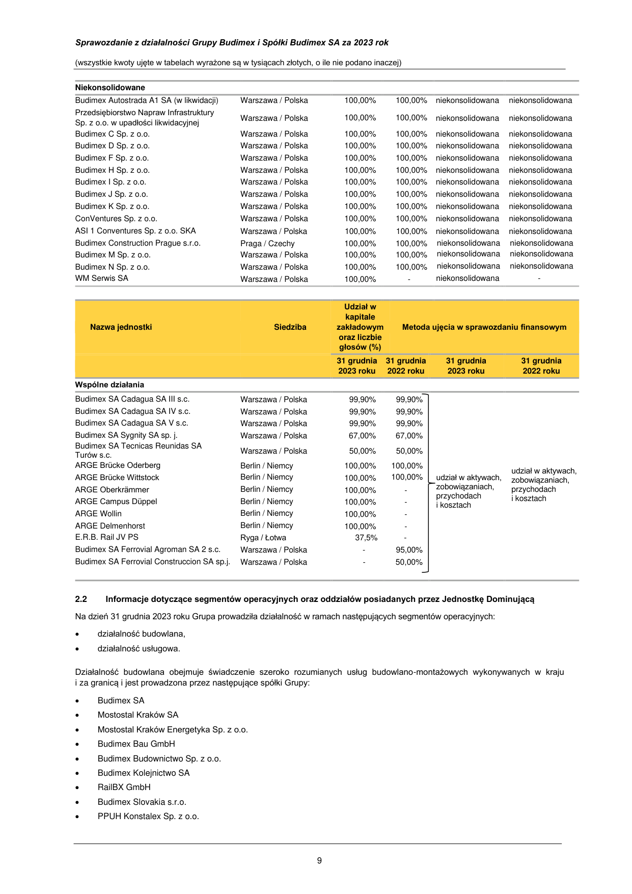

_**Sprawozdanie z działalności Grupy Budimex i Spółki Budimex SA za 2023 rok**_

(wszystkie kwoty ujęte w tabelach wyrażone są w tysiącach złotych, o ile nie podano inaczej)

**Zmiany w organizacji Grupy:**

W dniu **12 lipca 2023 roku** zarejestrowano w Krajowym Rejestrze Sądowym spółkę WMSerwis SA, w której Budimex SA objął
100% udziałów.

W dniu **25 września 2023 roku** zarejestrowano w Krajowym Rejestrze Sądowym spółkę BXF Energia Sp. z o.o., Budimex SA objął
51% udziałów.

W dniu **15 maja 2023 roku** spółka Mostostal Kraków SA, spółka w 100% zależna od Budimex SA nabyła 100% udziałów spółki
Przedsiębiorstwo Produkcyjno-Usługowo-Handlowe Konstalex Sp. z o.o.

W 2023 roku nie nastąpiły zmiany w zasadach zarządzania Grupą Budimex ani w zasadach zarządzania Budimex SA.

Wykaz jednostki dominującej, podmiotów od niej zależnych i współkontrolowanych wchodzących w skład Grupy Budimex:

**Jednostka dominująca**

Budimex SA Warszawa / Polska pełna pełna

**Konsolidowane**

Mostostal Kraków SA Kraków / Polska 100,00% 100,00% pełna pełna
Mostostal Kraków Energetyka Sp. z o.o. Kraków / Polska 100,00% 100,00% pełna pełna

Budimex Bau GmbH Berlin / Niemcy 100,00% 100,00% pełna pełna

Budimex Budownictwo Sp. z o.o. Warszawa / Polska 100,00% 100,00% pełna pełna
Budimex Kolejnictwo SA Warszawa / Polska 100,00% 100,00% pełna pełna

FBSerwis SA Warszawa / Polska 100,00% 100,00% pełna pełna

FBSerwis A Sp. z o.o. Warszawa / Polska 100,00% 100,00% pełna pełna

FBSerwis B Sp. z o.o. Warszawa / Polska 100,00% 100,00% pełna pełna

FBSerwis Karpatia Sp. z o.o. Tarnów / Polska 100,00% 100,00% pełna pełna

Bielany Wrocławskie /
FBSerwis Wrocław Sp. z o.o.
Polska

100,00% 100,00% pełna pełna

FBSerwis Dolny Śląsk Sp. z o.o. Ścinawka Dolna / Polska 100,00% 100,00% pełna pełna

FBSerwis Odbiór Sp. z o.o. Warszawa / Polska 100,00% 100,00% pełna pełna

FBSerwis Paliwa Alternatywne Sp. z o.o. Warszawa / Polska 100,00% 100,00% pełna pełna

JZE Sp. z o.o. Warszawa / Polska 100,00% 100,00% pełna pełna

FBSerwis Kamieńsk Sp. z o.o. Kamieńsk / Polska 80,00% 80,00% pełna pełna

Budimex Parking Wrocław Sp. z o.o. Warszawa / Polska 51,00% 51,00% pełna pełna

Budimex Most Wschodni SA Warszawa / Polska 100,00% 100,00% pełna pełna

Circular Construction SA Warszawa / Polska 100,00% 100,00% pełna pełna
Budimex Mobility SA Warszawa / Polska 100,00% 100,00% pełna pełna

Budimex Slovakia s.r.o. Bratysława/Słowacja 100,00% 100,00% pełna pełna
Magnolia Energy Sp. z o.o. Warszawa / Polska 100,00% 100,00% pełna pełna
Zakład Przetwarzania Odpadów Zawisty
Ostrołęka / Polska 100,00% 100,00% pełna pełna
Sp. z o.o.

Fotowoltaika HIG XIV Sp. z o.o. Warszawa / Polska 100,00% 100,00% pełna pełna

RailBX GmbH Berlin / Niemcy 100,00% 100,00% pełna pełna

Budimex F Sp. z o.o. Warszawa / Polska 100,00% 100,00% pełna niekonsolidowana
Budimex A Sp. z o.o. Warszawa / Polska 100,00% 100,00% pełna niekonsolidowana

Budimex O Sp. z o.o. Warszawa / Polska 100,00% 100,00% pełna niekonsolidowana
Budimex P Sp. z o.o. Warszawa / Polska 100,00% 100,00% pełna niekonsolidowana

Budimex R Sp. z o.o. Warszawa / Polska 100,00% 100,00% pełna niekonsolidowana
BxF Energia Sp. z o.o. Warszawa / Polska 51,00% - pełna 
PPUH Konstalex Sp. z o.o. Radomsko / Polska 100,00% - pełna 
Green Waste Management 1 Sp. z o.o. Warszawa / Polska 100,00% - pełna Green Waste Management 2 Sp. z o.o. Warszawa / Polska 100,00% - pełna 
Green Waste Management 3 Sp. z o.o. Warszawa / Polska 100,00% - pełna Green Waste Management 4 Sp. z o.o. Warszawa / Polska 100,00% - pełna 
Green Waste Management 5 Sp. z o.o. Warszawa / Polska 100,00% - pełna 
Green Waste Management 6 Sp. z o.o. Warszawa / Polska 100,00% - pełna 

8

---

## Page 10

_**Sprawozdanie z działalności Grupy Budimex i Spółki Budimex SA za 2023 rok**_

(wszystkie kwoty ujęte w tabelach wyrażone są w tysiącach złotych, o ile nie podano inaczej)

**Niekonsolidowane**

Budimex Autostrada A1 SA (w likwidacji) Warszawa / Polska 100,00% 100,00% niekonsolidowana niekonsolidowana

Przedsiębiorstwo Napraw Infrastruktury
Warszawa / Polska 100,00% 100,00% niekonsolidowana niekonsolidowana
Sp. z o.o. w upadłości likwidacyjnej

Budimex C Sp. z o.o. Warszawa / Polska 100,00% 100,00% niekonsolidowana niekonsolidowana
Budimex D Sp. z o.o. Warszawa / Polska 100,00% 100,00% niekonsolidowana niekonsolidowana

Budimex F Sp. z o.o. Warszawa / Polska 100,00% 100,00% niekonsolidowana niekonsolidowana

Budimex H Sp. z o.o. Warszawa / Polska 100,00% 100,00% niekonsolidowana niekonsolidowana
Budimex I Sp. z o.o. Warszawa / Polska 100,00% 100,00% niekonsolidowana niekonsolidowana

Budimex J Sp. z o.o. Warszawa / Polska 100,00% 100,00% niekonsolidowana niekonsolidowana

Budimex K Sp. z o.o. Warszawa / Polska 100,00% 100,00% niekonsolidowana niekonsolidowana

ConVentures Sp. z o.o. Warszawa / Polska 100,00% 100,00% niekonsolidowana niekonsolidowana

ASI 1 Conventures Sp. z o.o. SKA Warszawa / Polska 100,00% 100,00% niekonsolidowana niekonsolidowana
Budimex Construction Prague s.r.o. Praga / Czechy 100,00% 100,00% niekonsolidowana niekonsolidowana

Budimex M Sp. z o.o. Warszawa / Polska 100,00% 100,00% niekonsolidowana niekonsolidowana

Budimex N Sp. z o.o. Warszawa / Polska 100,00% 100,00% niekonsolidowana niekonsolidowana

WM Serwis SA Warszawa / Polska 100,00% - niekonsolidowana 

**Wspólne działania**

**2.2** **Informacje dotyczące segmentów operacyjnych oraz oddziałów posiadanych przez Jednostkę Dominującą**

Na dzień 31 grudnia 2023 roku Grupa prowadziła działalność w ramach następujących segmentów operacyjnych:

- działalność budowlana,

- działalność usługowa.

Działalność budowlana obejmuje świadczenie szeroko rozumianych usług budowlano-montażowych wykonywanych w kraju
i za granicą i jest prowadzona przez następujące spółki Grupy:

- Budimex SA

- Mostostal Kraków SA

- Mostostal Kraków Energetyka Sp. z o.o.

- Budimex Bau GmbH

- Budimex Budownictwo Sp. z o.o.

- Budimex Kolejnictwo SA

- RailBX GmbH

- Budimex Slovakia s.r.o.

- PPUH Konstalex Sp. z o.o.

9

---

## Page 11

_**Sprawozdanie z działalności Grupy Budimex i Spółki Budimex SA za 2023 rok**_

(wszystkie kwoty ujęte w tabelach wyrażone są w tysiącach złotych, o ile nie podano inaczej)

Segment działalności usługowej obejmuje kompleksowe usługi w zakresie gospodarki odpadami, utrzymania infrastruktury drogowej
i oświetleniowej oraz zarządzania i utrzymania technicznego nieruchomości, również w formie partnerstwa publiczno-prywatnego.
Segment ten obejmuje również usługi w zakresie wytwarzania energii elektrycznej z odnawialnych źródeł energii. Do tego segmentu
zakwalifikowano poniższe podmioty:

- Budimex Parking Wrocław Sp. z o.o.

- FBSerwis SA

- FBSerwis A Sp. z o.o.

- FBSerwis B Sp. z o.o.

- FBSerwis Dolny Śląsk Sp. z o.o.

- FBSerwis Wrocław Sp. z o.o.

- FBSerwis Karpatia Sp. z o.o.

- FBSerwis Kamieńsk Sp. z o.o.

- FBSerwis Odbiór Sp. z o.o.

- FBSerwis Paliwa Alternatywne Sp. z o.o.

- JZE Sp. z o.o.

- Budimex Most Wschodni SA

- Circular Construction SA

- Magnolia Energy Sp. z o.o.

- Zakłady Przetwarzania Odpadów Zawisty Sp. z o.o.

- Fotowoltaika HIG XIV Sp. z o.o.

- Budimex Mobility SA (wcześniej Budimex PPP SA)

- Budimex F Sp. z o.o.

- Budimex A Sp. z o.o.

- Budimex O Sp. z o.o.

- Budimex P Sp. z o.o.

- Budimex R Sp. z o.o.

- BxF Energia Sp. z o.o.

- Green Waste Management 1 Sp. z o.o.

- Green Waste Management 2 Sp. z o.o.

- Green Waste Management 3 Sp. z o.o.

- Green Waste Management 4 Sp. z o.o.

- Green Waste Management 5 Sp. z o.o.

- Green Waste Management 6 Sp. z o.o.

Na dzień 31 grudnia 2023 roku Jednostka Dominująca posiadała następujące oddziały:

- Oddział Budownictwa Ogólnego Północ w Poznaniu przy ulicy Wołowskiej 92A,

- Oddział Budownictwa Ogólnego Południe w Krakowie przy ulicy Wielickiej 20,

- Oddział Budownictwa Ogólnego Wschód w Warszawie przy ulicy Siedmiogrodzkiej 9,

- Oddział Budownictwa Komunikacyjnego Północ w Warszawie przy ulicy Siedmiogrodzkiej 9,

- Oddział Budownictwa Komunikacyjnego Południe w Krakowie przy ulicy Wielickiej 20,

- Oddział Budownictwa Komunikacyjnego Zachód we Wrocławiu przy ulicy Mokronoskiej 2,

- Oddział Budownictwa Przemysłowego i Kolejowego w Warszawie przy ulicy Siedmiogrodzkiej 9,

- Oddział Usług Sprzętowych w Pruszkowie przy ulicy Przejazdowej 24,

- Oddział w Rzeszowie przy ulicy Słowackiego 24,

- Oddział w Poznaniu przy ulicy Wołowskiej 92A,

- Budimex SA Zweigniederlassung Köln, Pferdmengesstr. 5, Kolonia, Niemcy,

- Oddział w Czechach, ul. Ceskobrodska 1174, Praga, Czechy,

- Oddział w Słowacji, ul. Vajnorska 100B, Bratysława, Słowacja

- Oddział w Łotwie, Mukusalas Iela 41, Ryga, Łotwa.

Pozostałe spółki Grupy prowadziły działalność za granicą za pośrednictwem następujących oddziałów:

- Mostostal Kraków Spółka Akcyjna Zweigniederlassung Köln, Pferdmengesstrasse 5, Kolonia, Niemcy.

10

---

## Page 12

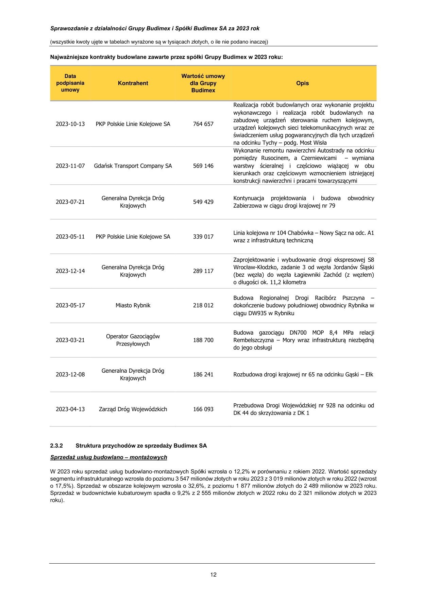

_**Sprawozdanie z działalności Grupy Budimex i Spółki Budimex SA za 2023 rok**_

(wszystkie kwoty ujęte w tabelach wyrażone są w tysiącach złotych, o ile nie podano inaczej)

**2.3** **Struktura przychodów ze sprzedaży**

**2.3.1** **Struktura przychodów ze sprzedaży Grupy Budimex**

**Sprzedaż segmentu budowlanego**
W 2023 roku rynek budowlany w Polsce (mierzony wartością sprzedaży produkcji budowlano-montażowej) według danych GUS
zwiększył wartość o blisko 15,4% w stosunku do roku 2022. Dynamiczny wzrost nastąpił w obszarze budownictwa
infrastrukturalnego (+24,1%) oraz w sektorze budownictwa kubaturowego (+6,5%). Z kolei w segmencie budownictwa
mieszkaniowego odnotowano spowolnienie aktywności (-6,8%). Jednocześnie wzrost aktywności nastąpił w zakresie budownictwa
niemieszkalnego (+15,0%), na który składała się poprawa w obrębie budowy budynków handlowych, przemysłowych
i magazynowych.

W roku obrotowym 2023 przychody ze sprzedaży Grupy Budimex w segmencie budowlanym wzrosły o 13,8% w porównaniu
do roku 2022.

Udział segmentu infrastruktury w całkowitych przychodach z usług budowlano-montażowych Grupy wzrósł z 38,8% w 2022 roku
do 40,2% w 2023 roku. Partycypacja segmentu kolejowego w strukturze przychodów segmentu budowlanego Grupy zwiększyła się
z poziomu 24,2% do 28,1% w 2023 roku. Natomiast udział budownictwa kubaturowego spadł z poziomu 37,0% w 2022 roku
do poziomu 31,7% w 2023 roku.

Strukturę sprzedaży w podziale na poszczególne sektory rynku budowlanego prezentuje poniższa tabela:

lądowo – inżynieryjne (infrastruktura) 3 578 40,2% 3 035 38,8%

kolejowe 2 498 28,1% 1 889 24,2%

kubaturowe, w tym: 2 826 31,7% 2 897 37,0%

_- niemieszkaniowe_ 2 709 30,4% 2 668 34,1%

_- mieszkaniowe_ 117 1,3% 229 2,9%

**Razem sprzedaż segmentu budowlanego** **8 902** 100,0% **7 821** 100,0%

_**Struktura geograficzna przychodów ze sprzedaży Grupy Budimex w roku 2023**_

Głównymi rynkami, na których działa Grupa Budimex są:

- Polska

- Niemcy

- Słowacja

Struktura geograficzna przychodów ze sprzedaży (z działalności budowlanej) w 2023 roku przedstawiała się następująco:

Słowacja

0,7% Inne kraje UE

95,4%

11

---

## Page 13

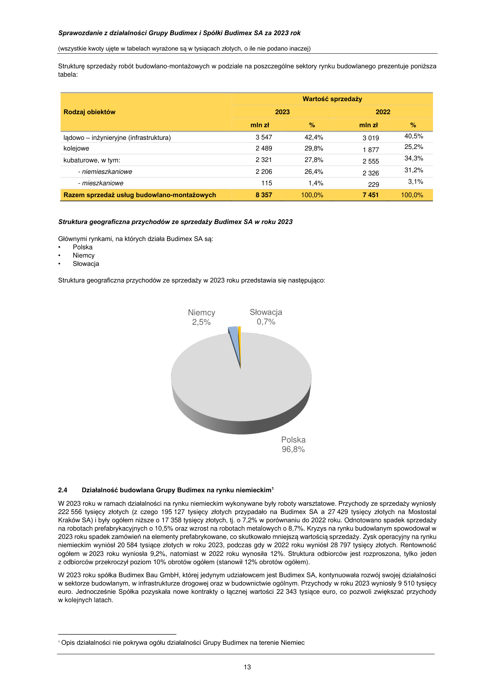

_**Sprawozdanie z działalności Grupy Budimex i Spółki Budimex SA za 2023 rok**_

(wszystkie kwoty ujęte w tabelach wyrażone są w tysiącach złotych, o ile nie podano inaczej)

**Najważniejsze kontrakty budowlane zawarte przez spółki Grupy Budimex w** **2023 roku:**

2023-10-13 PKP Polskie Linie Kolejowe SA 764 657

2023-11-07 Gdańsk Transport Company SA 569 146

wykonawczego i realizacja robót budowlanych na
zabudowę urządzeń sterowania ruchem kolejowym,
urządzeń kolejowych sieci telekomunikacyjnych wraz ze
świadczeniem usług pogwarancyjnych dla tych urządzeń
na odcinku Tychy – podg. Most Wisła

Wykonanie remontu nawierzchni Autostrady na odcinku
pomiędzy Rusocinem, a Czerniewicami – wymiana
warstwy ścieralnej i częściowo wiążącej w obu
kierunkach oraz częściowym wzmocnieniem istniejącej
konstrukcji nawierzchni i pracami towarzyszącymi

Generalna Dyrekcja Dróg Kontynuacja projektowania i budowa obwodnicy
2023-07-21 549 429

Krajowych Zabierzowa w ciągu drogi krajowej nr 79

Linia kolejowa nr 104 Chabówka – Nowy Sącz na odc. A1
2023-05-11 PKP Polskie Linie Kolejowe SA 339 017
wraz z infrastrukturą techniczną

Generalna Dyrekcja Dróg
2023-12-14 289 117

Krajowych

2023-05-17 Miasto Rybnik 218 012

Operator Gazociągów
2023-03-21 188 700

Przesyłowych

Zaprojektowanie i wybudowanie drogi ekspresowej S8
Wrocław-Kłodzko, zadanie 3 od węzła Jordanów Śląski
(bez węzła) do węzła Łagiewniki Zachód (z węzłem)

- długości ok. 11,2 kilometra

Budowa Regionalnej Drogi Racibórz Pszczyna dokończenie budowy południowej obwodnicy Rybnika w
ciągu DW935 w Rybniku

Budowa gazociągu DN700 MOP 8,4 MPa relacji
Rembelszczyzna – Mory wraz infrastrukturą niezbędną
do jego obsługi

Generalna Dyrekcja Dróg
2023-12-08 186 241 Rozbudowa drogi krajowej nr 65 na odcinku Gąski – Ełk

Krajowych

Przebudowa Drogi Wojewódzkiej nr 928 na odcinku od
2023-04-13 Zarząd Dróg Wojewódzkich 166 093
DK 44 do skrzyżowania z DK 1

**2.3.2** **Struktura przychodów ze sprzedaży Budimex SA**

_**Sprzedaż usług budowlano – montażowych**_

W 2023 roku sprzedaż usług budowlano-montażowych Spółki wzrosła o 12,2% w porównaniu z rokiem 2022. Wartość sprzedaży
segmentu infrastrukturalnego wzrosła do poziomu 3 547 milionów złotych w roku 2023 z 3 019 milionów złotych w roku 2022 (wzrost

- 17,5%). Sprzedaż w obszarze kolejowym wzrosła o 32,6%, z poziomu 1 877 milionów złotych do 2 489 milionów w 2023 roku.
Sprzedaż w budownictwie kubaturowym spadła o 9,2% z 2 555 milionów złotych w 2022 roku do 2 321 milionów złotych w 2023
roku).

12

---

## Page 14

_**Sprawozdanie z działalności Grupy Budimex i Spółki Budimex SA za 2023 rok**_

(wszystkie kwoty ujęte w tabelach wyrażone są w tysiącach złotych, o ile nie podano inaczej)

Strukturę sprzedaży robót budowlano-montażowych w podziale na poszczególne sektory rynku budowlanego prezentuje poniższa
tabela:

lądowo – inżynieryjne (infrastruktura) 3 547 42,4% 3 019 40,5%

kolejowe 2 489 29,8% 1 877 25,2%

kubaturowe, w tym: 2 321 27,8% 2 555 34,3%

_- niemieszkaniowe_ 2 206 26,4% 2 326 31,2%

_- mieszkaniowe_ 115 1,4% 229 3,1%

**Razem sprzedaż usług budowlano-montażowych** **8 357** 100,0% **7 451** 100,0%

_**Struktura geograficzna przychodów ze sprzedaży Budimex SA w roku 2023**_

Głównymi rynkami, na których działa Budimex SA są:

- Polska

- Niemcy

- Słowacja

Struktura geograficzna przychodów ze sprzedaży w 2023 roku przedstawia się następująco:

Niemcy

Słowacja

96,8%

**2.4** **Działalność budowlana Grupy Budimex na rynku niemieckim** **[1]**

W 2023 roku w ramach działalności na rynku niemieckim wykonywane były roboty warsztatowe. Przychody ze sprzedaży wyniosły
222 556 tysięcy złotych (z czego 195 127 tysięcy złotych przypadało na Budimex SA a 27 429 tysięcy złotych na Mostostal
Kraków SA) i były ogółem niższe o 17 358 tysięcy złotych, tj. o 7,2% w porównaniu do 2022 roku. Odnotowano spadek sprzedaży
na robotach prefabrykacyjnych o 10,5% oraz wzrost na robotach metalowych o 8,7%. Kryzys na rynku budowlanym spowodował w
2023 roku spadek zamówień na elementy prefabrykowane, co skutkowało mniejszą wartością sprzedaży. Zysk operacyjny na rynku
niemieckim wyniósł 20 584 tysiące złotych w roku 2023, podczas gdy w 2022 roku wyniósł 28 797 tysięcy złotych. Rentowność
ogółem w 2023 roku wyniosła 9,2%, natomiast w 2022 roku wynosiła 12%. Struktura odbiorców jest rozproszona, tylko jeden
z odbiorców przekroczył poziom 10% obrotów ogółem (stanowił 12% obrotów ogółem).

W 2023 roku spółka Budimex Bau GmbH, której jedynym udziałowcem jest Budimex SA, kontynuowała rozwój swojej działalności
w sektorze budowlanym, w infrastrukturze drogowej oraz w budownictwie ogólnym. Przychody w roku 2023 wyniosły 9 510 tysięcy
euro. Jednocześnie Spółka pozyskała nowe kontrakty o łącznej wartości 22 343 tysiące euro, co pozwoli zwiększać przychody
w kolejnych latach.

1 Opis działalności nie pokrywa ogółu działalności Grupy Budimex na terenie Niemiec

13

---

## Page 15

_**Sprawozdanie z działalności Grupy Budimex i Spółki Budimex SA za 2023 rok**_

(wszystkie kwoty ujęte w tabelach wyrażone są w tysiącach złotych, o ile nie podano inaczej)

**2.5** **Perspektywy rozwoju działalności Grupy Budimex i Budimex SA w okresie najbliższego roku**

W najbliższym roku Grupa Budimex nadal będzie działać we wszystkich ważniejszych sektorach rynku budowlanego na obszarze
Polski, jak również na wybranych rynkach zagranicznych.

Wartość zleceń podpisanych przez Grupę Budimex w roku 2023 była wyższa o 5,2% w stosunku do poprzedniego roku.
Zdywersyfikowana struktura portfela zamówień (obejmująca długoterminowe kontrakty „projektuj i buduj”) w dużej mierze
zabezpiecza front prac na najbliższe 2 lata. Grupa podejmuje dalsze działania zmierzające do ekspansji geograficznej,
w szczególności na rynek niemiecki, czeski, słowacki i łotewski. W roku 2023 został podpisany pierwszy kontrakt budowlany na
rynku czeskim o wartości 102 milionów złotych. W perspektywie najbliższych lat wymienione rynki mogą być źródłem dodatkowych
zleceń, które pozwolą na utrzymanie stabilnego portfela zamówień, także w dłuższym terminie.

Grupa planuje konsekwentnie wzmacniać swoją pozycję w segmencie budownictwa kubaturowego oraz pozyskiwać nowe zlecenia
w segmencie przemysłowo - energetycznym, kolejowym oraz hydrotechnicznym. W obszarze zainteresowania pozostają także
przedsięwzięcia na zasadach partnerstwa publiczno-prywatnego.

Grupa Budimex prowadzi także działalność w segmencie odnawialnych źródeł energii – nie tylko jako wykonawca tego typu
instalacji, lecz także jako inwestor. W lutym 2022 roku Spółka nabyła projekt gotowej do budowy farmy wiatrowej zlokalizowanej
w województwie wielkopolskim o mocy do 7 MW. Farma wiatrowa „Magnolia” (Magnolia Energy Sp. z o.o.), została uruchomiona
w drugiej połowie 2023 roku, a produkcja energii elektrycznej z tej farmy przekroczyła w 2023 roku 8 GWh. Ponadto Grupa Budimex
rozwija projekty fotowoltaiczne. W ramach rozwoju tego segmentu w listopadzie 2022 roku została nabyta farma fotowoltaiczna
„Kamelia” (Fotowoltaika HIG XIV Sp. z o.o.). Projekt został pozyskany w formie zakupu udziałów w spółce, która posiadała komplet
dokumentacji do budowy farmy fotowoltaicznej o mocy 14 MW. W 2023 roku prowadzone były prace związane z wybudowaniem
instalacji fotowoltaicznej, natomiast prace te jeszcze nie zostały zakończone. Energia wyprodukowana przez tę farmę powinna być
w stanie w dużej mierze pokryć zapotrzebowanie Budimex SA na energię elektryczną.

W kwietniu 2023 roku Budimex SA wraz z partnerem z Grupy Ferrovial - Ferrovial Energy Infrastructure and Mobility podpisał umowę
wspólników powołującą nową spółkę joint-venture BXF Energia Sp. z o.o. Budimex SA ma w nowym podmiocie udział
większościowy (51%). Celem spółki jest rozwój projektów odnawialnych źródeł energii, ich budowa oraz eksploatacja. Spółka skupia
się na projektach w technologii farm fotowoltaicznych i wiatrowych, których dewelopment rozpoczęła zabezpieczając kolejne
lokalizacje dla potencjalnych elektrowni o mocy kilkuset MW. Równocześnie dopuszcza kolejne przejęcia projektów w fazie
gotowości do budowy. W kolejnych latach będą prowadzone dalsze działania zmierzające do rozwoju organicznego tego typu
instalacji.

W planach jest dalszy rozwój Grupy FBSerwis, w szczególności w obszarze usług komunalnych, zarówno w sposób organiczny jak
i przez potencjalne akwizycje podmiotów z ugruntowaną pozycją rynkową.

W 2023 roku spółki Grupy Budimex podpisały kontrakty budowlane o łącznej wartości 8 289 576 tysięcy złotych (z aneksami).
Portfel zamówień budowlanych Grupy Budimex na dzień 31 grudnia 2023 roku wyniósł 13 139 554 tysiące złotych, co było
porównywalne ze stanem z końca 2022 roku.

Z kolei Budimex SA w 2023 roku podpisał kontrakty budowlane o łącznej wartości 7 470 358 tysięcy złotych (z aneksami). Portfel
zamówień na dzień 31 grudnia 2023 roku wyniósł 11 943 325 tysięcy złotych.

Struktura portfela zamówień Grupy Budimex na dzień 31 grudnia 2023 roku przedstawia się następująco:

Budownictwo
hydrotechniczne

Budownictwo przemysłowe

17%

7%

14

---

## Page 16

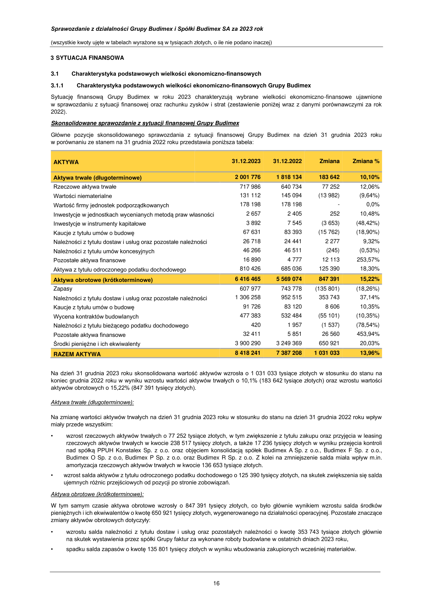

_**Sprawozdanie z działalności Grupy Budimex i Spółki Budimex SA za 2023 rok**_

(wszystkie kwoty ujęte w tabelach wyrażone są w tysiącach złotych, o ile nie podano inaczej)

**2.6** **Ocena możliwości realizacji zamierzeń inwestycyjnych**

W roku 2023 Grupa Budimex planuje nakłady inwestycyjne na poziomie około 230 milionów złotych, z czego około 70 milionów
złotych przypada na spółkę Budimex SA, a około 25 milionów złotych na spółkę Budimex Kolejnictwo SA, 85 milionów złotych na
Grupę FBSerwis oraz 35 milionów złotych na rozwój farm fotowoltaicznych i wiatrowych. Główne nakłady dotyczą nabycia maszyn
budowlanych i kolejowych oraz realizacji projektów informatycznych, a także inwestycji w odnawialne źródła energii. Nakłady
inwestycyjne planowane przez Grupę FBSerwis będą dotyczyły inwestycji w obszarze usług komunalnych oraz środków transportu.

**2.7** **Czynniki ryzyka**

Grupa Budimex w toku prowadzonej działalności narażona jest na szereg ryzyk, z których najistotniejsze grupy ryzyka odziaływujące
na Spółkę to:

- ryzyka finansowe: ryzyko walutowe, ryzyko cenowe, ryzyko kredytowe;

- ryzyka techniczne;

- ryzyka prawne.

Informacje dotyczące przyjętych przez Grupę celów oraz metod zarządzania ryzykiem finansowym zostały ujęte
w skonsolidowanym sprawozdaniu finansowym za rok zakończony 31 grudnia 2023 roku (nota 4).

Nieodłącznym ryzykiem związanym z prowadzeniem działalności gospodarczej jest ryzyko kredytowe kontrahentów.
Pomimo wprowadzenia restrykcyjnych procedur kontroli należności w Grupie, wciąż istnieje ryzyko związane z niewypłacalnością
inwestorów. Opóźnienia w terminowym regulowaniu należności mogą negatywnie wpłynąć na wyniki finansowe Grupy, powodując
konieczność tworzenia odpisów aktualizujących należności oraz finansowania działalności zadłużeniem zewnętrznym.

Realizacja kontraktów budowlanych odbywa się w określonych warunkach techniczno-ekonomicznych, co wpływa na poziom
uzyskiwanej marży. Spółki Grupy Budimex świadczące usługi budowlane monitorują ryzyka techniczne, organizacyjne, prawne
i finansowe związane z planowaniem i bieżącym przebiegiem prac na poszczególnych kontraktach. Pomimo wprowadzonych
mechanizmów kontrolnych i zabezpieczenia ogólnych ryzyk (kredytowego, walutowego), istnieje możliwość wystąpienia czynników
powodujących realizację kontraktu z marżą niższą niż pierwotnie planowana, wśród których należy wymienić:

- niepewność gospodarczą związaną z wojną w Ukrainie,

- wzrost cen usług i ograniczoną dostępność lub upadłość podwykonawców,

- wzrost kosztów zatrudnienia i ograniczoną dostępność wykwalifikowanych pracowników,

- wzrost cen materiałów budowlanych, ropopochodnych i energii,

- opóźnienia w terminowym wykonaniu lub niedostateczną jakość robót podwykonawców,

- opóźnienia w uzyskaniu odpowiednich decyzji administracyjnych,

- zmiany zakresu robót bądź technologii uzgodnionych w umowach,

- niekorzystne warunki pogodowe lub gruntowe.

**2.8** **Zmiana źródeł zaopatrzenia**

W 2023 roku nie nastąpiły istotne zmiany w źródłach zaopatrzenia budów. Udział żadnego z dostawców materiałów lub usług
nie przekroczył 10% wartości sprzedaży Grupy Budimex i Budimex SA.

15

---

## Page 17

_**Sprawozdanie z działalności Grupy Budimex i Spółki Budimex SA za 2023 rok**_

(wszystkie kwoty ujęte w tabelach wyrażone są w tysiącach złotych, o ile nie podano inaczej)

**3 SYTUACJA FINANSOWA**

**3.1** **Charakterystyka podstawowych wielkości ekonomiczno-finansowych**

**3.1.1** **Charakterystyka podstawowych wielkości ekonomiczno-finansowych Grupy Budimex**

Sytuację finansową Grupy Budimex w roku 2023 charakteryzują wybrane wielkości ekonomiczno-finansowe ujawnione
w sprawozdaniu z sytuacji finansowej oraz rachunku zysków i strat (zestawienie poniżej wraz z danymi porównawczymi za rok
2022).

_**Skonsolidowane sprawozdanie z sytuacji finansowej Grupy Budimex**_

Główne pozycje skonsolidowanego sprawozdania z sytuacji finansowej Grupy Budimex na dzień 31 grudnia 2023 roku
w porównaniu ze stanem na 31 grudnia 2022 roku przedstawia poniższa tabela:

Rzeczowe aktywa trwałe 717 986 640 734 77 252 12,06%

Wartości niematerialne 131 112 145 094 (13 982) (9,64%)

Wartość firmy jednostek podporządkowanych 178 198 178 198 - 0,0%

Inwestycje w jednostkach wycenianych metodą praw własności 2 657 2 405 252 10,48%

Inwestycje w instrumenty kapitałowe 3 892 7 545 (3 653) (48,42%)

Kaucje z tytułu umów o budowę 67 631 83 393 (15 762) (18,90%)

Należności z tytułu dostaw i usług oraz pozostałe należności 26 718 24 441 2 277 9,32%

Należności z tytułu umów koncesyjnych 46 266 46 511 (245) (0,53%)

Pozostałe aktywa finansowe 16 890 4 777 12 113 253,57%

Aktywa z tytułu odroczonego podatku dochodowego 810 426 685 036 125 390 18,30%

**Aktywa obrotowe (krótkoterminowe)** **6 416 465** **5 569 074** **847 391** **15,22%**

Zapasy 607 977 743 778 (135 801) (18,26%)

Należności z tytułu dostaw i usług oraz pozostałe należności 1 306 258 952 515 353 743 37,14%

Kaucje z tytułu umów o budowę 91 726 83 120 8 606 10,35%

Wycena kontraktów budowlanych 477 383 532 484 (55 101) (10,35%)

Należności z tytułu bieżącego podatku dochodowego 420 1 957 (1 537) (78,54%)

Pozostałe aktywa finansowe 32 411 5 851 26 560 453,94%

Środki pieniężne i ich ekwiwalenty 3 900 290 3 249 369 650 921 20,03%

**RAZEM AKTYWA** **8 418 241** **7 387 208** **1 031 033** **13,96%**

Na dzień 31 grudnia 2023 roku skonsolidowana wartość aktywów wzrosła o 1 031 033 tysiące złotych w stosunku do stanu na
koniec grudnia 2022 roku w wyniku wzrostu wartości aktywów trwałych o 10,1% (183 642 tysiące złotych) oraz wzrostu wartości
aktywów obrotowych o 15,22% (847 391 tysięcy złotych).

_Aktywa trwałe (długoterminowe):_

Na zmianę wartości aktywów trwałych na dzień 31 grudnia 2023 roku w stosunku do stanu na dzień 31 grudnia 2022 roku wpływ
miały przede wszystkim:

- wzrost rzeczowych aktywów trwałych o 77 252 tysiące złotych, w tym zwiększenie z tytułu zakupu oraz przyjęcia w leasing
rzeczowych aktywów trwałych w kwocie 238 517 tysięcy złotych, a także 17 236 tysięcy złotych w wyniku przejęcia kontroli
nad spółką PPUH Konstalex Sp. z o.o. oraz objęciem konsolidacją spółek Budimex A Sp. z o.o., Budimex F Sp. z o.o.,
Budimex O Sp. z o.o, Budimex P Sp. z o.o. oraz Budimex R Sp. z o.o. Z kolei na zmniejszenie salda miała wpływ m.in.
amortyzacja rzeczowych aktywów trwałych w kwocie 136 653 tysiące złotych.

- wzrost salda aktywów z tytułu odroczonego podatku dochodowego o 125 390 tysięcy złotych, na skutek zwiększenia się salda
ujemnych różnic przejściowych od pozycji po stronie zobowiązań.

_Aktywa obrotowe (krótkoterminowe):_

W tym samym czasie aktywa obrotowe wzrosły o 847 391 tysięcy złotych, co było głównie wynikiem wzrostu salda środków
pieniężnych i ich ekwiwalentów o kwotę 650 921 tysięcy złotych, wygenerowanego na działalności operacyjnej. Pozostałe znaczące
zmiany aktywów obrotowych dotyczyły:

- wzrostu salda należności z tytułu dostaw i usług oraz pozostałych należności o kwotę 353 743 tysiące złotych głównie
na skutek wystawienia przez spółki Grupy faktur za wykonane roboty budowlane w ostatnich dniach 2023 roku,

- spadku salda zapasów o kwotę 135 801 tysięcy złotych w wyniku wbudowania zakupionych wcześniej materiałów.

16

---

## Page 18

_**Sprawozdanie z działalności Grupy Budimex i Spółki Budimex SA za 2023 rok**_

(wszystkie kwoty ujęte w tabelach wyrażone są w tysiącach złotych, o ile nie podano inaczej)

**KAPITAŁ WŁASNY I ZOBOWIĄZANIA** **31.12.2023** **31.12.2022** **Zmiana** **Zmiana %**

**Kapitał własny przypadający akcjonariuszom jednostki**
**1 530 815** **1 258 384** **272 431** **21,65%**
**dominującej**

Kapitał podstawowy 145 848 145 848 - 0,0%

Nadwyżka ze sprzedaży akcji powyżej ich wartości nominalnej 80 199 80 199 - 0,0%

Pozostałe kapitały rezerwowe 54 555 56 413 (1 858) (3,29%)

Różnice kursowe z przeliczenia oddziałów i podmiotów
2 471 7 092 (4 621) (65,16%)
zagranicznych

Zyski zatrzymane 1 247 742 968 832 278 910 28,79%

**Kapitał własny przypisany udziałom niedającym kontroli** **39 483** **41 071** **(1 588)** **(3,87%)**

**Zobowiązania długoterminowe** **1 096 208** **1 029 009** **67 199** **6,53%**

Kredyty, pożyczki i inne zewnętrzne źródła finansowania 172 405 148 706 23 699 15,94%

Kaucje z tytułu umów o budowę 244 196 229 963 14 233 6,19%

Rezerwy na zobowiązania długoterminowe i inne obciążenia 656 385 626 314 30 071 4,80%

Zobowiązania z tytułu świadczeń emerytalnych i podobnych 13 366 10 070 3 296 32,73%

Pozostałe zobowiązania finansowe 8 223 12 807 (4 584) (35,79%)

Rezerwy z tytułu odroczonego podatku dochodowego 1 633 1 149 484 42,12%

**Zobowiązania krótkoterminowe** **5 751 735** **5 058 744** **692 991** **13,70%**

Kredyty, pożyczki i inne zewnętrzne źródła finansowania 64 186 76 435 (12 249) (16,03%)

Zobowiązania z tytułu dostaw i usług oraz pozostałe
1 782 006 1 516 956 265 050 17,47%
zobowiązania

Kaucje z tytułu umów o budowę 226 816 218 039 8 777 4,03%

Rezerwy na straty na kontraktach budowlanych 771 947 803 263 (31 316) (3,90%)

Wycena kontraktów budowlanych 1 767 989 1 493 517 274 472 18,38%

Przychody przyszłych okresów 469 798 578 658 (108 860) (18,81%)

Rezerwy na zobowiązania krótkoterminowe i inne obciążenia 557 394 337 818 219 576 65,00%

Zobowiązania z tytułu bieżącego podatku dochodowego 107 471 29 245 78 226 267,49%

Zobowiązania z tytułu świadczeń emerytalnych i podobnych 2 539 1 578 961 60,90%

Pozostałe zobowiązania finansowe 1 589 3 235 (1 646) (50,88%)

**RAZEM KAPITAŁ WŁASNY I ZOBOWIĄZANIA** **8 418 241** **7 387 208** **1 031 033** **13,96%**

_Kapitał własny i zobowiązania:_

Po stronie kapitałów własnych i zobowiązań zmiany dotyczyły:

- wzrostu salda pozycji „zyski zatrzymane” o kwotę 278 910 tysięcy złotych w wyniku wypracowania zysku netto za 12 miesięcy
2023 roku oraz wypłaty dywidendy za rok 2022,

- wzrostu wartości zobowiązań długoterminowych o kwotę 67 199 tysięcy złotych, przede wszystkim z powodu:

      - wzrostu salda długoterminowych kredytów, pożyczek i innych zewnętrznych źródeł finansowania o 23 699 tysięcy
złotych, m.in. w wyniku udzielenia długoterminowego kredytu inwestycyjnego spółce Magnolia Energy Sp. z o.o.;

      - wzrostu salda rezerwy na zobowiązania długoterminowe i inne obciążania o 30 071 tysięcy złotych, które dotyczy
w większości utworzenia dodatkowej rezerwy na naprawy gwarancyjne oraz na rekultywację,

      - wzrostu salda kaucji z tytułu umów o budowę o kwotę 14 233 tysiące złotych, głównie w wyniku większej skali
działalności, a tym samym wyższym kaucjom zatrzymanym podwykonawcom,

- wzrostu wartości zobowiązań krótkoterminowych o kwotę 692 991 tysięcy złotych, z których największe zmiany dotyczyły:

      - wzrostu salda zobowiązań z tytułu dostaw i usług oraz pozostałych zobowiązań o kwotę 265 050 tysięcy złotych,
co było skorelowane ze wzrostem skali działalności i osiągniętego wzrostu poziomu przychodów ze sprzedaży,

      - wzrostu salda wyceny kontraktów budowlanych o 274 472 tysiące złotych, w wyniku sezonowego wzrostu salda
przefakturowania, szczególnie na kontraktach realizowanych dla odbiorców publicznych,

      - wzrostu salda rezerw na zobowiązania krótkoterminowe i inne obciążenia o kwotę 219 576 tysięcy złotych, głównie
jako rezultat utworzenia rezerw na kary,

      - spadku salda przychodów przyszłych okresów o 108 860 tysięcy złotych, głównie w wyniku rozliczenia zaliczek
otrzymanych w poprzednich latach obrotowych.

17

---

## Page 19

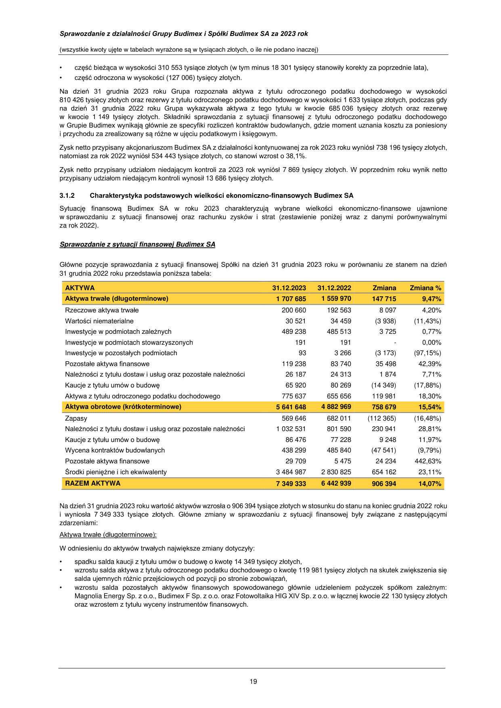

_**Sprawozdanie z działalności Grupy Budimex i Spółki Budimex SA za 2023 rok**_

(wszystkie kwoty ujęte w tabelach wyrażone są w tysiącach złotych, o ile nie podano inaczej)

_**Skonsolidowany rachunek zysków i strat Grupy Budimex**_

Przychody netto ze sprzedaży produktów i usług oraz
9 801 515 8 619 054 1 182 461 13,72%
towarów i materiałów

Koszty sprzedanych produktów i usług oraz towarów
(8 676 934) (7 746 611) (930 323) 12,01%
i materiałów

**Zysk brutto ze sprzedaży** **1 124 581** **872 443** **252 138** **28,90%**

Koszty sprzedaży (13 516) (13 530) 14 (0,10%)

Koszty ogólnego zarządu (371 396) (317 153) (54 243) 17,10%

Pozostałe przychody operacyjne 125 722 65 235 60 487 92,72%

Pozostałe koszty operacyjne (84 264) (44 568) (39 696) 89,07%

**Zysk z działalności operacyjnej** **781 127** **562 427** **218 700** **38,89%**

Przychody finansowe 203 048 131 961 71 087 53,87%

Koszty finansowe (54 868) (45 589) (9 279) 20,35%
Udział w zyskach / (stratach) netto jednostek
305 135 170 125,93%
podporządkowanych wycenianych metodą praw własności

**Zysk brutto** **929 612** **648 934** **280 678** **43,25%**

Podatek dochodowy (183 547) (100 805) (82 742) 82,08%

Zysk (strata) netto z działalności kontynuowanej 746 065 548 129 197 936 36,11%

**Zysk netto za okres** **746 065** **548 129** **197 936** **36,11%**

_z tego przypadający:_

_- akcjonariuszom jednostki dominującej_ _738 196_ _534 443_ _203 753_ _38,12%_

_- udziałom niedającym kontroli_ _7 869_ _13 686_ _(5 817)_ _(42,50%)_

W roku 2023 Grupa Budimex uzyskała przychody ze sprzedaży w wysokości 9 801 515 tysięcy złotych, co stanowi wzrost o 13,72%
w porównaniu do przychodów uzyskanych w roku 2022.

W 2023 roku produkcja budowlano-montażowa w Polsce wyrażona w cenach bieżących wzrosła o 15,4% w stosunku
do analogicznego okresu roku ubiegłego natomiast sprzedaż segmentu budowlanego Grupy Budimex na rynku krajowym wzrosła
w porównywanych okresach o 13,3%.

Zysk brutto ze sprzedaży w 2023 roku wyniósł 1 124 581 tysięcy złotych, natomiast w roku poprzednim osiągnął wartość
872 443 tysiące złotych. Rentowność brutto sprzedaży w roku 2023 wyniosła 11,5%, a w roku 2022 wskaźnik ten wynosił 10,1%.

Zgodnie z przyjętymi zasadami rachunkowości w przypadku, gdy budżetowane koszty realizacji kontraktu budowlanego
przekraczają całkowitą wartość przewidywanych przychodów, spółki Grupy w momencie zidentyfikowania tego faktu tworzą rezerwy
na straty, prezentowane w skonsolidowanym sprawozdaniu z działalności finansowej w pozycji „Rezerwy na straty na kontraktach
budowlanych”. Na dzień 31 grudnia 2023 roku rezerwy na straty na kontraktach wynosiły 771 947 tysięcy złotych.
W 2023 roku saldo rezerw na straty na kontraktach uległo zmniejszeniu o kwotę 31 316 tysięcy złotych. W przypadku usług
budowlanych, spółki Grupy Budimex są zobowiązane do udzielenia gwarancji na swoje usługi. Na dzień 31 grudnia 2023 roku
wartość rezerw na naprawy gwarancyjne wynosiła 739 910 tysięcy złotych. W okresie 12 miesięcy zakończonym 31 grudnia
2023 roku saldo rezerw na naprawy gwarancyjne wzrosło o 103 940 tysięcy złotych.

Koszty sprzedaży w okresie 12 miesięcy zakończonym 31 grudnia 2023 roku w porównaniu z rokiem poprzednim spadły

- 14 tysięcy złotych, natomiast koszty ogólnego zarządu wzrosły o 54 243 tysiące złotych w porównaniu do 2022 roku. Wskaźnik
udziału łącznie kosztów sprzedaży i kosztów ogólnego zarządu w sprzedaży ogółem wzrósł z 3,8% w 2022 roku do 3,9% w roku
2023.

Pozostałe przychody operacyjne w 2023 roku wyniosły 125 722 tysiące złotych, a pozostałe koszty operacyjne – 84 264 tysiące
złotych. Szczegółowa analityka pozostałych przychodów i pozostałych kosztów operacyjnych została przedstawiona w nocie 32 do
skonsolidowanego sprawozdania finansowego.

W 2023 roku Grupa wykazała zysk z działalności operacyjnej w wysokości 781 127 tysięcy złotych, co stanowiło 8,0% wartości
przychodów ze sprzedaży. W roku poprzednim zysk z działalności operacyjnej wyniósł 562 427 tysięcy złotych, co stanowiło
6,5% wartości przychodów ze sprzedaży.

W okresie 12 miesięcy zakończonym 31 grudnia 2023 roku Grupa osiągnęła zysk z działalności finansowej wynoszący
148 180 tysięcy złotych, natomiast w 2022 roku – zysk w wysokości 86 372 tysiące złotych. Szczegółowa analityka przychodów
i kosztów finansowych została przedstawiona w nocie 33 do skonsolidowanego sprawozdania finansowego.

Rok 2023 Grupa zamknęła zyskiem brutto w wysokości 929 612 tysięcy złotych, natomiast rok poprzedni - zyskiem brutto
w wysokości 648 934 tysiące złotych.

Obciążenie wyniku z tytułu podatku dochodowego za 2023 rok wyniosło 183 547 tysięcy złotych, w tym:

18

---

## Page 20

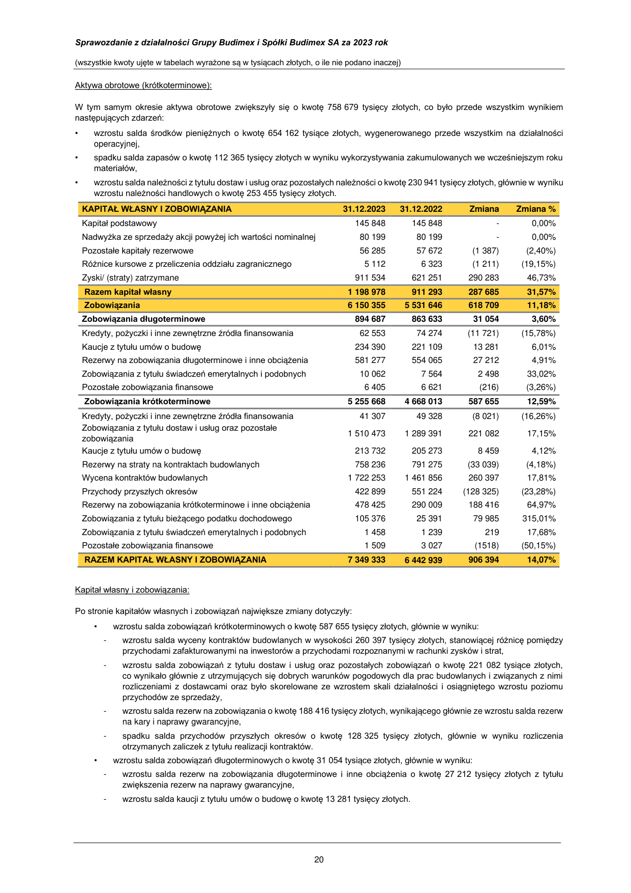

_**Sprawozdanie z działalności Grupy Budimex i Spółki Budimex SA za 2023 rok**_

(wszystkie kwoty ujęte w tabelach wyrażone są w tysiącach złotych, o ile nie podano inaczej)

- część bieżąca w wysokości 310 553 tysiące złotych (w tym minus 18 301 tysięcy stanowiły korekty za poprzednie lata),

- część odroczona w wysokości (127 006) tysięcy złotych.

Na dzień 31 grudnia 2023 roku Grupa rozpoznała aktywa z tytułu odroczonego podatku dochodowego w wysokości
810 426 tysięcy złotych oraz rezerwy z tytułu odroczonego podatku dochodowego w wysokości 1 633 tysiące złotych, podczas gdy
na dzień 31 grudnia 2022 roku Grupa wykazywała aktywa z tego tytułu w kwocie 685 036 tysięcy złotych oraz rezerwę
w kwocie 1 149 tysięcy złotych. Składniki sprawozdania z sytuacji finansowej z tytułu odroczonego podatku dochodowego
w Grupie Budimex wynikają głównie ze specyfiki rozliczeń kontraktów budowlanych, gdzie moment uznania kosztu za poniesiony
i przychodu za zrealizowany są różne w ujęciu podatkowym i księgowym.

Zysk netto przypisany akcjonariuszom Budimex SA z działalności kontynuowanej za rok 2023 roku wyniósł 738 196 tysięcy złotych,
natomiast za rok 2022 wyniósł 534 443 tysiące złotych, co stanowi wzrost o 38,1%.

Zysk netto przypisany udziałom niedającym kontroli za 2023 rok wyniósł 7 869 tysięcy złotych. W poprzednim roku wynik netto
przypisany udziałom niedającym kontroli wynosił 13 686 tysięcy złotych.

**3.1.2** **Charakterystyka podstawowych wielkości ekonomiczno-finansowych Budimex SA**

Sytuację finansową Budimex SA w roku 2023 charakteryzują wybrane wielkości ekonomiczno-finansowe ujawnione
w sprawozdaniu z sytuacji finansowej oraz rachunku zysków i strat (zestawienie poniżej wraz z danymi porównywalnymi
za rok 2022).

_**Sprawozdanie z sytuacji finansowej Budimex SA**_

Główne pozycje sprawozdania z sytuacji finansowej Spółki na dzień 31 grudnia 2023 roku w porównaniu ze stanem na dzień
31 grudnia 2022 roku przedstawia poniższa tabela:

Rzeczowe aktywa trwałe 200 660 192 563 8 097 4,20%

Wartości niematerialne 30 521 34 459 (3 938) (11,43%)

Inwestycje w podmiotach zależnych 489 238 485 513 3 725 0,77%

Inwestycje w podmiotach stowarzyszonych 191 191  - 0,00%

Inwestycje w pozostałych podmiotach 93 3 266 (3 173) (97,15%)

Pozostałe aktywa finansowe 119 238 83 740 35 498 42,39%

Należności z tytułu dostaw i usług oraz pozostałe należności 26 187 24 313 1 874 7,71%

Kaucje z tytułu umów o budowę 65 920 80 269 (14 349) (17,88%)

Aktywa z tytułu odroczonego podatku dochodowego 775 637 655 656 119 981 18,30%

**Aktywa obrotowe (krótkoterminowe)** **5 641 648** **4 882 969** **758 679** **15,54%**

Zapasy 569 646 682 011 (112 365) (16,48%)

Należności z tytułu dostaw i usług oraz pozostałe należności 1 032 531 801 590 230 941 28,81%

Kaucje z tytułu umów o budowę 86 476 77 228 9 248 11,97%

Wycena kontraktów budowlanych 438 299 485 840 (47 541) (9,79%)

Pozostałe aktywa finansowe 29 709 5 475 24 234 442,63%

Środki pieniężne i ich ekwiwalenty 3 484 987 2 830 825 654 162 23,11%

**RAZEM AKTYWA** **7 349 333** **6 442 939** **906 394** **14,07%**

Na dzień 31 grudnia 2023 roku wartość aktywów wzrosła o 906 394 tysiące złotych w stosunku do stanu na koniec grudnia 2022 roku
i wyniosła 7 349 333 tysiące złotych. Główne zmiany w sprawozdaniu z sytuacji finansowej były związane z następującymi
zdarzeniami:

Aktywa trwałe (długoterminowe):

W odniesieniu do aktywów trwałych największe zmiany dotyczyły:

- spadku salda kaucji z tytułu umów o budowę o kwotę 14 349 tysięcy złotych,

- wzrostu salda aktywa z tytułu odroczonego podatku dochodowego o kwotę 119 981 tysięcy złotych na skutek zwiększenia się
salda ujemnych różnic przejściowych od pozycji po stronie zobowiązań,

- wzrostu salda pozostałych aktywów finansowych spowodowanego głównie udzieleniem pożyczek spółkom zależnym:
Magnolia Energy Sp. z o.o., Budimex F Sp. z o.o. oraz Fotowoltaika HIG XIV Sp. z o.o. w łącznej kwocie 22 130 tysięcy złotych
oraz wzrostem z tytułu wyceny instrumentów finansowych.

19

---

## Page 21

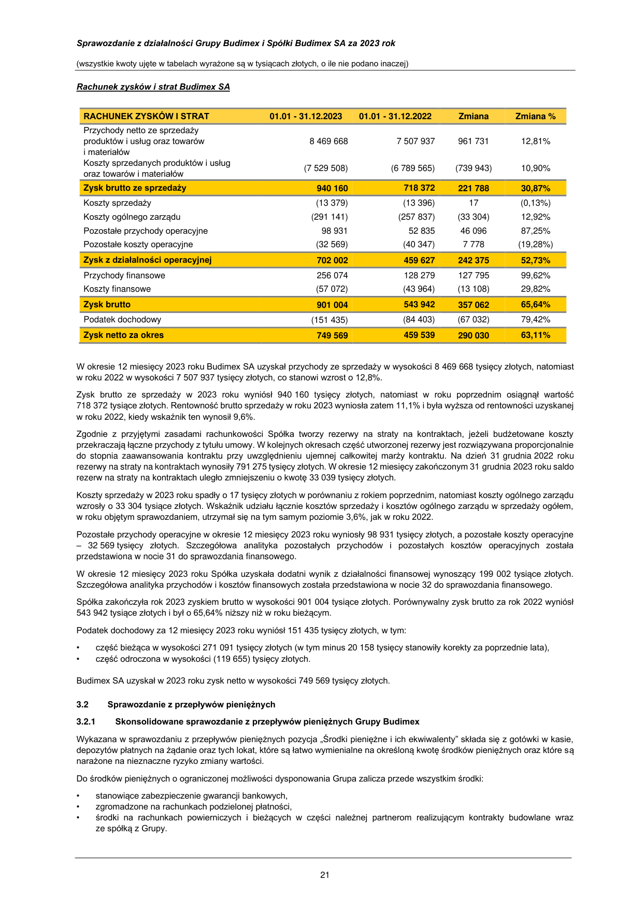

_**Sprawozdanie z działalności Grupy Budimex i Spółki Budimex SA za 2023 rok**_

(wszystkie kwoty ujęte w tabelach wyrażone są w tysiącach złotych, o ile nie podano inaczej)

Aktywa obrotowe (krótkoterminowe):

W tym samym okresie aktywa obrotowe zwiększyły się o kwotę 758 679 tysięcy złotych, co było przede wszystkim wynikiem
następujących zdarzeń:

- wzrostu salda środków pieniężnych o kwotę 654 162 tysiące złotych, wygenerowanego przede wszystkim na działalności
operacyjnej,

- spadku salda zapasów o kwotę 112 365 tysięcy złotych w wyniku wykorzystywania zakumulowanych we wcześniejszym roku
materiałów,

- wzrostu salda należności z tytułu dostaw i usług oraz pozostałych należności o kwotę 230 941 tysięcy złotych, głównie w wyniku
wzrostu należności handlowych o kwotę 253 455 tysięcy złotych.

**KAPITAŁ WŁASNY I ZOBOWIĄZANIA** **31.12.2023** **31.12.2022** **Zmiana** **Zmiana %**

Kapitał podstawowy 145 848 145 848  - 0,00%

Nadwyżka ze sprzedaży akcji powyżej ich wartości nominalnej 80 199 80 199  - 0,00%

Pozostałe kapitały rezerwowe 56 285 57 672 (1 387) (2,40%)

Różnice kursowe z przeliczenia oddziału zagranicznego 5 112 6 323 (1 211) (19,15%)

Zyski/ (straty) zatrzymane 911 534 621 251 290 283 46,73%

**Zobowiązania długoterminowe** **894 687** **863 633** **31 054** **3,60%**

Kredyty, pożyczki i inne zewnętrzne źródła finansowania 62 553 74 274 (11 721) (15,78%)

Kaucje z tytułu umów o budowę 234 390 221 109 13 281 6,01%

Rezerwy na zobowiązania długoterminowe i inne obciążenia 581 277 554 065 27 212 4,91%

Zobowiązania z tytułu świadczeń emerytalnych i podobnych 10 062 7 564 2 498 33,02%

Pozostałe zobowiązania finansowe 6 405 6 621 (216) (3,26%)

**Zobowiązania krótkoterminowe** **5 255 668** **4 668 013** **587 655** **12,59%**

Kredyty, pożyczki i inne zewnętrzne źródła finansowania 41 307 49 328 (8 021) (16,26%)
Zobowiązania z tytułu dostaw i usług oraz pozostałe
1 510 473 1 289 391 221 082 17,15%
zobowiązania

Kaucje z tytułu umów o budowę 213 732 205 273 8 459 4,12%

Rezerwy na straty na kontraktach budowlanych 758 236 791 275 (33 039) (4,18%)

Wycena kontraktów budowlanych 1 722 253 1 461 856 260 397 17,81%

Przychody przyszłych okresów 422 899 551 224 (128 325) (23,28%)

Rezerwy na zobowiązania krótkoterminowe i inne obciążenia 478 425 290 009 188 416 64,97%

Zobowiązania z tytułu bieżącego podatku dochodowego 105 376 25 391 79 985 315,01%

Zobowiązania z tytułu świadczeń emerytalnych i podobnych 1 458 1 239 219 17,68%

Pozostałe zobowiązania finansowe 1 509 3 027 (1518) (50,15%)

**RAZEM KAPITAŁ WŁASNY I ZOBOWIĄZANIA** **7 349 333** **6 442 939** **906 394** **14,07%**

Kapitał własny i zobowiązania:

Po stronie kapitałów własnych i zobowiązań największe zmiany dotyczyły:

    - wzrostu salda zobowiązań krótkoterminowych o kwotę 587 655 tysięcy złotych, głównie w wyniku:

      - wzrostu salda wyceny kontraktów budowlanych w wysokości 260 397 tysięcy złotych, stanowiącej różnicę pomiędzy
przychodami zafakturowanymi na inwestorów a przychodami rozpoznanymi w rachunki zysków i strat,

      - wzrostu salda zobowiązań z tytułu dostaw i usług oraz pozostałych zobowiązań o kwotę 221 082 tysiące złotych,
co wynikało głównie z utrzymujących się dobrych warunków pogodowych dla prac budowlanych i związanych z nimi
rozliczeniami z dostawcami oraz było skorelowane ze wzrostem skali działalności i osiągniętego wzrostu poziomu
przychodów ze sprzedaży,

      - wzrostu salda rezerw na zobowiązania o kwotę 188 416 tysięcy złotych, wynikającego głównie ze wzrostu salda rezerw
na kary i naprawy gwarancyjne,

      - spadku salda przychodów przyszłych okresów o kwotę 128 325 tysięcy złotych, głównie w wyniku rozliczenia
otrzymanych zaliczek z tytułu realizacji kontraktów.

    - wzrostu salda zobowiązań długoterminowych o kwotę 31 054 tysiące złotych, głównie w wyniku:

      - wzrostu salda rezerw na zobowiązania długoterminowe i inne obciążenia o kwotę 27 212 tysięcy złotych z tytułu
zwiększenia rezerw na naprawy gwarancyjne,

      - wzrostu salda kaucji z tytułu umów o budowę o kwotę 13 281 tysięcy złotych.

20

---

## Page 22

_**Sprawozdanie z działalności Grupy Budimex i Spółki Budimex SA za 2023 rok**_

(wszystkie kwoty ujęte w tabelach wyrażone są w tysiącach złotych, o ile nie podano inaczej)

_**Rachunek zysków i strat Budimex SA**_

**RACHUNEK ZYSKÓW I STRAT** **01.01 - 31.12.2023** **01.01 - 31.12.2022** **Zmiana** **Zmiana %**

Przychody netto ze sprzedaży
produktów i usług oraz towarów
i materiałów

8 469 668 7 507 937 961 731 12,81%

Koszty sprzedanych produktów i usług
(7 529 508) (6 789 565) (739 943) 10,90%
oraz towarów i materiałów

**Zysk brutto ze sprzedaży** **940 160** **718 372** **221 788** **30,87%**

Koszty sprzedaży (13 379) (13 396) 17 (0,13%)

Koszty ogólnego zarządu (291 141) (257 837) (33 304) 12,92%

Pozostałe przychody operacyjne 98 931 52 835 46 096 87,25%

Pozostałe koszty operacyjne (32 569) (40 347) 7 778 (19,28%)

**Zysk z działalności operacyjnej** **702 002** **459 627** **242 375** **52,73%**

Przychody finansowe 256 074 128 279 127 795 99,62%

Koszty finansowe (57 072) (43 964) (13 108) 29,82%

**Zysk brutto** **901 004** **543 942** **357 062** **65,64%**

Podatek dochodowy (151 435) (84 403) (67 032) 79,42%

**Zysk netto za okres** **749 569** **459 539** **290 030** **63,11%**

W okresie 12 miesięcy 2023 roku Budimex SA uzyskał przychody ze sprzedaży w wysokości 8 469 668 tysięcy złotych, natomiast
w roku 2022 w wysokości 7 507 937 tysięcy złotych, co stanowi wzrost o 12,8%.

Zysk brutto ze sprzedaży w 2023 roku wyniósł 940 160 tysięcy złotych, natomiast w roku poprzednim osiągnął wartość
718 372 tysiące złotych. Rentowność brutto sprzedaży w roku 2023 wyniosła zatem 11,1% i była wyższa od rentowności uzyskanej
w roku 2022, kiedy wskaźnik ten wynosił 9,6%.

Zgodnie z przyjętymi zasadami rachunkowości Spółka tworzy rezerwy na straty na kontraktach, jeżeli budżetowane koszty
przekraczają łączne przychody z tytułu umowy. W kolejnych okresach część utworzonej rezerwy jest rozwiązywana proporcjonalnie
do stopnia zaawansowania kontraktu przy uwzględnieniu ujemnej całkowitej marży kontraktu. Na dzień 31 grudnia 2022 roku
rezerwy na straty na kontraktach wynosiły 791 275 tysięcy złotych. W okresie 12 miesięcy zakończonym 31 grudnia 2023 roku saldo
rezerw na straty na kontraktach uległo zmniejszeniu o kwotę 33 039 tysięcy złotych.

Koszty sprzedaży w 2023 roku spadły o 17 tysięcy złotych w porównaniu z rokiem poprzednim, natomiast koszty ogólnego zarządu
wzrosły o 33 304 tysiące złotych. Wskaźnik udziału łącznie kosztów sprzedaży i kosztów ogólnego zarządu w sprzedaży ogółem,
w roku objętym sprawozdaniem, utrzymał się na tym samym poziomie 3,6%, jak w roku 2022.

Pozostałe przychody operacyjne w okresie 12 miesięcy 2023 roku wyniosły 98 931 tysięcy złotych, a pozostałe koszty operacyjne

- 32 569 tysięcy złotych. Szczegółowa analityka pozostałych przychodów i pozostałych kosztów operacyjnych została
przedstawiona w nocie 31 do sprawozdania finansowego.

W okresie 12 miesięcy 2023 roku Spółka uzyskała dodatni wynik z działalności finansowej wynoszący 199 002 tysiące złotych.
Szczegółowa analityka przychodów i kosztów finansowych została przedstawiona w nocie 32 do sprawozdania finansowego.

Spółka zakończyła rok 2023 zyskiem brutto w wysokości 901 004 tysiące złotych. Porównywalny zysk brutto za rok 2022 wyniósł
543 942 tysiące złotych i był o 65,64% niższy niż w roku bieżącym.

Podatek dochodowy za 12 miesięcy 2023 roku wyniósł 151 435 tysięcy złotych, w tym:

- część bieżąca w wysokości 271 091 tysięcy złotych (w tym minus 20 158 tysięcy stanowiły korekty za poprzednie lata),

- część odroczona w wysokości (119 655) tysięcy złotych.

Budimex SA uzyskał w 2023 roku zysk netto w wysokości 749 569 tysięcy złotych.

**3.2** **Sprawozdanie z przepływów pieniężnych**

**3.2.1** **Skonsolidowane sprawozdanie z przepływów pieniężnych Grupy Budimex**

Wykazana w sprawozdaniu z przepływów pieniężnych pozycja „Środki pieniężne i ich ekwiwalenty” składa się z gotówki w kasie,
depozytów płatnych na żądanie oraz tych lokat, które są łatwo wymienialne na określoną kwotę środków pieniężnych oraz które są
narażone na nieznaczne ryzyko zmiany wartości.

Do środków pieniężnych o ograniczonej możliwości dysponowania Grupa zalicza przede wszystkim środki:

- stanowiące zabezpieczenie gwarancji bankowych,

- zgromadzone na rachunkach podzielonej płatności,

- środki na rachunkach powierniczych i bieżących w części należnej partnerom realizującym kontrakty budowlane wraz
ze spółką z Grupy.

21

---

## Page 23

_**Sprawozdanie z działalności Grupy Budimex i Spółki Budimex SA za 2023 rok**_

(wszystkie kwoty ujęte w tabelach wyrażone są w tysiącach złotych, o ile nie podano inaczej)

Grupa Budimex rozpoczęła rok 2023 posiadając środki pieniężne na rachunkach bankowych i w kasie w łącznej kwocie
3 249 369 tysięcy złotych, która dla celów sporządzenia sprawozdania z przepływów pieniężnych została zmniejszona o środki

- ograniczonej możliwości dysponowania w wysokości 27 959 tysięcy złotych. Przepływy pieniężne netto za rok 2023 były dodatnie
i wyniosły 654 933 tysiące złotych i na dzień 31 grudnia 2023 roku Grupa wykazała środki pieniężne w wysokości
3 900 290 tysięcy złotych, w tym środki pieniężne o ograniczonej możliwości dysponowania w kwocie 22 396 tysięcy złotych.

W roku 2023 stan środków pieniężnych z działalności operacyjnej zwiększył się o kwotę 1 312 035 tysięcy złotych, przede wszystkim
w związku z mniejszym finansowym zaangażowaniem spółek Grupy (a zwiększonym inwestorów) w realizowane projekty.

Przepływy pieniężne z działalności inwestycyjnej zamknęły się ujemnym saldem w wysokości 131 810 tysięcy złotych, co było
głównie rezultatem nabycia rzeczowych aktywów trwałych oraz udziałów w jednostkach powiązanych.

Przepływy pieniężne z działalności finansowej za 2023 rok były ujemne i wyniosły 525 292 tysiące złotych i były głównie wynikiem
wypłaty dywidendy za rok 2022 oraz spłaty zobowiązań leasingowych i kredytowych.

**3.2.2** **Sprawozdanie z przepływów pieniężnych Budimex SA**

Saldo środków pieniężnych na rachunkach bankowych i w kasie Spółki na początku 2023 roku wynosiło 2 830 825 tysięcy złotych.
Na potrzeby sporządzenia sprawozdania z przepływów pieniężnych kwota ta została skorygowana o środki o ograniczonej
możliwości dysponowania w wysokości 9 010 tysięcy złotych, dotyczące głównie środków zgromadzonych na rachunkach
podzielonej płatności oraz na rachunkach konsorcjów w części przypadającej na współkonsorcjantów. Przepływy pieniężne netto
w okresie 12 miesięcy 2023 roku były dodatnie i wyniosły 648 690 tysięcy złotych i na dzień 31 grudnia 2023 roku Spółka wykazała
środki pieniężne w wysokości 3 484 987 tysięcy złotych, w tym środki pieniężne o ograniczonej możliwości dysponowania w kwocie
12 930 tysięcy złotych.

W roku 2023 stan środków pieniężnych z działalności operacyjnej zwiększył się o 1 176 541 tysięcy złotych.

Stan środków pieniężnych Spółki z działalności inwestycyjnej zmniejszył się o kwotę 7 125 tysięcy złotych, w czym największy udział
miało nabycie rzeczowych aktywów trwałych oraz udzielenie pożyczek spółkom z Grupy, w tym Budimex F Sp. z o.o., Mostostal
Kraków SA i Fotowoltaika HIG XIV Sp. z o.o. przy jednoczesnym otrzymaniu dywidend, w tym od FBSerwis SA, Budimex
Budownictwo Sp. z o.o. oraz Mostostal Kraków SA.

Przepływy pieniężne z działalności finansowej za 2023 rok były ujemne i wyniosły 520 726 tysięcy złotych. Wydatki dotyczyły wypłaty
przez Spółkę dywidendy w kwocie 459 286 tysięcy złotych oraz spłaty zobowiązań leasingowych.

**3.3** **Zarządzanie zasobami finansowymi**

**3.3.1** **Zarządzanie zasobami finansowymi Grupy Budimex**

Stan środków pieniężnych oraz płynnych lokat Grupy Budimex wynosił na dzień 31 grudnia 2023 roku 3 900 290 tysięcy złotych
i był o 650 921 tysięcy złotych wyższy niż stan na dzień 31 grudnia 2022 roku. Do najważniejszych czynników mających wpływ na
powyższą zmianę stanu zasobów finansowych Grupy Budimex w trakcie roku 2023 zaliczyć należy następujące zdarzenia:

- utrzymanie wysokiej rentowności działalności budowlanej,

- korzystne zmiany składników kapitału obrotowego netto w segmencie budowlanym, w tym spadek salda zapasów,

- istotny wzrost przychodów finansowych z odsetek od środków pieniężnych wskutek utrzymujących się wysokich stóp
procentowych,

- utrzymanie wysokiej rentowności w segmencie odbioru i zagospodarowania odpadów Grupy FBSerwis,

- wypłacona przez Budimex SA dywidenda w kwocie 459 286 tysięcy złotych, która miała miejsce w czerwcu 2023

Nadwyżki środków pieniężnych Grupy były - zgodnie z polityką Grupy – lokowane w depozyty bankowe w bankach posiadających
wysokie ratingi kredytowe. Ponadto, spółka Budimex SA wykorzystywała nadwyżki środków pieniężnych do finansowania swoich
dostawców usług i materiałów, co wpływało pozytywnie na płynność finansową tychże dostawców.

Jednocześnie Grupa Budimex posiadała zadłużenie zewnętrzne z tytułu kredytów bankowych, pożyczek i leasingu, które na dzień
31 grudnia 2023 roku wynosiło 236 591 tysięcy złotych, w tym kwota 130 153 tysiące złotych to wartość zobowiązań leasingowych
rozpoznanych zgodnie z MSSF 16. Kwota zadłużenia zewnętrznego Grupy z tytułu kredytów bankowych, pożyczek i leasingu,
niezawierająca zobowiązań wykazywanych zgodnie z MSSF 16, wynosiła 106 438 tysięcy złotych i tym samym była wyższa

- 12 779 tysięcy złotych w porównaniu do stanu na dzień 31 grudnia 2022 roku (tabela poniżej). Na kwotę zadłużenia Grupy składają
się przede wszystkim:

- zadłużenie Budimex SA, Budimex Kolejnictwo SA, Mostostal Kraków SA i spółek Grupy FBSerwis z tytułu umów leasingu

finansowego (zawartych w celu finansowania nabycia składników rzeczowego majątku trwałego),

- zadłużenie Magnolia Energy Sp. z o.o. z tytułu kredytu na finansowanie projektu OZE (farma wiatrowa) – zadłużenie bez regresu

do Budimex SA,

- zadłużenie Budimex Parking Wrocław Sp. z o.o. z tytułu kredytu na finansowanie projektu koncesyjnego i pożyczki

podporządkowanej udzielonej przez mniejszościowego udziałowca - zadłużenie bez regresu do Budimex SA

- zadłużenie FBSerwis Kamieńsk Sp. z o.o. z tytułu pożyczki udzielonej przez NFOŚiGW na finansowanie inwestycji związanej

z gospodarką odpadami.

W trakcie roku 2023 roku Budimex SA nie korzystał z linii kredytowych, do których dostęp posiada.

22

---

## Page 24

_**Sprawozdanie z działalności Grupy Budimex i Spółki Budimex SA za 2023 rok**_

(wszystkie kwoty ujęte w tabelach wyrażone są w tysiącach złotych, o ile nie podano inaczej)

Utrzymujące się wysokie stopy procentowe w Polsce w roku 2023 roku nie wpływały w istotny sposób negatywnie na wyniki
finansowe Grupy Budimex poprzez rosnące koszty odsetkowe ze względu na:

- relatywnie niski poziom zadłużenia finansowego Grupy: 106 438 tysięcy złotych (tabela poniżej),

- stałą stopę procentową pożyczki z NFOŚiGW

- zawarte transakcje zabezpieczające ryzyko stóp procentowych w Budimex Parking Wrocław Sp. z o.o.

- długoterminowe

- długoterminowe (zobowiązania z tytułu leasingu - MSSF 16):

83 322

89 083

61 743

86 963

89 797

65 472

 - krótkoterminowe 23 116 31 916 40 752

 - krótkoterminowe (zobowiązania z tytułu leasingu - MSSF 16): 41 070 44 519 43 025

**Ogółem** **236 591** **225 141** **239 046**

Strukturę finansowania Grupy Budimex obrazują następujące wskaźniki:

**Wskaźnik** **31.12.2023** **31.12.2022** **31.12.2021**

**Pokrycie majątku kapitałem własnym:**

_(kapitał własny przypadający na akcjonariuszy jednostki dominującej) /_
_(aktywa ogółem)_

**Pokrycie majątku trwałego kapitałem własnym:**

_(kapitał własny przypadający na akcjonariuszy jednostki dominującej) /_
_(aktywa trwałe)_

0,18 0,17 0,19

0,76 0,69 0,79

**Wskaźnik** **31.12.2023** **31.12.2022** **31.12.2021**

**Wskaźnik zadłużenia całkowitego:**

_(aktywa ogółem - kapitał własny przypadający na akcjonariuszy_
_jednostki dominującej) / (aktywa ogółem)_

**Wskaźnik zadłużenia kapitałów własnych:**

_(aktywa ogółem - kapitał własny przypadający na akcjonariuszy_
_jednostki dominującej) / (kapitał własny przypadający na akcjonariuszy_
_jednostki dominującej)_

0,82 0,83 0,81

4,50 4,87 4,20

Na koniec roku 2023, w porównaniu do końca 2022 roku, wskaźniki struktury finansowania Grupy pozostawały na zbliżonym
poziomie. Wskaźniki płynności (bieżącej oraz szybkiej) na koniec roku 2023 zwiększyły się nieznacznie, pomimo wypłaconej przez
Budimex SA dywidendy.

**Wskaźnik** **31.12.2023** **31.12.2022** **31.12.2021**

Płynność bieżąca
1,12 1,10 1,16
_(aktywa obrotowe) / (zobowiązania krótkoterminowe)_

Płynność szybka
1,01 0,95 1,06
_(aktywa obrotowe – zapasy) / (zobowiązania krótkoterminowe)_

Obecna bardzo dobra sytuacja finansowa Grupy Budimex, posiadane zasoby gotówkowe, dostęp do limitów kredytowych
w bankach oraz nieznaczny poziom zadłużenia finansowego powodują, że nie ma zagrożeń dla finansowania działalności Grupy
w roku 2024.

**3.3.2** **Zarządzanie zasobami finansowymi Budimex SA**

Stan środków pieniężnych i płynnych lokat Budimex SA wynosił na dzień 31 grudnia 2023 roku 3 484 987 tysięcy złotych
i był o 654 162 tysięcy złotych wyższy niż stan na dzień 31 grudnia 2022 roku. Do najważniejszych czynników mających wpływ na
powyższą zmianę stanu zasobów finansowych Budimex SA w trakcie roku 2023 zaliczyć należy następujące zdarzenia:

- utrzymująca się wysoka rentowność działalności Budimex SA,

- korzystne zmiany składników kapitału obrotowego netto, w tym wzrost salda zaliczek kontraktowych,

- istotny wzrost przychodów finansowych z odsetek od środków pieniężnych wskutek wzrostu stóp procentowych,

- wypłacona przez Budimex SA dywidenda w kwocie 459 286 tysięcy złotych, która miała miejsce w czerwcu 2023.

Jednocześnie Spółka posiadała zadłużenie zewnętrzne z tytułu kredytów, pożyczek i innych zewnętrznych źródeł finansowania,
w tym z tytułu leasingu, które na 31 grudnia 2023 roku wynosiło 103 860 tysięcy złotych, w tym kwota 88 757 tysięcy złotych to

23

---

## Page 25

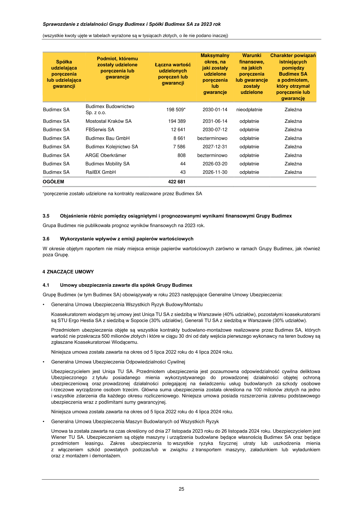

_**Sprawozdanie z działalności Grupy Budimex i Spółki Budimex SA za 2023 rok**_

(wszystkie kwoty ujęte w tabelach wyrażone są w tysiącach złotych, o ile nie podano inaczej)

wartość zobowiązań leasingowych rozpoznanych zgodnie z MSSF 16. Porównywalna z latami poprzednimi kwota zadłużenia
zewnętrznego Budimex SA z tytułu kredytów bankowych, pożyczek i leasingu rozumianego zgodnie z MSR 17, a więc nie
zawierająca zobowiązań leasingowych wykazywanych zgodnie z MSSF 16, wynosiła 15 103 tysiące złotych i tym samym była
niższa o 16 830 tysięcy złotych w porównaniu do stanu na dzień 31 grudnia 2022 roku oraz o 41 672 tysiące złotych niższa od stanu
na koniec 2021 roku (tabela poniżej). Na kwotę zadłużenia finansowego [2] Budimex SA składają się wyłącznie zobowiązania z tytułu
zawartych umów leasingu dotyczących maszyn i urządzeń niezbędnych do realizacji kontraktów drogowych. Na koniec roku 2022
Spółka nie posiadała zadłużenia z tytułu wyemitowanych obligacji.

- długoterminowe

- długoterminowe (zobowiązania z tytułu leasingu - MSSF 16):

4 706

57 847

13 919

60 355

32 631

38 647

 - krótkoterminowe 10 397 18 014 24 144

 - krótkoterminowe (zobowiązania z tytułu leasingu - MSSF 16): 30 910 31 314 30 270

**Ogółem** **103 860** **123 602** **125 692**

Strukturę finansowania Budimex SA obrazują następujące wskaźniki:

**Wskaźnik** **31.12.2023** **31.12.2022** **31.12.2021**

**Pokrycie majątku kapitałem własnym:**
_(kapitał własny) / (aktywa ogółem)_

**Pokrycie majątku trwałego kapitałem własnym:**
_(kapitał własny) / (aktywa trwałe)_

**Wskaźnik zadłużenia całkowitego:**
_(aktywa ogółem – kapitał własny) / (aktywa ogółem)_

**Wskaźnik zadłużenia kapitałów własnych:**
_(aktywa ogółem – kapitał własny) / (kapitał własny)_

0,16 0,14 0,17

0,70 0,58 0,76

0,84 0,86 0,83

5,13 6,07 4,71

Na koniec roku 2023 trwałość struktury finansowania opisana powyższymi wskaźnikami poprawiła się w stosunku do roku 2022.
Najistotniejszy wpływ na powyższe wskaźniki miały dwa przeciwstawne zjawiska: wysoka zyskowność Spółki (wysoka rentowność
operacyjna oraz wysoki wynik na działalności finansowej - przychody odsetkowe i otrzymane dywidendy) skutkująca wzrostem
kapitałów własnych oraz polityka dywidend (coroczne wypłaty bliskie kwocie wypracowanych przez Spółkę zysków netto)
ograniczająca tempo wzrostu kapitałów własnych. W roku 2023 poprawiły się również wskaźniki płynności w stosunku do roku 2022,
osiągając poziomy zbliżone do obserwowanych na koniec roku 2021 (tabela poniżej).

**Wskaźnik** **31.12.2023** **31.12.2022** **31.12.2021**

Płynność bieżąca
(aktywa obrotowe) / (zobowiązania krótkoterminowe)

Płynność szybka
(aktywa obrotowe – zapasy) / (zobowiązania krótkoterminowe)

1,07 1,05 1,13

0,97 0,90 1,03

Sytuacja Spółki w zakresie płynności oraz dostępu do zewnętrznych źródeł finansowania jest obecnie bardzo dobra i brak jest
zagrożeń dla finansowania działalności w roku 2024.

**3.4** **Zobowiązania i należności warunkowe Grupy Budimex**

Poręczenia, gwarancje oraz inne zobowiązania i należności warunkowe zostały opisane w nocie 44 skonsolidowanego
sprawozdania finansowego Grupy Budimex oraz nocie 44 sprawozdania finansowego Budimex SA.

Udzielone przez Budimex SA lub przez jednostki od niego zależne poręczenia kredytu lub pożyczki oraz udzielone gwarancje
według stanu na dzień 31 grudnia 2023 roku przedstawia poniższa tabela:

2 pozycje nieobejmujące kwot składających się na zobowiązania z tytułu leasingu wykazywane zgodnie MSSF 16

24

---

## Page 26

_**Sprawozdanie z działalności Grupy Budimex i Spółki Budimex SA za 2023 rok**_

(wszystkie kwoty ujęte w tabelach wyrażone są w tysiącach złotych, o ile nie podano inaczej)

Budimex Budownictwo
Budimex SA 198 509* 2030-01-14 nieodpłatnie Zależna
Sp. z o.o.

Budimex SA Mostostal Kraków SA 194 389 2031-06-14 odpłatnie Zależna

Budimex SA FBSerwis SA 12 641 2030-07-12 odpłatnie Zależna

Budimex SA Budimex Bau GmbH 8 661 bezterminowo odpłatnie Zależna

Budimex SA Budimex Kolejnictwo SA 7 586 2027-12-31 odpłatnie Zależna

Budimex SA ARGE Oberkrämer 808 bezterminowo odpłatnie Zależna

Budimex SA Budimex Mobility SA 44 2026-03-20 odpłatnie Zależna

Budimex SA RailBX GmbH 43 2026-11-30 odpłatnie Zależna

**OGÓŁEM** **422 681**

*poręczenie zostało udzielone na kontrakty realizowane przez Budimex SA

**3.5** **Objaśnienie różnic pomiędzy osiągniętymi i prognozowanymi wynikami finansowymi Grupy Budimex**

Grupa Budimex nie publikowała prognoz wyników finansowych na 2023 rok.

**3.6** **Wykorzystanie wpływów z emisji papierów wartościowych**

W okresie objętym raportem nie miały miejsca emisje papierów wartościowych zarówno w ramach Grupy Budimex, jak również
poza Grupę.

**4 ZNACZĄCE UMOWY**

**4.1** **Umowy ubezpieczenia zawarte dla spółek Grupy Budimex**

Grupę Budimex (w tym Budimex SA) obowiązywały w roku 2023 następujące Generalne Umowy Ubezpieczenia:

- Generalna Umowa Ubezpieczenia Wszystkich Ryzyk Budowy/Montażu

Koasekuratorem wiodącym tej umowy jest Uniqa TU SA z siedzibą w Warszawie (40% udziałów), pozostałymi koasekuratorami
są STU Ergo Hestia SA z siedzibą w Sopocie (30% udziałów), Generali TU SA z siedzibą w Warszawie (30% udziałów).

Przedmiotem ubezpieczenia objęte są wszystkie kontrakty budowlano-montażowe realizowane przez Budimex SA, których
wartość nie przekracza 500 milionów złotych i które w ciągu 30 dni od daty wejścia pierwszego wykonawcy na teren budowy są
zgłaszane Koasekuratorowi Wiodącemu.

Niniejsza umowa została zawarta na okres od 5 lipca 2022 roku do 4 lipca 2024 roku.

- Generalna Umowa Ubezpieczenia Odpowiedzialności Cywilnej

Ubezpieczycielem jest Uniqa TU SA. Przedmiotem ubezpieczenia jest pozaumowna odpowiedzialność cywilna deliktowa
Ubezpieczonego z tytułu posiadanego mienia wykorzystywanego do prowadzonej działalności objętej ochroną
ubezpieczeniową oraz prowadzonej działalności polegającej na świadczeniu usług budowlanych za szkody osobowe
i rzeczowe wyrządzone osobom trzecim. Główna suma ubezpieczenia została określona na 100 milionów złotych na jedno
i wszystkie zdarzenia dla każdego okresu rozliczeniowego. Niniejsza umowa posiada rozszerzenia zakresu podstawowego
ubezpieczenia wraz z podlimitami sumy gwarancyjnej.

Niniejsza umowa została zawarta na okres od 5 lipca 2022 roku do 4 lipca 2024 roku.

- Generalna Umowa Ubezpieczenia Maszyn Budowlanych od Wszystkich Ryzyk

Umowa ta została zawarta na czas określony od dnia 27 listopada 2023 roku do 26 listopada 2024 roku. Ubezpieczycielem jest
Wiener TU SA. Ubezpieczeniem są objęte maszyny i urządzenia budowlane będące własnością Budimex SA oraz będące
przedmiotem leasingu. Zakres ubezpieczenia to wszystkie ryzyka fizycznej utraty lub uszkodzenia mienia
z włączeniem szkód powstałych podczas/lub w związku z transportem maszyny, załadunkiem lub wyładunkiem
oraz z montażem i demontażem.

25

---

## Page 27

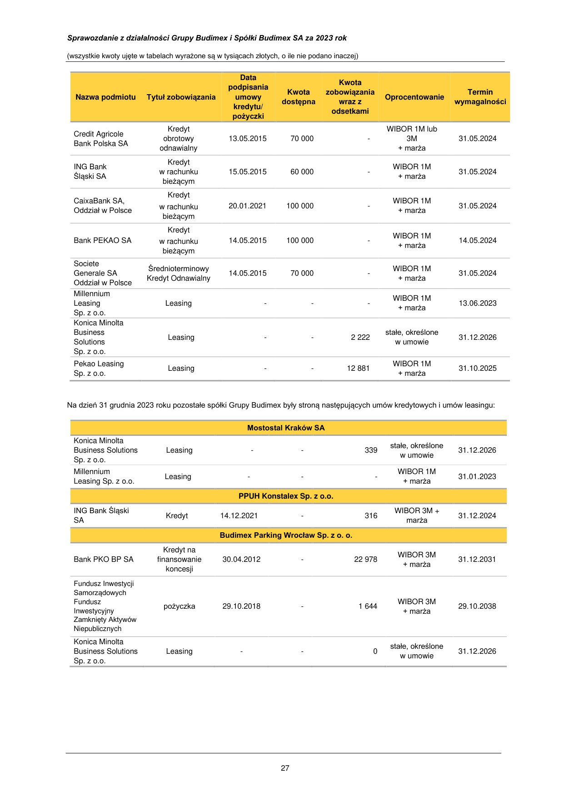

_**Sprawozdanie z działalności Grupy Budimex i Spółki Budimex SA za 2023 rok**_

(wszystkie kwoty ujęte w tabelach wyrażone są w tysiącach złotych, o ile nie podano inaczej)

- Pozostałe istotne umowy ubezpieczenia

W 2023 roku została przedłużona z Chubb Umowa Ubezpieczenia Odpowiedzialności Cywilnej członków władz spółek Grupy
Budimex. Kolejne przedłużenie objęło okres od 22 lipca 2023 roku do 21 lipca 2024 roku. Zakres podmiotowy ubezpieczenia
obejmuje członków władz (rad nadzorczych, zarządów oraz prokurentów) spółek Grupy Budimex oraz spółek zależnych.

**4.2** **Umowy o współpracy i kooperacji obowiązujące w roku 2023**

Umowy o współpracy i kooperacji zawarte w roku 2023:

1 Involt Sp. z o.o. Sp. komandytowa osprzęt sieci trakcyjnej kolejowej 35 201 2023-11-15

2 Confirme Sp. z o.o. stal zbrojeniowa 14 659 2023-11-22

3 Fabryka Urządzeń Kolejowych Sp. z o.o. konstrukcje wsporcze 10 766 2023-12-05

4 Petrolift Sp. z o.o. sprzęt budowlany 9 942 2023-02-22

5 UNIMOT Bitumen Sp. z o.o. asfalty drogowe 7 913 2023-01-26

6 Lausitz Energie Bergbau AG pył węglowy 7 158 2023-01-01

7 TOM 2 Sp. z o.o. elementy zbrojarskie 6 416 2023-04-24

8 KUCA Sp. z o.o. konstrukcje wsporcze 5 968 2023-11-03

9 KENPOL Holding Sp z o.o. materiały ogólnobudowlane 5 873 2023-01-19

10 Grupa Amako Sp. z o.o. usługi spawalnicze i monterskie 3 521 2023-12-11

Umowy przedstawione powyżej są umowami ramowymi o współpracy bez zasady wyłączności i nie stanowią zobowiązania Grupy
Budimex oraz Budimex SA.

Umowy o współpracy i kooperacji zawarte przed rokiem 2023 i obowiązujące w roku 2023:

**Dostawca** **Przedmiot umowy** **Roczna wartość** **Data zawarcia**

1 ORLEN Asfalt Sp. z o.o. asfalty drogowe 64 547

2018-03-26
2016-01-19
2012-04-20

materiały do wykonania sieci 2013-04-30
2 HTI BP Sp. z o.o. WARSZAWA sp.k 45 876
i instalacji wodno-kanalizacyjnych

3 Lafarge Cement SA beton towarowy 40 338 2016-04-15
4 Moris Sp. z o.o. wyroby hutnicze 38 221 2019-03-06

ArcelorMittal Distribution Solutions z zbrojenia do betonu, 2011-05-24
5 37 688
Poland Sp. z o.o. stal zbrojeniowa 2013-06-25

6 IMPOSTAL Sp. z o.o. rury stalowe 31 821 2020-07-16

rury i elementy konstrukcyjne
7 ViaCon Polska Sp. z o.o. 30 034 2006-02-14
do budowy przepustów

8 Lafarge Kruszywa i Beton Sp. z o.o. kruszywa 24 823 2010-06-01
9 PKP CARGO SA usługi przewozowe 24 149 2019-01-15

2010-03-01
10 Stalprodukt SA bariery drogowe i mostowe 23 910
2007-06-18

Umowy przedstawione powyżej są umowami ramowymi o współpracy, bez zasady wyłączności i nie stanowią zobowiązania Grupy
Budimex oraz Budimex SA.

**4.3** **Transakcje z podmiotami powiązanymi**

Szczegółowe informacje na temat transakcji z podmiotami powiązanymi zostały zamieszczone w nocie 39 skonsolidowanego
sprawozdania finansowego Grupy Budimex oraz nocie 37 sprawozdania finansowego Budimex SA.

**4.4** **Zaciągnięte kredyty i pożyczki**

Na dzień 31 grudnia 2023 roku Budimex SA posiadał następujące kredyty, pożyczki oraz umowy leasingu:

26

---

## Page 28

_**Sprawozdanie z działalności Grupy Budimex i Spółki Budimex SA za 2023 rok**_

(wszystkie kwoty ujęte w tabelach wyrażone są w tysiącach złotych, o ile nie podano inaczej)

WIBOR 1M lub

Credit Agricole
Bank Polska SA

ING Bank
Śląski SA

CaixaBank SA,
Oddział w Polsce

Bank PEKAO SA

Societe
Generale SA
Oddział w Polsce

Millennium
Leasing
Sp. z o.o.

Konica Minolta
Business
Solutions
Sp. z o.o.

Kredyt
obrotowy
odnawialny

Kredyt
w rachunku

bieżącym

Kredyt

w rachunku

bieżącym

Kredyt

w rachunku

bieżącym

13.05.2015 70 000 

3M
+ marża

31.05.2024

WIBOR 1M
15.05.2015 60 000 - 31.05.2024

+ marża

WIBOR 1M
20.01.2021 100 000 - 31.05.2024

+ marża

WIBOR 1M
14.05.2015 100 000 - 14.05.2024

+ marża

Średnioterminowy WIBOR 1M
14.05.2015 70 000            - 31.05.2024
Kredyt Odnawialny + marża

WIBOR 1M
Leasing - - - 13.06.2023

+ marża

stałe, określone
Leasing - - 2 222 31.12.2026

w umowie

Pekao Leasing WIBOR 1M
Leasing              -              - 12 881 31.10.2025
Sp. z o.o. + marża

Na dzień 31 grudnia 2023 roku pozostałe spółki Grupy Budimex były stroną następujących umów kredytowych i umów leasingu:

**Mostostal Kraków SA**

Konica Minolta
Business Solutions
Sp. z o.o.

stałe, określone
Leasing - - 339 31.12.2026

w umowie

Millennium WIBOR 1M
Leasing              -              -              - 31.01.2023
Leasing Sp. z o.o. + marża

**PPUH Konstalex Sp. z o.o.**

ING Bank Śląski WIBOR 3M +
Kredyt 14.12.2021              - 316 31.12.2024
SA marża

**Budimex Parking Wrocław Sp. z o. o.**

Bank PKO BP SA

Fundusz Inwestycji
Samorządowych
Fundusz
Inwestycyjny
Zamknięty Aktywów
Niepublicznych

Konica Minolta
Business Solutions
Sp. z o.o.

Kredyt na
finansowanie

koncesji

stałe, określone
Leasing - - 0 31.12.2026

w umowie

27

WIBOR 3M
30.04.2012 - 22 978 31.12.2031

+ marża

WIBOR 3M
pożyczka 29.10.2018 - 1 644 29.10.2038

+ marża

---

## Page 29

_**Sprawozdanie z działalności Grupy Budimex i Spółki Budimex SA za 2023 rok**_

(wszystkie kwoty ujęte w tabelach wyrażone są w tysiącach złotych, o ile nie podano inaczej)

**Budimex Kolejnictwo SA**

Pekao WIBOR 1M
Leasing             -             - 1 607 31.07.2025
Leasing Sp. z o.o. + marża

Millennium WIBOR 1M
Leasing             -             - 3 674 31.12.2027
Leasing Sp. z o.o. + marża

Konica Minolta
Business Solutions
Sp. z o.o.

Bank
Gospodarstwa
Krajowego

stałe, określone
Leasing - - 10 31.12.2026

w umowie

**Magnolia Energy Sp. z o.o.**

WIBOR 3M
Kredyt 26.01.2024 - 42 823 25.06.2038

+ marża

**FBSERWIS KAMIEŃSK Sp. z o. o.**

stałe, określone
NFOŚIGW Pożyczka - - 6 907 31.03.2026

w umowie

**FBSERWIS SA**

Societe
Generale SA
Oddział w Polsce

Bank PEKAO SA

Kredyt
w rachunku

bieżącym

Kredyt

w rachunku

bieżącym

WIBOR 1M
30.12.2021 - 31.12.2023
20 000 + marża

WIBOR 1M
31.03.2022 20 000 - 31.03.2024

+ marża

Santander WIBOR 1M
Leasing             -             - 1 979 30.06.2025
Leasing SA + marża

Millennium WIBOR 1M
Leasing              -              - 676 28.02.2029
Leasing Sp. z o. o + marża

**FBSERWIS WROCŁAW Sp. z o. o.**

Santander WIBOR 1M
Leasing             -             - 3 226 30.06.2025
Leasing SA + marża

WIBOR 1M
mLeasing Sp. z o.o. Leasing - - - 28.12.2025

+ marża

WIBOR 1M
- - 932 28.02.2029

+ marża

Millennium
Leasing Sp. z o.o.

Leasing

Pekao Leasing WIBOR 1M
Leasing             -             - 174 12.07.2025
Sp. z o. o. + marża

**FBSERWIS KARPATIA Sp. z o. o.**

Santander WIBOR 1M
Leasing               -               - 1 596 31.10.2025
Leasing SA + marża

Europejski Fundusz WIBOR 1M
Leasing               -               -               - 18.03.2023
Leasingowy SA + marża

WIBOR 1M
mLeasing Sp. z o.o. Leasing  -  - 474 28.12.2025

+ marża

Millennium Leasing WIBOR 1M
Leasing               -               - 1 980 30.04.2026
Sp. z o.o. + marża

**4.5** **Główne lokaty kapitałowe i inwestycje kapitałowe dokonane w 2023 roku**

W 2023 roku Jednostka Dominująca nie dokonywała inwestycji kapitałowych w jednostki spoza Grupy Budimex. Spółka zależna od
Budimex SA - Mostostal Kraków SA w dniu 15 maja 2023 roku nabyła udziały w spółce Przedsiębiorstwo Produkcyjno-UsługowoHandlowe Konstalex Sp. z o.o. Szczegółowe informacje na temat tej transakcji zostały zawarte w nocie 7.1 skonsolidowanego
sprawozdania Grupy Budimex. Opis inwestycji kapitałowych w ramach Grupy Budimex zawiera punkt 2.1.

28

---

## Page 30

_**Sprawozdanie z działalności Grupy Budimex i Spółki Budimex SA za 2023 rok**_

(wszystkie kwoty ujęte w tabelach wyrażone są w tysiącach złotych, o ile nie podano inaczej)

**4.6** **Informacje o udzielonych w danym roku obrotowym pożyczkach, ze szczególnym uwzględnieniem pożyczek**
**udzielonych jednostkom powiązanym**

Szczegóły dotyczące pożyczek udzielonych zostały ujawnione w nocie 14.1 skonsolidowanego sprawozdania Grupy Budimex oraz
w nocie 14.2 sprawozdania finansowego Budimex SA.

**5 INFORMACJE POZOSTAŁE**

**5.1** **Informacje o stanie posiadania akcji Jednostki Dominującej oraz akcji/udziałów w jednostkach powiązanych**
**przez osoby zarządzające i nadzorujące Jednostkę Dominującą**

Na dzień 31 grudnia 2023 roku członkowie Zarządu Budimex SA posiadali następującą ilość akcji:

- Artur Popko - 2 031 akcji

- Marcin Węgłowski - 2 830 akcji

- Anna Karyś-Sosińska - 1 200 akcji

Na dzień 31 grudnia 2023 roku członkowie Rady Nadzorczej Budimex SA posiadali następującą ilość akcji:

- Marek Michałowski - 4 000 akcji

**5.2** **Informacje o nabyciu akcji własnych**

W roku 2023 Budimex SA nie dokonał nabycia akcji własnych.

**5.3** **Informacje o systemie kontroli programów akcji pracowniczych**

Spółka nie wprowadziła programów akcji pracowniczych.

**5.4** **Informacje o znanych Spółce umowach (w tym również zawartych po dniu bilansowym), w wyniku których mogą**
**w przyszłości nastąpić zmiany w proporcjach posiadanych akcji przez dotychczasowych akcjonariuszy**

Na dzień publikacji niniejszego sprawozdania Budimex SA nie posiada informacji o umowach, w wyniku których mogą w przyszłości
nastąpić zmiany w proporcjach posiadanych akcji przez dotychczasowych akcjonariuszy.

**5.5** **Informacja o prowadzonej działalności charytatywnej i sponsoringowej**

Odpowiedzialność, uczciwość czy wrażliwość na innych to wartości, którymi Grupa Budimex kieruje się od lat. Stworzenie Strategii
CSR Grupy Budimex na lata 2021-2023 miało na celu wyłącznie uporządkowanie i przyspieszenie działań w tym zakresie i nie
wymagało zmiany tożsamości czy kultury organizacyjnej firmy. By wzmocnić jej potencjał i jeszcze lepiej odpowiadać na wyzwania
przyszłości oraz stawać się jeszcze bardziej wiarygodnym partnerem w biznesie, dotychczasowe doświadczenia organizacji w
sferze zrównoważonego rozwoju zostały przekute w Strategię ESG na lata 2023-2026 z perspektywą do 2050 roku. Dokument
ogłoszony w dniu 30 czerwca 2023 roku, którego tytuł i zarazem myśl przewodnia brzmi Zmieniamy dla Was świat! I zmieniamy
siebie, systematyzuje podejście oraz plany Grupy Budimex w odniesieniu do środowiska (E – environment), odpowiedzialności
społecznej (S – social responsibility) i ładu korporacyjnego (G – governance). W każdym z tych obszarów wyznaczone zostały cele
strategiczne, odpowiadające na kluczowe wyzwania dla sektora budowlanego oraz spójne z globalnymi Celami Zrównoważonego
Rozwoju ONZ. Mają one nadać tempa działaniom organizacji oraz ułatwić mierzenie postępów. Ich wypełnianie wesprze
zrównoważony rozwój Spółki, w tym pozwoli jej osiągnąć w dłuższej perspektywie neutralność klimatyczną oraz przewodzić
pozytywnej zmianie w całej branży budowlanej.

Za realizację zobowiązań określonych w strategii odpowiedzialni są liderzy zespołów, którzy mieli swój udział w opracowywaniu
dokumentu: Dyrektor Biura ESG, Jakości i Ochrony Środowiska (nadzór nad strategią), Kierownik ds. ESG (obszar środowiskowy),
Dyrektor Pionu Zarządzania Zasobami Ludzkimi (obszar społeczny) oraz Dyrektor ds. prawnych obszarów korporacyjnych (ład
korporacyjny).

Budimex SA nieprzerwanie od roku 2011 pozostawał w składzie RESPECT Index – pierwszego w Europie Środkowo-Wschodniej
indeksu giełdowego skupiającego akcje spółek odpowiedzialnych społecznie, a od września 2019 roku znalazł się
w składzie indeksu WIG-ESG, który zastąpił RESPECT Index.

Budimex SA przywiązuje ogromną wagę̨ do współpracy ze społecznościami lokalnymi, w tym wspierania ich, a także do
ograniczania negatywnego wpływu na mieszkańców terenów, na których firma prowadzi swoją działalność́.

Zarzadzanie obszarem oddziaływania społecznego Grupy Budimex określone zostało w „Zasadach Polityki Odpowiedzialności
Spółki”. Dokument ten obejmuje m.in. postanowienia bezpośrednio lub pośrednio związane z aspektami społecznego
oddziaływania, nakazując etyczne i odpowiedzialne postępowanie w odniesieniu do wszystkich prowadzonych działań́,
przejrzystość́ i stosowanie najlepszych praktyk w zakresie nadzoru właścicielskiego, a także przyczynianie się̨ do rozwoju
społeczno-ekonomicznego.

Drugim dokumentem funkcjonującym w tym obszarze jest „Polityka współpracy ze społecznościami lokalnymi”. Wskazuje ona
na konkretne działania, jakie muszą zostać́ podjęte zarówno przed rozpoczęciem prac budowlanych (prowadzenie dialogu
ze społecznością̨ lokalną na temat danego projektu pozwalającego na rozwiewanie ewentualnych obaw związanych z realizacją
inwestycji), jak i w trakcie trwania kontraktu (budowanie relacji z otoczeniem społecznym przedsięwzięcia).

29

---

## Page 31

_**Sprawozdanie z działalności Grupy Budimex i Spółki Budimex SA za 2023 rok**_

(wszystkie kwoty ujęte w tabelach wyrażone są w tysiącach złotych, o ile nie podano inaczej)

Budowa infrastruktury drogowej i kolejowej w perspektywie długoterminowej jest jednym z warunków rozwoju społecznogospodarczego kraju, a w efekcie podnosi jakość życia danej społeczności. Jednak na etapie realizacji prac budowlanych wiąże się̨
z konkretnymi utrudnieniami, szczególnie dla mieszkańców terenów bezpośrednio sąsiadujących z danym projektem
(np. wzmożony ruch i hałas wynikający z transportu materiałów budowlanych, pracy maszyn). Każdy potencjalny aspekt wpływu
inwestycji na otoczenie jest analizowany już [̇ ] na etapie wydawania decyzji administracyjnych, a przedstawiciele mieszkańców biorą
udział w konsultacjach społecznych. Grupa Budimex prowadzi również nieobligatoryjne, dodatkowe konsultacje społeczne w trakcie
projektowania np. objazdów czy zamknięć dróg. W tym celu uczestniczy także na etapie prowadzenia projektu w sesjach rady gmin
czy miast, by na bieżąco odpowiadać na wątpliwości oraz reagować na zgłoszone uwagi. Często są to również spotkania
w gabinetach prezydentów lub wójtów gmin w celu omówienia zmian jakie będą zachodzić w zakresie prowadzonej inwestycji i tym
samym wspólne wypracowanie i dostosowanie komunikacji do potrzeb mieszkańców. Budimex SA ponadto udostępnia kanały
informacji zwrotnej dla mieszkańców w postaci formularza kontaktowego dostępnego na stronie www.budimex.pl oraz profili
firmowych w mediach społecznościowych. W ten sposób ogranicza ryzyko wystąpienia zjawisk, które mogą negatywnie wpływać
na sąsiadów realizowanych przedsięwzięć lub prowadzić do opóźnień i przestojów robót wynikających np. z protestów
mieszkańców, blokowania przez nich prac, przedłużania procedur administracyjnych.

W 2023 roku w ramach działalności Budimex SA nie wystąpiły konflikty ze społecznościami lokalnymi o długoterminowym
charakterze. W tym okresie zgłoszono kilka incydentów, w każdym przypadku podjęto działania naprawcze mające na celu
zniwelowanie zidentyfikowanych niedogodności.

Mamy świadomość, że w okresie prowadzonych przez nas projektów znacząco wpływamy na życie lokalnych społeczności. Choć
naszym długoterminowym celem jest poprawa jakości ich życia, nie pozostajemy obojętni na potrzeby społeczności tu i teraz.
Dlatego otwarci na dialog, spotykamy się z przedstawicielami społeczności, wsłuchujemy się w ich potrzeby i w miarę możliwości
reagujemy, aby zapewnić jak najlepsze dobrosąsiedzkie stosunki. Wspieramy lokalne inicjatywy, ułatwiamy komunikację wokół
prowadzonego projektu i pobudzamy działania charytatywne by na trwałe zbudować wartościowe relacje. Tam, gdzie jesteśmy
obecni, zapraszamy również do współpracy. W tym celu nawiązujemy kontakty z uczelniami i technikami proponując dla uczniów
program przygotowujący do wykonywania zawodu. Dzieląc się naszym doświadczeniem wierzymy, że umożliwiamy młodym
pokoleniom lepszy start w przyszłość.

W trosce o przyszłe pokolenia od lat z powodzeniem realizujemy autorski program „Hello ICE. Budimex Dzieciom”. Poprzez
bezpośrednie spotkania w placówkach oświatowych dzielimy się własnym doświadczeniem z młodymi jak dbać o bezpieczeństwo
w ruchu publicznym a także edukujemy z zakresu udzielania pierwszej pomocy. Pragniemy poszerzać naszą ofertę dla dzieci
i młodzieży, zwiększając zakres edukacji również w obszarze mikromobility (bezpieczni na rolkach/ hulajnogach/ deskorolkach).

Jednym z autorskich projektów społecznych spółki Budimex SA jest „Strefa Rodzica” realizowany nieprzerwanie od 2012 roku.
Głównym celem programu jest stworzenie rodzicom chorych dzieci komfortowych warunków do przebywania ze swoimi pociechami
w szpitalu, a tym samym poprawa samopoczucia dzieci i ułatwienie im szybszego powrotu do zdrowia. Dzięki miejscom takim jak
Strefy Rodzica, mali pacjenci mogą na chwilę oderwać się od myśli o chorobie i w przyjemny sposób spędzać czas. Program wspiera
również rodziców, którzy mogą stale towarzyszyć swoim pociechom w tym trudnym dla nich czasie. W ramach projektu na
oddziałach dziecięcych wydzielane są specjalne strefy dla rodziców. „Strefa Rodzica" to ogromne zaangażowanie pracowników
naszej firmy, którzy w ramach wolontariatu remontują szpitalne pomieszczenia. W 2023 roku Budimex SA otworzył kolejne Strefy
Rodzica w szpitalu w Ełku, przy realizacji której pracowało 23 wolontariuszy przez 400 godzin, a ze Strefy skorzystało około 2500
beneficjentów.

Spółka Budimex SA w 2023 roku rozpoczęła działania zmierzające do zrealizowania projektu “Dom z Serca 3”. W poprzednich
dwóch edycjach tego projektu, kierowaliśmy nasze wsparcie do rodzin wielodzietnych z trudną sytuacją materialną. W trzeciej edycji
skupiliśmy się na pomocy starszej osobie – 70 letniej pani Teresie, której w wyniku zwarcia instalacji spłonął cały dom. Nasza
beneficjentka jest osobą w trudnej sytuacji życiowej, po bolesnych przejściach rodzinnych (śmierci męża i syna). Razem
z partnerami naszej akcji oddamy w 2024 roku do użytku funkcjonalny, modułowy dom, który będzie odpowiadał potrzebom starszej
osoby oraz jej pociechy – psa Lusi.

Spółka co roku uruchamia program wolontariatu pracowniczego, w ramach którego pracownicy mogą zgłaszać pomysły i realizować
projekty wolontaryjne. Program “Grant na Wolontariat” istnieje w spółce Budimex SA od 2015 roku. Wolontariat może się opierać
na kompetencjach i umiejętnościach zawodowych pracowników, ale również na pracy i wysiłku fizycznym włożonym w projekt.
Dobrym przykładem takiego działania jest odnowienie świetlicy w domu dziecka lub domu samotnej matki czy zorganizowanie
(odnowienie, wyposażenie) placu zabaw dla dzieci z ośrodka opieki społecznej, itp. W 2023 roku uruchomiliśmy specjalną edycję
Eko Grantu na Wolontariat i uruchomiliśmy 3 edycje tego grantu. Wolontariusze Grupy Budimex zorganizowali we współpracy
z nauczycielami przyrody i wychowawcami klas Zespołu Szkoły Podstawowej i Przedszkola w Kalinowicach lekcje dotyczące
segregacji odpadów. Dla wzmocnienia relacji z mieszkańcami miejscowości Pelnik zakupiono urządzenia wspomagające
działalność proekologiczną na terenie Rezerwatu Przyrody Ostoja Bobrów na rzece Pasłęka. Dzięki niemu stworzone zostaną
warunki do lepszego monitoringu rzeki ze szczególnym uwzględnieniem tarlisk zagrożonych gatunków ryb wraz z montaż
fotopułapek chroniących ekosystem przed kłusownikami, a także zakupiono rejestratory temperatury wody, co pozwoli obserwować
zmiany zachodzące w rzece. Dodatkowo na terenie ogrodu wokół Centrum Edukacji Ekologicznej w Ełku, postawiono edukacyjne
ławostoły z planszami edukacyjnymi. Budimex SA wsparł także Fundację Rozwoju Uniwersytetu Gdańskiego, odpowiedzialną za
stację morską i fokarium w Helu. W ramach współpracy ośrodek rehabilitacji fok otrzymał zaawansowany analizator biochemiczny.
Urządzenie znacznie skróci czas oczekiwania na wyniki badań krwi, co znacząco zwiększy szanse na uratowanie leczonych
zwierząt.

Grupa Budimex aktywnie angażuje się w działalność sponsoringową i charytatywną. Dokumentem, który reguluje ten obszar
działalności jest „Instrukcja zatwierdzania projektów sponsoringowych, patronatów i darowizn”.

W 2023 roku Budimex SA kontynuował współfinansowanie programu stypendialnego Odkrywcy Talentów, którego ideą jest
udzielanie wsparcia finansowego utalentowanym i efektywnie działającym grupom młodzieży, by umożliwić im start w prestiżowych

30

---

## Page 32

_**Sprawozdanie z działalności Grupy Budimex i Spółki Budimex SA za 2023 rok**_

(wszystkie kwoty ujęte w tabelach wyrażone są w tysiącach złotych, o ile nie podano inaczej)

ogólnopolskich i międzynarodowych konkursach z zakresu nauk ścisłych i technicznych. Więcej na temat przedsięwzięcia można
przeczytać na stronie internetowej odkrywcydiamentow.com.pl.

Spółka nadal pomagała także młodym ludziom znajdującym się w trudnej sytuacji życiowej, przekazując środki na działalność
Fundacji Demos, która tworzy zaplecze lokalowe do prowadzenia działalności wychowawczej, edukacyjnej, terapeutycznej
i sportowej, a także organizuje programy stypendialne oraz warsztaty dla liderów młodzieżowych. Wspierała także zakup
wyposażenia szkolnego oraz organizację turniejów edukacyjnych i letniego wypoczynku uczniów w regionach walczących
z ubóstwem (województwa: warmińsko-mazurskie, mazowieckie, podlaskie, łódzkie) oraz funkcjonowanie ochotniczych straży
pożarnych. Inne obszary zaangażowania firmy w 2023 roku to m.in. pomoc żołnierzom Wojska Polskiego, którzy zostali
poszkodowani w misjach wojskowych poza granicami kraju i ich rodzinom, rozwój sportu młodzieżowego oraz ochrona zabytkowego
Cmentarza Powązkowskiego.

**5.6** **Postępowania sądowe**

Łączna wartość postępowań dotyczących zobowiązań oraz wierzytelności na dzień 31 grudnia 2023 roku wynosiła 748 985 tysięcy
złotych. Nadwyżka wartości postępowań z powództwa spółek Grupy nad sprawami przeciwko spółkom Grupy wynosiła 171 379
tysięcy złotych.

W oparciu o posiadane przez Budimex SA informacje, łączna wartość toczących się postępowań dotyczących zobowiązań
Budimeksu SA i spółek zależnych według stanu na dzień 31 grudnia 2023 roku wynosiła 288 803 tysiące złotych. Toczące się
postępowania dotyczące Budimeksu SA i spółek zależnych związane są z działalnością operacyjną spółek Grupy.

Największym pod względem wartości przedmiotu sporu jest pozew złożony w dniu 24 lipca 2017 roku przez Muzeum Śląskie
w Katowicach przeciwko Budimex SA oraz Ferrovial Agroman SA tworzących konsorcjum w związku z realizacją kontraktu „Budowa
nowej siedziby Muzeum Śląskiego w Katowicach” zawartego w dniu 7 czerwca 2011 roku. Powód domaga się zasądzenia solidarnie
od Pozwanych albo kwoty 122 758 tysięcy złotych z odsetkami ustawowymi od dnia wniesienia pozwu z tytułu nienależytego
wykonania zobowiązania wynikającego z Kontraktu albo ewentualnie zasądzenia roszczenia o obniżenie ceny o kwotę 34 675
tysięcy złotych tytułem zwrotu niesłusznie – zdaniem Powoda - zapłaconej części wynagrodzenia. Jako podstawa dochodzenia
żądania głównego został wskazany art. 471 k.c., zaś żądania ewentualnego – przepisy o rękojmi za wady.

Zdaniem Zarządu Budimex SA roszczenia objęte powództwem są bezzasadne. Nieprawidłowości stanowiące zdaniem Powoda
podstawę faktyczną roszczeń – o ile występują - nie są konsekwencją działań lub zaniechań konsorcjum. Ponadto należyte
wykonanie obiektu przez konsorcjum zostało potwierdzone przez powoda wydanym Świadectwem Przejęcia i Świadectwem
Wykonania dla obiektu Muzeum Śląskiego w Katowicach. Rezerwy utworzone wcześniej na naprawy gwarancyjne pokrywają
w ocenie Zarządu ryzyka związane z realizacją kontraktu. Odpowiedź Budimex SA na pozew została złożona 31 października
2017 roku, a następnie uzupełniono ją w styczniu 2018 roku. Sąd skutecznie doręczył odpis pozwu do Ferrovial Agroman SA w dniu
21 września 2018 roku. Ferrovial Agroman SA złożył odpowiedź na pozew w dniu 22 października 2018 roku. Pierwsza rozprawa
miała miejsce w dniu 11 marca 2019 roku, podczas której sąd zobowiązał strony do wpłaty zaliczki na poczet wynagrodzenia
biegłego w sprawie, który nie został jeszcze wyznaczony. Postanowieniem z dnia 22 grudnia 2021 roku sąd zawiesił prowadzone
postępowanie zgodnie z wnioskiem stron. Następnie, postanowieniem z dnia 29 czerwca 2022 roku sąd podjął na wniosek powoda
postępowanie, zawieszone w grudniu 2021 roku, a postanowieniem z dnia 2 sierpnia 2022 roku sąd skierował strony do mediacji,
wyznaczając jednocześnie mediatora Sądu Polubownego przy Prokuratorii Generalnej RP. W dniu 26 sierpnia 2022 roku
Budimex SA i Ferrovial Construction SA wyrazili zgodę na mediację i wyznaczonego mediatora.

W 2023 roku odbyło się kilka spotkań mediacyjnych, które jednak nie doprowadziły do zawarcia przez Strony ugody. Sąd przedłużył
termin na przeprowadzenie mediacji do dnia 30 kwietnia 2024 roku.

Inna istotna co do wartości sprawa dotyczy pozwu złożonego w dniu 5 marca 2008 roku przez Miejskie Wodociągi i Kanalizację
w Bydgoszczy Sp. z o.o. o zasądzenie solidarne od konsorcjum, w skład którego wchodziły spółki Budimex SA
i Budimex Dromex SA, łącznej kwoty 25 252 tysiące złotych. Roszczenie dotyczy kosztów wykonawstwa zastępczego poniesionych
przez zamawiającego w związku z odstąpieniem przez konsorcjum od umowy. Udział spółek w konsorcjum wynosił 90%, w związku
z czym wartość roszczenia przypadająca obecnie na Budimex SA wynosi 22 727 tysięcy złotych. W dniu 12 lipca 2017 roku sąd
I instancji wydał wyrok, w którym zasądził od Budimex SA kwotę 22 tysięcy złotych (tytułem zwrotu kosztów ekspertyz
przeprowadzonych przez powoda), zaś w całym pozostałym zakresie powództwo oddalił. Apelacja od wyroku została wniesiona
zarówno przez powoda (co do całości orzeczenia), jak i pozwanego (co do części orzeczenia - tj. kwoty 22 tysięcy złotych). Obecnie
Strony nadal czekają na wyznaczenie terminu rozprawy przed sądem II instancji. W międzyczasie sąd na posiedzeniu niejawnym
wydał postanowienie o dopuszczeniu dowodu z opinii biegłego, obejmującego wyliczenie wartości robót poprawkowych oraz
wartości robót pozostałych do wykonania. Z jednej strony uwzględnia to wniosek powoda z jego apelacji o przeprowadzenie takiego
dowodu, z drugiej sugeruje, że sąd będzie jednak zmierzał do porównania zakresu kontraktu Konsorcjum z zakresem robot
wykonanych zastępczo. Do dnia sporządzenia niniejszego sprawozdania opinia ta nie została jeszcze wydana.

Na dzień sporządzenia sprawozdania nie są znane wyniki końcowe pozostałych postępowań. Na wszystkie sprawy sądowe, które
w ocenie Grupy mogą zakończyć się dla niej niekorzystnie, zostały utworzone rezerwy w wysokości uwzględniającej oszacowane
przez Grupę ryzyko.

Łączna wartość toczących się postępowań dotyczących roszczeń Budimeksu SA i spółek zależnych według stanu na dzień
31 grudnia 2023 roku wynosi 460 182 tysiące złotych. Postępowania dotyczą głównie odzyskania przeterminowanych należności
od kontrahentów oraz dodatkowych roszczeń z tytułu wykonanych prac budowlanych. Na dzień sporządzenia sprawozdania nie są
znane ich wyniki końcowe.

31

---

## Page 33

_**Sprawozdanie z działalności Grupy Budimex i Spółki Budimex SA za 2023 rok**_

(wszystkie kwoty ujęte w tabelach wyrażone są w tysiącach złotych, o ile nie podano inaczej)

**5.7** **Ważniejsze osiągnięcia w dziedzinie badań i rozwoju**

Innowacyjne projekty prowadzone przez Budimex SA zostały opisane w punkcie 3.3 Sprawozdania na temat informacji
niefinansowych Grupy Budimex za 2023 rok.

**5.8** **Informacja o zobowiązaniach wynikających z emerytur i świadczeń o podobnym charakterze dla byłych osób**
**zarządzających lub nadzorujących**

Budimex SA oraz spółki z Grupy Budimex nie posiadały na dzień 31 grudnia 2023 roku żadnych zobowiązań wynikających
z emerytur i świadczeń o podobnym charakterze dla byłych osób zarządzających lub nadzorujących.

**6 OŚWIADCZENIE O STOSOWANIU ŁADU KORPORACYJNEGO**

**6.1** **Wskazanie zbioru zasad ładu korporacyjnego, któremu podlega Budimex SA oraz miejsca, gdzie tekst zbioru**
**zasad jest publicznie dostępny**

Spółka w 2023 roku stosowała Dobre Praktyki Spółek Notowanych na GPW 2021 („DPSN 2021”) wprowadzone Uchwałą
Nr 13/1834/2021 Rady Nadzorczej Giełdy Papierów Wartościowych w Warszawie SA z dnia 29 marca 2021 roku Zakres stosowania
przez Spółkę DPSN 2021 w trakcie 2023 roku nie ulegał zmianie. Spółka w roku 2023 nie stosowała dziewięciu zasad, tj.

- zasady 1.3.1, 1.3.2, 1.4 oraz 1.4.1 w związku z prowadzonymi pracami nad strategią Spółki, których zakończenie zgodnie

z raportem EBI z dnia 30 września 2022 roku planowano na pierwszą połowę 2023 roku. Raportem EBI z dnia 30 czerwca
2023 roku Spółka poinformowała o przyjęciu przez Zarząd strategii ESG na lata 2023-2026 oraz o przesunięciu terminu publikacji
strategii biznesowej na koniec roku 2023. Raportem EBI z dnia 22 grudnia 2023 roku Spółka poinformowała o przesunięciu
terminu publikacji strategii biznesowej na koniec roku 2024,

- zasady 2.1 oraz 2.2 dotyczących polityki różnorodności - Spółka opublikowała na stronie internetowej Politykę Różnorodności

Grupy Budimex, a następnie przyjętą przez Radę Nadzorczą Spółki Politykę Różnorodności Zarządu Budimex SA. Dalszymi
działaniami było zarekomendowanie przez Zarząd i Radę Nadzorczą Zwyczajnemu Walnemu Zgromadzeniu przyjęcie Polityki
Różnorodności Rady Nadzorczej Budimex SA (przyjęcie Polityki nastąpiło w dniu 19 maja 2022 roku). Wszystkie wyżej
wymienione dokumenty nie zawierają warunku udziału mniejszości na poziomie nie niższym niż 30%. Przewidują natomiast
wprowadzenie minimalnego poziomu reprezentacji każdej płci w procesie wyłaniania kandydatów wynoszącego 30% wszystkich
kandydatów, jeżeli osoby te są reprezentowane wśród kandydatów, a ich kompetencje są co najmniej równe kompetencjom
pozostałych osób kandydujących,

- zasady 3.4 – dotyczącej wynagrodzenia osób odpowiedzialnych za zarządzanie ryzykiem i compliance oraz kierującego audytem

wewnętrznym – Spółka wyjaśniła, iż zgodnie z zasadą 3.4 wynagrodzenie osoby kierującej audytem wewnętrznym, pracowników
Biura Audytu Wewnętrznego a także osoby odpowiedzialnej za compliance uzależnione jest od realizacji wyznaczonych zadań,
a nie od krótkoterminowych wyników Spółki. Wynagrodzenie osób zarządzających ryzykiem z racji łączenia tych funkcji z innymi
obowiązkami jest uzależnione od krótkoterminowych wyników Spółki, przy czym z chwilą powierzenia tych zadań osobom
zajmującym się wyłącznie zarządzaniem ryzykiem zasada będzie stosowana przez Spółkę.

- zasady 3.7 – zgodnie z tą zasadą Zasady 3.4 - 3.6 mają zastosowanie również w przypadku podmiotów z grupy spółki o istotnym

znaczeniu dla jej działalności, jeśli wyznaczono w nich osoby do wykonywania tych zadań – Spółka w tym zakresie wyjaśniła,
iż spółką o istotnym znaczeniu dla działalności Grupy Budimex jest FBSerwis SA. W spółce tej powołany został Koordynator ds.
Zgodności, który podlega bezpośrednio Prezesowi Zarządu FBSerwis SA, a organizacyjnie Dyrektorowi Pionu Prawnego –
członkowi Zarządu FBSerwis SA. Wynagrodzenie Koordynatora uzależnione jest częściowo od wyników finansowych
FBSerwis SA. W spółce wdrożono regulacje i strukturę zarządzania ryzykiem, powołano Pełnomocnika Zarządu ds. Systemów
i Zarządzania Ryzykiem – podlegającego bezpośrednio Prezesowi Zarządu FBSerwis SA, a organizacyjnie Dyrektorowi Pionu
Prawnego – członkowi Zarządu FBSerwis SA. Wynagrodzenie Pełnomocnika uzależnione jest częściowo od wyników
finansowych FBSerwis SA. Spółka cyklicznie analizuje ryzyka strategiczne i operacyjne. Spółka w zakresie audytu wewnętrznego
zawarła umowę, na mocy której korzysta ze wsparcia Budimex SA w tym zakresie,

- zasady 4.1 - Spółka wyjaśniła, iż nie stosuje tej zasady z tych samych przyczyn, ze względu na które nie stosowała rekomendacji

IV.R.2. pkt 2) i pkt 3) DPSN 2016. Spółka podtrzymuje dotychczas prezentowane stanowisko w związku z nadal występującymi
wątpliwościami co do możliwości zapewnienia bezpiecznego pod względem prawnym zapewnienia akcjonariuszom udziału
w Walnym Zgromadzeniu przy wykorzystaniu środków komunikacji elektronicznej, w szczególności przy uwzględnieniu ilości
akcjonariuszy uczestniczących zwykle w obradach Walnego Zgromadzenia Budimex SA. Tym samym nadal zdaniem Spółki
występują zagrożenia zarówno natury technicznej a w konsekwencji prawnej dla prawidłowego i sprawnego przeprowadzenia
obrad e-walnego.

Informacje o zakresie stosowania DPSN 2021 oraz tekst DPSN 2021 publikowane są na stronie internetowej Spółki (zakładka „Ład
korporacyjny”).

**6.2** **Polityka compliance**

Od września 2017 roku w Budimex SA obowiązuje Polityka Compliance, która przyjęta została przez Zarząd Spółki Budimex SA.
Przyjęcie Polityki potwierdza znaczenie, jakie Spółka przywiązuje do prowadzenia działalności w zgodzie z obowiązującymi
przepisami prawa, regulacjami wewnętrznymi oraz normami etycznymi. Przyjęta Polityka Compliance zagregowała obowiązujące
w Spółce regulacje wewnętrzne, nadając im bardziej formalny wymiar i charakter. Istotnym było również zwrócenie uwagi, zarówno
otoczenia zewnętrznego Spółki jak i pracowników/współpracowników na to, jak ważne jest stosowanie się w codziennej działalności
biznesowej do obowiązujących przepisów prawa oraz zasad etyczno–moralnych. W Polityce Compliance zawarto katalog działań

32

---

## Page 34

_**Sprawozdanie z działalności Grupy Budimex i Spółki Budimex SA za 2023 rok**_

(wszystkie kwoty ujęte w tabelach wyrażone są w tysiącach złotych, o ile nie podano inaczej)

zabronionych, niemający jednak charakteru zamkniętego oraz wskazano zasadnicze obszary aktywności Spółki, w których mogą
wystąpić ryzyka naruszenia prawa. Przywołane zostały także wewnętrzne akty prawne obowiązujące w Spółce i mające na celu
uporządkowanie i sformalizowanie określonych procesów, celem zminimalizowania wystąpienia ryzyk wskazanych powyżej.
Bieżący nadzór nad realizacją Polityki powierzony został Dyrektorowi ds. prawnych obszaru Compliance, podlegającemu
bezpośrednio Członkowi Zarządu Spółki – Dyrektorowi Pionu Prawno - Organizacyjnego. Kwestią, na którą należy również zwrócić
uwagę, jest fakt wprowadzenia przez Spółkę jednolitego systemu sygnalizowania nieprawidłowości, za pośrednictwem
4 dostępnych kanałów komunikacji Compliance. Spółka prowadzi regularne szkolenia z obszaru Compliance mające na celu
podniesienie świadomości Compliance wśród pracowników oraz mające na celu zaangażowanie pracowników w budowanie
etycznej kultury organizacyjnej, którą pracownicy uznają jako własny system wartości (Integrity).

**6.3** **Polityka różnorodności**

Zagadnienia związane z różnorodnością zostały jednoznacznie uregulowane w dokumentach korporacyjnych, które odnoszą się do
wszystkich spółek wchodzących w skład Grupy Budimex. Są to m.in. „Zasady Polityki Odpowiedzialności Spółki” Grupy Ferrovial,
głównego akcjonariusza Budimex SA. Zobowiązują one wszystkich pracowników Grupy m.in. do poszanowania podstawowych
praw człowieka, sprzyjania równości, różnorodności oraz dbania o równowagę pomiędzy pracą a życiem prywatnym. Drugim
ogólnogrupowym dokumentem są „Zasady Ochrony Praw Człowieka”, dotyczące unikania dyskryminacji, promowania równych
szans, a także dostrzegania wartości w różnorodności w miejscu pracy. Trzecim dokumentem jest „Kodeks Etyki”, wdrażający
założenia wskazanych polityk i przeciwdziałający dyskryminacji w sferze zatrudnienia.

Grupa Budimex kontynuuje zasadę dodatkowego wyrównywania luki płacowej osobom wracającym po długotrwałych
nieobecnościach (tzw. budżet gender pay gap).

Grupa Budimex ma wdrożoną „Politykę Różnorodności” odnoszącą się do równego traktowania ze względu m.in. na płeć, wiek,
niepełnosprawność, stan zdrowia, narodowość, przekonania polityczne, formę, zakres oraz podstawę zatrudnienia, a także
zobowiązał się do tworzenia atmosfery i kultury organizacyjnej, która zapewnia poszanowanie dla wszelkich form różnorodności.
Postanowienia dokumentu obejmują również obszar rekrutacji, dostępu do szkoleń i awansów, wynagrodzeń, godzenia obowiązków
zawodowych z życiem prywatnym, ochrony przed mobbingiem i nieuzasadnionym zwolnieniem. Grupa Budimex przełamuje bariery
związane ze stanem zdrowia pracowników, zatrudniając osoby niepełnosprawne. W celu sprawnego zarządzania „Polityką”
wprowadzony został tzw. monitoring antydyskryminacyjny oraz antymobbingowy, a także system narzędzi edukacyjnych, szkoleń
i warsztatów. Corocznie rezultaty prowadzenia „Polityki” są raportowane do Zarządu.

Ogólna Polityka Różnorodności funkcjonuje w Grupie Budimex od września 2016 roku. Została ona zaktualizowana w czerwcu
2021 roku. Polityka określa kierunek dla skutecznego zarządzania różnorodnością w Grupie. Pozostając jednym
z największych pracodawców w Polsce Grupa Budimex kieruje się zasadami poszanowania wszystkich osób, równego ich
traktowania, wykorzystywania potencjału pracowników oraz przeciwdziałania wszelkim formom dyskryminacji wierząc, że przynosi
to wymierne korzyści i wpływa na rozwój oraz innowacyjność organizacji oraz kreowanie przyjaznego otoczenia społecznego.

_**Celami Polityki Różnorodności są:**_

     - aktywne zarządzanie różnorodnością w ramach prowadzonej polityki zarządzania zasobami ludzkimi, tworzenie
otwartego i różnorodnego środowiska pracy,

     - przeciwdziałanie wszelkim formom dyskryminacji,

     - zapewnienie równych szans w dostępie do edukacji i awansu,

     - zapewnienie uczciwej i obiektywnej oceny pracowniczej,

     - zapewnienie równych szans w dostępie do informacji o obowiązujących w Grupie standardach etycznych,

     - osiągnięcie poziomu równości wynagrodzeń mierzonego wskaźnikiem Gender Pay Gap,

     - utrzymanie poziomu reprezentacji kobiet w całkowitej liczbie pracowników Grupy Budimex na poziomie powyżej średniej
dla sektora budowlanego,

     - utrzymanie poziomu reprezentacji kobiet na stanowiskach w wyższej kadrze zarządzającej oraz pośród menadżerów
i kierowników na poziomie co najmniej równym poziomowi reprezentacji kobiet w całkowitej liczbie pracowników Grupy
Budimex,

     - promocja różnorodności i edukacja we współpracy z naszymi interesariuszami.

Polityka odnosi się do wszystkich szczebli zatrudnienia w Grupie. Z uwagi na istotność wpływu, jaki wywiera Zarząd na pozostałą
kadrę przestrzegając zasad różnorodności, 21 września 2021 roku w Grupie Budimex przyjęta została Polityka Różnorodności
Zarządu. Celem Polityki jest zapewnienie zasad równego traktowania i różnorodności na najwyższym szczeblu zarządczym Grupy.
Polityka ta wyznacza trajektorię działań w dążeniu do spełnienia najlepszych praktyk, w tym Dobrych Praktyk Spółek Notowanych
2021 w zakresie różnorodności. W 2022 roku przyjęto przez Walne Zgromadzenie Politykę Różnorodności Rady Nadzorczej,
wskazującą, że w gronie kandydatów do Rady Nadzorczej każda płeć musi być reprezentowana przez minimum 30%.

Grupa Budimex jest też sygnatariuszem „Karty Różnorodności” – międzynarodowej inicjatywy stanowiącej dobrowolne
zobowiązanie danej organizacji do równego traktowania wszystkich pracowników, zapobiegania jakiejkolwiek dyskryminacji
w miejscu pracy oraz podejmowania działań na rzecz tworzenia warunków sprzyjających różnorodności. Wyraża gotowość
organizacji do angażowania wszystkich grup jej interesariuszy w działania na rzecz ochrony i propagowania różnorodności.

Grupa Budimex zatrudnia pracowników różnych narodowości dając możliwość realizacji ambicji zawodowych osób obcojęzycznych.
Środowisko pracy w Grupie ułatwia zatrudnianie i integrowanie pracowników.

33

---

## Page 35

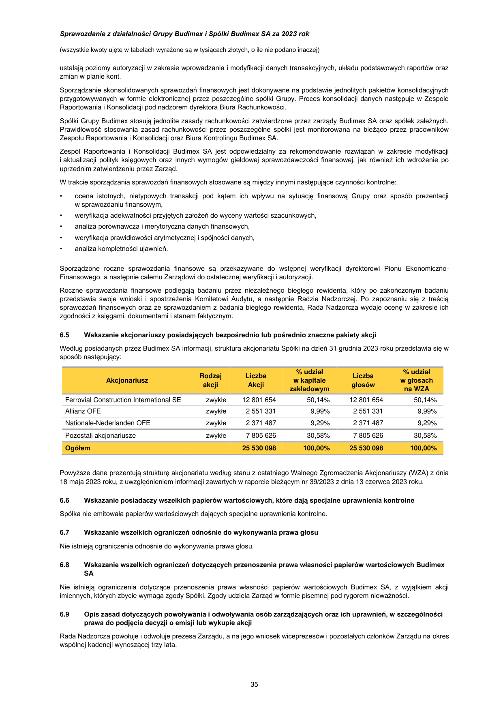

_**Sprawozdanie z działalności Grupy Budimex i Spółki Budimex SA za 2023 rok**_

(wszystkie kwoty ujęte w tabelach wyrażone są w tysiącach złotych, o ile nie podano inaczej)

_**Zapobieganie dyskryminacji kobiet**_

Grupa Budimex aktywnie zapobiega dyskryminacji ze względu na płeć. W tym celu regularnie analizuje poziom współczynnika
GPGR, Gender Pay Gap Ratio (tzw. nieskorygowaną lukę płacową), odzwierciedlającego różnice w wynagrodzeniach osób
zatrudnionych w organizacji. Stanowi on stosunek średniego wynagrodzenia kobiet do mężczyzn w poszczególnych grupach
stanowiskowych i jest wyliczany zgodnie z metodologią ustaloną dla całej Grupy Ferrovial, w oparciu o całkowite wynagrodzenie,
uwzględniające premie jak również w oparciu o wynagrodzenie stałe.

W 2023 roku GPGR wyliczany w oparciu o całkowite wynagrodzenie, uwzględniające premie osiągnął -1,7%, podczas gdy
w 2022 roku wyniósł -1,9%. Z perspektywy płacy zasadniczej i stałych składników wynagrodzenia, luka płacowa nie wystąpiła w
2023 roku (wyniosła dokładnie 0,02%).

_**Struktura pracowników Grupy Budimex w 2023 roku:**_

**Wiek** (lat) **Kobiety** **Mężczyźni** **Razem**

**<30** 540 901 1 441

**30 - 50** 1 033 3 350 4 383

**> 50** 108 1 405 1 513

**Razem pracowników** **1 681** **5 656** **7 337**

_**Struktura wieku i płci w Zarządzie Spółki**_

**Kobiety** **Mężczyźni** **Razem**

**Zarząd łącznie**, w tym: 1 5 **6**

**wiek poniżej 30** 0 0 **0**

**wiek 30-50** 1 2 **3**

**wiek powyżej 50** 0 3 **3**

w tym obcokrajowcy 0 0 0

_**Struktura wieku i płci w Radzie Nadzorczej Spółki**_

**Kobiety** **Mężczyźni** **Razem**

**Rada Nadzorcza** 2 7 **9**

**wiek poniżej 30** 0 0 **0**

**wiek 30-50** 1 1 **2**

**wiek powyżej 50** 1 6 **7**

w tym obcokrajowcy 1 3 4

**6.4** **Opis podstawowych cech stosowanych w spółce systemów kontroli wewnętrznej i zarządzania ryzykiem**
**w odniesieniu do procesu sporządzania sprawozdań finansowych Budimeksu SA i Grupy Budimex**

Zarząd Budimeksu SA jest odpowiedzialny za wdrożenie i funkcjonowanie systemu kontroli wewnętrznej w procesie sporządzania
sprawozdań finansowych Budimex SA oraz skonsolidowanych sprawozdań finansowych Grupy Budimex.

Obowiązek sporządzenia sprawozdań finansowych jest realizowany w praktyce przez wykwalifikowanych pracowników pionu
finansowego pod nadzorem członka Zarządu - dyrektora Pionu Ekonomiczno - Finansowego Budimex SA.

Sporządzenie sprawozdań rocznych poprzedza spotkanie Komitetu Audytu z niezależnymi audytorami w celu ustalenia planu
i zakresu badania sprawozdań finansowych oraz omówienia potencjalnych obszarów ryzyk mogących mieć wpływ na rzetelność
i prawidłowość sprawozdań finansowych. Grupa Budimex korzysta dodatkowo z programu komputerowego wspierającego
identyfikację i zarządzanie ryzykami związanymi ze sporządzaniem wszelkich informacji finansowych, w tym sprawozdań
finansowych.

Sporządzanie sprawozdań finansowych jest zaplanowanym procesem, uwzględniającym odpowiedni podział zadań pomiędzy
pracowników pionu finansowego Budimex SA, adekwatny do ich kompetencji i kwalifikacji. Podstawą sporządzenia jednostkowych
sprawozdań finansowych są księgi rachunkowe. Księgi rachunkowe większości spółek Grupy są prowadzone przy użyciu programu
finansowo-księgowego SAP R/3, który zapewnia podstawowe potrzeby informacyjne dla rachunkowości finansowej i zarządczej od
1 stycznia 2003 roku. System SAP R/3 jest zarządzany centralnie przez wykwalifikowanych pracowników Budimex SA, którzy

34

---

## Page 36

_**Sprawozdanie z działalności Grupy Budimex i Spółki Budimex SA za 2023 rok**_

(wszystkie kwoty ujęte w tabelach wyrażone są w tysiącach złotych, o ile nie podano inaczej)

ustalają poziomy autoryzacji w zakresie wprowadzania i modyfikacji danych transakcyjnych, układu podstawowych raportów oraz
zmian w planie kont.

Sporządzanie skonsolidowanych sprawozdań finansowych jest dokonywane na podstawie jednolitych pakietów konsolidacyjnych
przygotowywanych w formie elektronicznej przez poszczególne spółki Grupy. Proces konsolidacji danych następuje w Zespole
Raportowania i Konsolidacji pod nadzorem dyrektora Biura Rachunkowości.

Spółki Grupy Budimex stosują jednolite zasady rachunkowości zatwierdzone przez zarządy Budimex SA oraz spółek zależnych.
Prawidłowość stosowania zasad rachunkowości przez poszczególne spółki jest monitorowana na bieżąco przez pracowników
Zespołu Raportowania i Konsolidacji oraz Biura Kontrolingu Budimex SA.

Zespół Raportowania i Konsolidacji Budimex SA jest odpowiedzialny za rekomendowanie rozwiązań w zakresie modyfikacji
i aktualizacji polityk księgowych oraz innych wymogów giełdowej sprawozdawczości finansowej, jak również ich wdrożenie po
uprzednim zatwierdzeniu przez Zarząd.

W trakcie sporządzania sprawozdań finansowych stosowane są między innymi następujące czynności kontrolne:

- ocena istotnych, nietypowych transakcji pod kątem ich wpływu na sytuację finansową Grupy oraz sposób prezentacji
w sprawozdaniu finansowym,

- weryfikacja adekwatności przyjętych założeń do wyceny wartości szacunkowych,

- analiza porównawcza i merytoryczna danych finansowych,

- weryfikacja prawidłowości arytmetycznej i spójności danych,

- analiza kompletności ujawnień.

Sporządzone roczne sprawozdania finansowe są przekazywane do wstępnej weryfikacji dyrektorowi Pionu EkonomicznoFinansowego, a następnie całemu Zarządowi do ostatecznej weryfikacji i autoryzacji.

Roczne sprawozdania finansowe podlegają badaniu przez niezależnego biegłego rewidenta, który po zakończonym badaniu
przedstawia swoje wnioski i spostrzeżenia Komitetowi Audytu, a następnie Radzie Nadzorczej. Po zapoznaniu się z treścią
sprawozdań finansowych oraz ze sprawozdaniem z badania biegłego rewidenta, Rada Nadzorcza wydaje ocenę w zakresie ich
zgodności z księgami, dokumentami i stanem faktycznym.

**6.5** **Wskazanie akcjonariuszy posiadających bezpośrednio lub pośrednio znaczne pakiety akcji**

Według posiadanych przez Budimex SA informacji, struktura akcjonariatu Spółki na dzień 31 grudnia 2023 roku przedstawia się w
sposób następujący:

Ferrovial Construction International SE zwykłe 12 801 654 50,14% 12 801 654 50,14%

Allianz OFE zwykłe 2 551 331 9,99% 2 551 331 9,99%

Nationale-Nederlanden OFE zwykłe 2 371 487 9,29% 2 371 487 9,29%

Pozostali akcjonariusze zwykłe 7 805 626 30,58% 7 805 626 30,58%

**Ogółem** **25 530 098** **100,00%** **25 530 098** **100,00%**

Powyższe dane prezentują strukturę akcjonariatu według stanu z ostatniego Walnego Zgromadzenia Akcjonariuszy (WZA) z dnia
18 maja 2023 roku, z uwzględnieniem informacji zawartych w raporcie bieżącym nr 39/2023 z dnia 13 czerwca 2023 roku.

**6.6** **Wskazanie posiadaczy wszelkich papierów wartościowych, które dają specjalne uprawnienia kontrolne**

Spółka nie emitowała papierów wartościowych dających specjalne uprawnienia kontrolne.

**6.7** **Wskazanie wszelkich ograniczeń odnośnie do wykonywania prawa głosu**

Nie istnieją ograniczenia odnośnie do wykonywania prawa głosu.

**6.8** **Wskazanie wszelkich ograniczeń dotyczących przenoszenia prawa własności papierów wartościowych Budimex**
**SA**

Nie istnieją ograniczenia dotyczące przenoszenia prawa własności papierów wartościowych Budimex SA, z wyjątkiem akcji
imiennych, których zbycie wymaga zgody Spółki. Zgody udziela Zarząd w formie pisemnej pod rygorem nieważności.

**6.9** **Opis zasad dotyczących powoływania i odwoływania osób zarządzających oraz ich uprawnień, w szczególności**
**prawa do podjęcia decyzji o emisji lub wykupie akcji**

Rada Nadzorcza powołuje i odwołuje prezesa Zarządu, a na jego wniosek wiceprezesów i pozostałych członków Zarządu na okres
wspólnej kadencji wynoszącej trzy lata.

35

---

## Page 37

_**Sprawozdanie z działalności Grupy Budimex i Spółki Budimex SA za 2023 rok**_

(wszystkie kwoty ujęte w tabelach wyrażone są w tysiącach złotych, o ile nie podano inaczej)

Zarząd nie posiada uprawnień do podjęcia decyzji o emisji akcji. Uprawnienia Zarządu odnośnie do prawa do podjęcia decyzji

- wykupie akcji nie odbiegają od uregulowań zawartych w Kodeksie spółek handlowych.

Zasady dotyczące powoływania i odwoływania osób zarządzających, uprawnienia osób zarządzających, w tym uprawnienia
do podjęcia decyzji o emisji lub wykupie akcji Spółki, zawarte w Statucie w ciągu 2023 roku nie uległy zmianie.

Zgodnie z regulacjami zawartymi w Statucie, Zarząd prowadzi sprawy Spółki i reprezentuje Spółkę, czyli zakres jego uprawnień nie
odbiega od zakresu określonego przepisami Kodeksu spółek handlowych. W zakresie szczegółowych uprawnień Zarządu
przewidzianych statutem należy wymienić:

- wyrażanie zgody na zbycie akcji imiennych,

- ustalanie ceny emisyjnej akcji w przypadku podwyższenia kapitału zakładowego,

- wyłączanie lub ograniczanie prawa poboru akcji nowych emisji za zgodą Rady Nadzorczej,

- określanie sposobu ustalania wysokości ceny emisyjnej oraz wydawania akcji w zamian za wkłady niepieniężne za zgodą
Rady Nadzorczej,

- podejmowanie decyzji w sprawie zakupu lub zbycia nieruchomości, użytkowania wieczystego lub udziału
w nieruchomości, maszyn, urządzeń, papierów wartościowych lub innych składników majątkowych, jeżeli jednostkowa cena
zakupu lub sprzedaży nie przekracza kwoty stanowiącej jedną piątą kapitału zakładowego Spółki,

- podejmowanie decyzji w sprawie wypłaty zaliczki na poczet przewidywanej na koniec roku obrotowego dywidendy za zgodą
Rady Nadzorczej.

**6.10** **Opis zasad zmiany statutu Budimex SA**

Zmiana Statutu dokonywana jest w drodze uchwały Walnego Zgromadzenia i wpisu do Krajowego Rejestru Sądowego. Kwestie te
uregulowane są w par. 13 lit. r) statutu przy opisie uprawnień Walnego Zgromadzenia. Projekt uchwały w sprawie zmiany statutu,
jak w przypadku wszystkich uchwał Walnego Zgromadzenia, powinien być przedstawiony Radzie Nadzorczej przez Zarząd do
zaopiniowania. Zgodnie z regulacjami zawartymi w Kodeksie spółek handlowych podjęcie takiej uchwały wymaga kwalifikowanej
większości tj. (i) co do zasady 3/4 głosów, (ii) w przypadku istotnej zmiany przedmiotu działalności 2/3 głosów.

**6.11** **Opis sposobu działania Walnego Zgromadzenia i jego zasadniczych uprawnień oraz praw akcjonariuszy**
**i sposobu ich wykonywania**

Walne Zgromadzenie Spółki działa na podstawie Statutu, Regulaminu Obrad Walnego Zgromadzenia (obydwa dokumenty dostępne
na stronie internetowej Spółki) i przepisów prawa, w tym Kodeksu spółek handlowych. Szczegółowe uprawnienia Walnego
Zgromadzenia określone są w par. 13 Statutu. Akcjonariusze realizują swoje prawa w sposób określony Statutem, Regulaminem
Obrad Walnego Zgromadzenia oraz obowiązującymi przepisami.

Walne Zgromadzenie obraduje jako zwyczajne lub nadzwyczajne. Zwyczajne Walne Zgromadzenie zwoływane jest najpóźniej
w terminie sześciu miesięcy po upływie każdego roku obrotowego. Walne Zgromadzenie jest zwoływane przez Zarząd Spółki. Rada
Nadzorcza może zwołać Zwyczajne Walne Zgromadzenie, jeżeli Zarząd Spółki nie zwoła go w terminie określonym w Kodeksie
spółek handlowych lub w Statucie, jak również Nadzwyczajne Walne Zgromadzenie, jeżeli uzna to za wskazane. Nadzwyczajne
Walne Zgromadzenie mogą zwołać również akcjonariusze reprezentujący co najmniej połowę kapitału zakładowego lub co najmniej
połowę ogółu głosów w Spółce. Akcjonariusze wyznaczają przewodniczącego tego Zgromadzenia.

Akcjonariusz lub akcjonariusze reprezentujący co najmniej jedną dwudziestą kapitału zakładowego mogą żądać od Zarządu Spółki
w formie pisemnej lub elektronicznej, zwołania Nadzwyczajnego Walnego Zgromadzenia i umieszczenia określonych spraw w
porządku jego obrad lub spraw, które mają zostać wprowadzone do porządku obrad. Jeżeli w terminie dwóch tygodni od dnia
przedstawienia żądania Nadzwyczajne Walne Zgromadzenie nie zostanie zwołane, sąd rejestrowy może upoważnić do jego
zwołania akcjonariuszy występujących z tym żądaniem. Sąd wyznacza przewodniczącego tego zgromadzenia, natomiast
w zawiadomieniu o zwołaniu zgromadzenia należy powołać się na postanowienie sądu rejestrowego. Zgromadzenie podejmuje
uchwałę rozstrzygającą, czy koszty zwołania i odbycia zgromadzenia ma ponieść Spółka. Akcjonariusze, na żądanie których zostało
zwołane zgromadzenie, mogą zwrócić się do sądu rejestrowego o zwolnienie z obowiązku pokrycia kosztów nałożonych uchwałą
zgromadzenia.

Na stronie internetowej Spółki znajduje się dedykowany adres e-mail, który może być wykorzystywany w przypadkach
przewidzianych w Kodeksie spółek handlowych w związku z Walnym Zgromadzeniem.

Walne Zgromadzenie Spółki zwołuje się przez ogłoszenie dokonywane na stronie internetowej Spółki oraz w sposób określony dla
przekazywania informacji bieżących zgodnie z przepisami o ofercie publicznej i warunkach wprowadzania instrumentów
finansowych do zorganizowanego systemu obrotu oraz o spółkach publicznych. Ogłoszenie powinno być dokonane co najmniej na
dwadzieścia sześć dni przed terminem Walnego Zgromadzenia.

Walne Zgromadzenie może również odbyć się w sposób przewidziany Kodeksem spółek handlowych przy spełnieniu określonych
ustawą wymogów (art. 405 ksh).

Akcjonariusz lub akcjonariusze, reprezentujący co najmniej jedną dwudziestą kapitału zakładowego, mogą żądać umieszczenia
określonych spraw w porządku obrad najbliższego Walnego Zgromadzenia. Żądanie powinno zostać zgłoszone Zarządowi Spółki
nie później niż na dwadzieścia jeden dni przed wyznaczonym terminem zgromadzenia i powinno zawierać uzasadnienie lub projekt
uchwały dotyczącej proponowanego punktu porządku obrad. Żądanie może zostać złożone w postaci elektronicznej. Zarząd jest
obowiązany niezwłocznie, jednak nie później niż na osiemnaście dni przed wyznaczonym terminem Walnego Zgromadzenia, ogłosić

36

---

## Page 38

_**Sprawozdanie z działalności Grupy Budimex i Spółki Budimex SA za 2023 rok**_

(wszystkie kwoty ujęte w tabelach wyrażone są w tysiącach złotych, o ile nie podano inaczej)

zmiany w porządku obrad, wprowadzone na żądanie akcjonariuszy. Ogłoszenie następuje w sposób właściwy dla zwołania Walnego
Zgromadzenia.

Akcjonariusz lub akcjonariusze Spółki, reprezentujący co najmniej jedną dwudziestą kapitału zakładowego, mogą przed terminem
Walnego Zgromadzenia zgłaszać Spółce na piśmie lub przy wykorzystaniu środków komunikacji elektronicznej projekty uchwał
dotyczące spraw wprowadzonych do porządku obrad Walnego Zgromadzenia lub spraw, które mają być wprowadzone do porządku
obrad. Spółka niezwłocznie ogłasza projekty uchwał na stronie internetowej. Każdy z akcjonariuszy może podczas Walnego
Zgromadzenia zgłaszać projekty uchwał dotyczące spraw wprowadzonych do porządku obrad.

Akcjonariusze mogą uczestniczyć w Walnym Zgromadzeniu oraz wykonywać prawo głosu osobiście lub przez swoich
pełnomocników. Pełnomocnictwo do uczestniczenia w Walnym Zgromadzeniu i wykonywania prawa głosu winno być udzielone na
piśmie lub w postaci elektronicznej. Udzielenie pełnomocnictwa w postaci elektronicznej nie wymaga opatrzenia kwalifikowanym
podpisem elektronicznym.

Zgodnie ze Statutem oraz obowiązującymi przepisami prawa Walne Zgromadzenie podejmuje uchwały w szczególności
w następujących sprawach:

- rozpatrywanie i zatwierdzanie sprawozdania z działalności Spółki oraz sprawozdania finansowego za ubiegły rok obrotowy,

- rozpatrzenie i zatwierdzenie sprawozdania z działalności Grupy oraz sprawozdania finansowego skonsolidowanego Grupy
Budimex,

- udzielenie absolutorium członkom organów Spółki z wykonania przez nich obowiązków,

- tworzenie i znoszenie funduszy specjalnych i kapitałów rezerwowych oraz ich wykorzystywanie,

- podział zysku lub określenie sposobu pokrycia straty; Walne Zgromadzenie może przyjąć uchwałę, że dywidendę w całości
lub części przeznacza się na podwyższenie kapitału zakładowego, a akcjonariuszom wydaje się w zamian za to nowe akcje,

- roszczeń o naprawienie szkody wyrządzonej przy zawiązywaniu Spółki lub sprawowaniu zarządu albo nadzoru,

- zbywanie lub wydzierżawianie przedsiębiorstwa lub jego zorganizowanej części oraz ustanowienie na nim ograniczonego
prawa rzeczowego,

- decydowanie w sprawie połączenia lub likwidacji Spółki oraz wyznaczenie likwidatorów Spółki,

- emisja obligacji zamiennych lub z prawem pierwszeństwa i warrantów subskrypcyjnych,

- umorzenie akcji,

- zmiany statutu, w tym zwłaszcza podwyższenia lub obniżenia kapitału zakładowego oraz zmiany przedmiotu przedsiębiorstwa
Spółki,

- uchwalanie Regulaminu Obrad Walnego Zgromadzenia,

- powoływanie i odwoływanie członków Rady Nadzorczej,

- ustalanie zasad i wysokości wynagrodzenia dla członków Rady Nadzorczej,

- nabycie przez Spółkę własnych akcji w celu ich zaoferowania do nabycia pracownikom lub osobom, które były zatrudnione w
spółce lub spółce z nią powiązanej przez okres co najmniej trzech lat,

- zawarcie przez Spółkę umowy kredytu, pożyczki, poręczenia lub innej podobnej umowy z członkiem Zarządu, Rady
Nadzorczej, prokurentem, likwidatorem lub na rzecz którejkolwiek z tych osób,

- określenie dnia, według którego ustala się listę akcjonariuszy uprawnionych do dywidendy za dany rok obrotowy
(dnia dywidendy).

Sprawy wnoszone przez Zarząd pod obrady Walnego Zgromadzenia są uprzednio przedstawiane Radzie Nadzorczej
do zaopiniowania.

Uchwały Walnego Zgromadzenia są podejmowane bezwzględną większością głosów niezależnie od ilości reprezentowanych
na nim akcji, chyba że przepisy Kodeksu spółek handlowych stanowią inaczej.

**6.12** **Skład osobowy i zmiany, które w nim zaszły w ciągu ostatniego roku obrotowego oraz opis działania organów**
**zarządzających i nadzorujących Spółkę oraz ich komitetów**

_**a) Skład osobowy Zarządu**_

**Na dzień 31 grudnia 2023 roku Zarząd Budimex SA składał się z następujących osób:**

- Artur Popko prezes Zarządu, dyrektor generalny,

- Anna Karyś-Sosińska członek Zarządu, dyrektor Pionu Zarządzania Zasobami Ludzkimi,

- Jacek Daniewski członek Zarządu, dyrektor Pionu Prawno - Organizacyjnego,

- Cezary Łysenko członek Zarządu, dyrektor Operacyjny Budownictwa Infrastrukturalnego,

- Maciej Olek członek Zarządu, dyrektor Operacyjny Budownictwa Kolejowego,
Energetycznego i Przemysłowego,

- Marcin Węgłowski członek Zarządu, dyrektor Pionu Ekonomiczno – Finansowego.

37

---

## Page 39

_**Sprawozdanie z działalności Grupy Budimex i Spółki Budimex SA za 2023 rok**_

(wszystkie kwoty ujęte w tabelach wyrażone są w tysiącach złotych, o ile nie podano inaczej)

W ciągu 2023 roku w składzie Zarządu zachodziły następujące zmiany:

- w dniu 14 grudnia 2022 roku Rada Nadzorcza powołała z mocą od 1 stycznia 2023 roku następujące osoby do pełnienia funkcji

członka Zarządu Budimex SA: Anna Karyś-Sosińska, Cezary Łysenko, Maciej Olek,

- w dniu 6 lutego 2023 roku Rada Nadzorcza zawiesiła p. Artura Pielecha w czynnościach członka Zarządu Budimex SA,

- w dniu 30 marca 2023 roku Rada Nadzorcza odwołała p. Artura Pielecha z Zarządu Spółki.

Z dniem 30 października 2023 roku rezygnację z funkcji prokurenta Budimex SA złożył p. Piotr Świecki. Była to jedyna zmiana
w zakresie udzielonych przez Zarząd prokur w 2023 roku.

_**b) Skład osobowy Rady Nadzorczej oraz jej komitetów**_

Na dzień 31 grudnia 2023 roku Rada Nadzorcza Budimex SA miała następujący skład:

- Marek Michałowski przewodniczący Rady

- Juan Ignacio Gaston Najarro wiceprzewodniczący Rady

- Igor Adam Chalupec sekretarz Rady

- Danuta Dąbrowska członek Rady

- Silvia Rodriguez Hueso członek Rady

- Janusz Dedo członek Rady

- Ignacio Aitor Garcia Bilbao członek Rady

- Artur Kucharski członek Rady

- Mario Manuel Menendez Montoya członek Rady

W 2023 roku w składzie Rady Nadzorczej zaszły następujące zmiany:

- w dniu 30 marca 2023 roku Rada Nadzorcza dokooptowała p. Silvię Rodriguez Hueso ze skutkiem od dnia 1 kwietnia 2023 roku,

- z dniem 27 kwietnia 2023 roku rezygnację z funkcji członka Rady Nadzorczej złożył p. Dariusz Blocher.

Skład osobowy Komitetu Audytu na dzień 31 grudnia 2023 roku:

- Danuta Dąbrowska – przewodnicząca,

- Janusz Dedo – członek,

- Ignacio Aitor Garcia Bilbao – członek.

W 2023 roku w składzie Komitetu Audytu nie zachodziły zmiany.

W zakresie spełniania warunków niezależności członków Komitetu Audytu w 2023 roku Spółka stosowała przepisy art. 129 ust. 3
ustawy z dnia 11 maja 2017 roku o biegłych rewidentach, firmach audytorskich oraz nadzorze publicznym, a także kryteria
niezależności członków Rady w rozumieniu Dobrych Praktyk Spółek Notowanych na GPW 2021.

Status niezależności członka Rady Nadzorczej ustalany jest przez Spółkę zgodnie z kryteriami ustalonymi w Instrukcji Operacyjnej
Nr IO-01-07-02, dotyczącej uzyskiwania informacji od członków Rady i ich upubliczniania, na podstawie oświadczeń składanych
przez członków Rady oraz na podstawie art. 129 ust. 3 ustawy z dnia 11 maja 2017 roku o biegłych rewidentach, firmach
audytorskich oraz nadzorze publicznym.

Skład osobowy Komitetu Inwestycyjnego na dzień 31 grudnia 2023 roku:

- Janusz Dedo – przewodniczący,

- Ignacio Aitor Garcia Bilbao – członek.

Skład osobowy Komitetu Inwestycyjnego zmienił się z dniem 27 kwietnia 2023 roku w związku z rezygnacją p. Dariusza Blochera
z członkostwa w Radzie Nadzorczej, co spowodowało również zakończenie pełnienia funkcji członka Komitetu.

Skład osobowy Komitetu Wynagrodzeń na dzień 31 grudnia 2023 roku:

- Marek Michałowski – przewodniczący,

- Silvia Rodriguez Hueso – członek,

- Igor Chalupec – członek,

Z dniem 1 kwietnia 2023 roku funkcję członka Komitetu zaczęła pełnić p. Silvia Rodriguez Hueso. Z dniem 27 kwietnia 2023 roku w
związku z rezygnacją p. Dariusza Blochera z członkostwa w Radzie Nadzorczej przestał on pełnić również funkcję członka Komitetu
Wynagrodzeń.

_**c) Opis działania Zarządu**_

Zarząd działa na podstawie Statutu, Regulaminu Zarządu i obowiązujących przepisów, w tym przepisów Kodeksu spółek
handlowych. Zarząd składa się z jednego lub większej liczby członków. Zarząd prowadzi sprawy Spółki i reprezentuje Spółkę.

38

---

## Page 40

_**Sprawozdanie z działalności Grupy Budimex i Spółki Budimex SA za 2023 rok**_

(wszystkie kwoty ujęte w tabelach wyrażone są w tysiącach złotych, o ile nie podano inaczej)

Prezes Zarządu jest powoływany i odwoływany przez Radę Nadzorczą. Prezes Zarządu jest jednocześnie dyrektorem generalnym
Spółki. Rada Nadzorcza, na wniosek prezesa Zarządu, powołuje wiceprezesów i pozostałych członków Zarządu na okres wspólnej
kadencji trwającej trzy lata.

Pracami Zarządu kieruje prezes Zarządu. Szczegółowy tryb działania Zarządu określa Regulamin Zarządu zatwierdzony przez
Radę Nadzorczą.

Uchwały Zarządu zapadają bezwzględną większością głosów. W przypadku równej liczby głosów decyduje głos prezesa Zarządu.

Do składania oświadczeń i podpisywania w imieniu Spółki upoważnieni są:

- prezes Zarządu – jednoosobowo,

- dwóch członków Zarządu - działających łącznie lub jeden członek Zarządu działający łącznie z prokurentem.

Oświadczenia składane Spółce oraz doręczenia pism mogą być dokonywane wobec jednego członka Zarządu lub prokurenta.

_**d) Opis działania Rady Nadzorczej**_

Rada Nadzorcza działa na podstawie Statutu, Regulaminu Rady Nadzorczej i obowiązujących przepisów, w tym przepisów Kodeksu
spółek handlowych. Organizację Rady Nadzorczej i sposób wykonywania przez nią czynności określa uchwalony przez Radę
Regulamin Rady Nadzorczej.

Rada Nadzorcza podejmuje uchwały, o ile na posiedzeniu jest obecna co najmniej połowa jej członków, a wszyscy jej członkowie
zostali zaproszeni. W posiedzeniu Rady Nadzorczej można uczestniczyć również przy wykorzystaniu środków bezpośredniego
porozumiewania się na odległość. Rada Nadzorcza podejmuje uchwały bezwzględną większością głosów. W przypadku równej
liczby głosów rozstrzyga głos przewodniczącego Rady Nadzorczej. Dopuszcza się podejmowanie przez Radę Nadzorczą uchwał
w trybie pisemnym oraz przy wykorzystaniu środków bezpośredniego porozumiewania się. Uchwały są ważne, gdy wszyscy
członkowie Rady zostali powiadomieni o treści projektu uchwały oraz co najmniej połowa członków Rady wzięła udział
w podejmowaniu uchwały. Członkowie Rady Nadzorczej mogą brać udział w podejmowaniu uchwał Rady, oddając swój głos na
piśmie za pośrednictwem innego członka Rady Nadzorczej we wszystkich sprawach objętych porządkiem obrad, z wyjątkiem spraw
wprowadzonych do porządku obrad na posiedzeniu Rady Nadzorczej.

Rada Nadzorcza uprawniona jest do przeglądania wszystkich dokumentów Spółki oraz żądania sprawozdań i wyjaśnień od Zarządu
i pracowników Spółki, dokonywania rewizji majątku oraz sprawdzania ksiąg i dokumentów. Rada ma prawo żądania dla swoich
potrzeb, wykonania niezbędnych ekspertyz i badań w zakresie spraw będących przedmiotem jej nadzoru i kontroli.

Rada Nadzorcza sprawuje stały nadzór nad działalnością Spółki, we wszystkich dziedzinach jej działalności. Do szczególnych
obowiązków Rady Nadzorczej należy:

- ocena sprawozdania z działalności Spółki oraz sprawozdania finansowego za ubiegły rok obrotowy,

- ocena wniosków Zarządu dotyczących podziału zysku albo pokrycia straty,

- rekomendowanie Walnemu Zgromadzeniu udzielenia członkom Zarządu Spółki absolutorium z wykonania przez nich
obowiązków,

- składanie Walnemu Zgromadzeniu corocznego pisemnego sprawozdania z wyników oceny, o której mowa wyżej,

- zawieszanie, z ważnych powodów, w czynnościach poszczególnych lub wszystkich członków Zarządu oraz delegowanie
członków Rady Nadzorczej na okres nie dłuższy niż 3 miesiące do czasowego wykonywania czynności członków Zarządu,
którzy zostali odwołani, złożyli rezygnację albo z innych przyczyn niemogących sprawować swych czynności,

- zatwierdzanie Regulaminu Zarządu Spółki,

- zawieranie umów z członkami Zarządu Spółki oraz ustalanie wynagrodzenia Prezesa i członków Zarządu Spółki oraz zasad
ich premiowania, wykonywanie względem członków Zarządu w imieniu Spółki uprawnień wynikających ze stosunku pracy,
przy czym umowy takie w imieniu Rady Nadzorczej podpisuje Przewodniczący,

- wyznaczanie biegłego rewidenta z listy prowadzonej przez Krajową Radę Biegłych Rewidentów w celu zbadania sprawozdania
finansowego Spółki,

- wyrażanie zgody na zawarcie przez Zarząd z subemitentem umowy na objęcie akcji spółki,

- udzielanie zgody na zajmowanie się interesami konkurencyjnymi lub na uczestniczenie w spółce konkurencyjnej przez członka
Zarządu,

- wyrażanie zgody na wyłączenie lub ograniczenie przez Zarząd prawa poboru akcji nowych emisji,

- wyrażanie zgody w sprawie proponowanego przez Zarząd sposobu ustalenia wysokości, ceny emisji oraz wydawanie akcji
w zamian za wkłady niepieniężne,

- wyrażanie zgody na nabycie lub zbycie nieruchomości, użytkowania wieczystego lub udziału w nieruchomości, maszyn,
urządzeń, papierów wartościowych lub innych składników majątkowych, jeżeli jednostkowa cena nabycia lub zbycia
przekracza jedną piątą kapitału zakładowego Spółki, w transakcjach objętych powyższym obowiązkiem wyrażenia zgody,
nieprzekraczających tej wartości decyzje podejmuje samodzielnie Zarząd,

- nadzór nad realizacją Polityki podatkowej (Strategii podatkowej) Spółki oraz nadzór nad skutecznością i adekwatnością Ram
Wewnętrznego Nadzoru Podatkowego.

39

---

## Page 41

_**Sprawozdanie z działalności Grupy Budimex i Spółki Budimex SA za 2023 rok**_

(wszystkie kwoty ujęte w tabelach wyrażone są w tysiącach złotych, o ile nie podano inaczej)

Zgodnie z par. 12 ust. 3 Regulaminu Rada Nadzorcza może tworzyć komitety lub zespoły spośród Rady Nadzorczej lub delegować
członka Rady. Jak wyżej wskazano - w ramach Rady Nadzorczej działają trzy komitety: Komitet Audytu, Komitet Inwestycyjny
i Komitet Wynagrodzeń.

_**e) Zadania Komitetu Audytu**_

Do zadań Komitetu Audytu należy:

- monitorowanie procesu sporządzania sprawozdania finansowego Spółki oraz skonsolidowanego sprawozdania finansowego
za ubiegły rok finansowy; szczegółowe zapoznawanie się z rezultatami badań biegłego rewidenta na poszczególnych etapach;
monitorowanie procesu sporządzania sprawozdania z działalności oraz sprawozdania na temat informacji niefinansowych;

- monitorowanie skuteczności systemów kontroli wewnętrznej i systemów zarządzania ryzykiem oraz audytu wewnętrznego,
w tym w zakresie sprawozdawczości finansowej;

- monitorowanie wykonywania czynności rewizji finansowej, w szczególności przeprowadzania przez firmę audytorską badania,
z uwzględnieniem wszelkich wniosków i ustaleń Polskiej Agencji Nadzoru Audytowego wynikających z kontroli
przeprowadzonej w firmie audytorskiej;

- kontrolowanie i monitorowanie niezależności biegłego rewidenta i firmy audytorskiej, w szczególności w przypadku, gdy
na rzecz Spółki świadczone są przez firmę audytorską inne usługi niż badanie;

- informowanie Rady Nadzorczej o wynikach badania oraz wyjaśnianie, w jaki sposób badanie to przyczyniło się do rzetelności
sprawozdawczości finansowej w Spółce, a także jaka była rola Komitetu Audytu w procesie badania;

- dokonywanie oceny niezależności biegłego rewidenta oraz wyrażanie zgody na świadczenie przez niego dozwolonych usług
niebędących badaniem w Spółce;

- opracowywanie polityki wyboru firmy audytorskiej do przeprowadzania badania;

- opracowywanie polityki świadczenia przez firmę audytorską przeprowadzającą badanie, przez podmioty powiązane z tą firmą
audytorską oraz przez członka sieci firmy audytorskiej dozwolonych usług niebędących badaniem;

- określanie procedury wyboru firmy audytorskiej przez Spółkę;

- przedstawianie Radzie Nadzorczej rekomendacji, o której mowa w art. 16 ust. 2 rozporządzenia nr 537/2014 (rekomendacja
dotycząca powołania biegłych rewidentów lub firm audytorskich), zgodnie z politykami, o których mowa powyżej;

- przedkładanie zaleceń mających na celu zapewnienie rzetelności procesu sprawozdawczości finansowej w Spółce;

- przedstawianie Radzie Nadzorczej wniosków i rekomendacji dotyczących procesu badania i oceny sprawozdania finansowego
i skonsolidowanego sprawozdania finansowego za ubiegły rok finansowy;

- przedstawianie Radzie Nadzorczej wniosków i rekomendacji w sprawie udzielenia absolutorium członkowi Zarządu Spółki,
odpowiedzialnemu za funkcjonowanie Pionu Ekonomiczno – Finansowego, z wykonania przez niego obowiązków;

- realizowanie innych przedsięwzięć ustalanych przez Radę Nadzorczą w zależności od potrzeb wynikających z aktualnej
sytuacji Spółki;

- składanie Radzie Nadzorczej sprawozdania ze swojej działalności raz na pół roku, w terminie zatwierdzania sprawozdań
rocznych oraz po publikacji sprawozdań półrocznych;

- opiniowanie proponowanych przez Zarząd zmian modelu Ram wewnętrznego nadzoru podatkowego oraz zmian w Polityce
podatkowej (Strategii podatkowej) i Ładzie podatkowym Budimex SA;

- doradzanie Radzie Nadzorczej w sprawie wyboru, ponownego wyboru lub odwołania podmiotu przeprowadzającego w Spółce
niezależny audyt funkcji podatkowej, włącznie z przygotowaniem listy kandydatów i przedstawienie rekomendacji Radzie
Nadzorczej;

**•** przygotowanie dla Rady Nadzorczej raportu z działalności i rozwoju współpracy z podmiotem przeprowadzającym w Spółce
niezależny audyt funkcji podatkowej, nie rzadziej niż raz na trzy lata oraz w przypadku rozwiązania/wypowiedzenia umowy
z niezależnym audytorem.

Ustawowe kryterium niezależności w trakcie 2023 roku spełniali następujący członkowie Komitetu Audytu: Danuta Dąbrowska oraz
Janusz Dedo.

W 2023 roku członkiem Komitetu Audytu, posiadającym największe doświadczenie, wiedzę i umiejętności w zakresie
rachunkowości i zarządzania była Danuta Dąbrowska, członek Stowarzyszenia Licencjonowanych Biegłych Rewidentów
Księgowych (ACCA), członek rad nadzorczych spółek notowanych na GPW.

Członkiem Komitetu Audytu posiadającym największe doświadczenie, wiedzę i umiejętności w zakresie szeroko rozumianej branży
budowalnej był Ignacio Aitor Garcia Bilbao – dyrektor finansowy w Ferrovial Construcción SA, głównej spółce segmentu
budowlanego Grupy Ferrovial.

Komitet Audytu odbył w 2023 roku 7 posiedzeń.

40

---

## Page 42

_**Sprawozdanie z działalności Grupy Budimex i Spółki Budimex SA za 2023 rok**_

(wszystkie kwoty ujęte w tabelach wyrażone są w tysiącach złotych, o ile nie podano inaczej)

_**Główne założenia polityki wyboru firmy audytorskiej**_

Zgodnie ze Statutem Budimex SA, wyboru firmy audytorskiej dokonuje Rada Nadzorcza, działając na podstawie rekomendacji
Komitetu Audytu. Zakazane jest wprowadzanie jakichkolwiek klauzul umownych, które nakazywałyby Radzie Nadzorczej wybór
firmy audytorskiej spośród określonej kategorii lub wykazu firm audytorskich. Klauzule takie są nieważne z mocy prawa.

Jednocześnie Rada Nadzorcza podczas dokonywania wyboru firmy audytorskiej, a Komitet Audytu na etapie przygotowywania
rekomendacji, kierują się m.in. następującymi wytycznymi dotyczącymi firmy audytorskiej:

a) cena zaproponowana przez firmę audytorską,

b) możliwość zapewnienia świadczenia pełnego zakresu usług określonych przez Budimex SA,

c) dotychczasowe doświadczenie firmy audytorskiej w badaniu sprawozdań jednostek o podobnym do Grupy Budimex profilu
działalności oraz doświadczenie w badaniu sprawozdań jednostek zainteresowania publicznego,

d) kwalifikacje zawodowe i doświadczenie osób bezpośrednio zaangażowanych w prowadzone w Grupie Budimex badanie,

e) możliwość współpracy z audytorami Grupy Ferrovial oraz dotrzymania terminów raportowania na potrzeby Grupy Ferrovial.

Rekomendacja Komitetu Audytu dla Rady Nadzorczej dotycząca przedłużenia umowy z firmą audytorską na przeprowadzenie
badania została wydana w 2019 roku i spełniała obowiązujące warunki. Pierwsza rekomendacja dotycząca wyboru firmy
audytorskiej została wydana w 2017 roku i była sporządzona w następstwie zorganizowanej przez Budimex SA procedury wyboru
firmy audytorskiej, przeprowadzonej w drugiej połowie 2016 i na początku 2017 roku. Przeprowadzona procedura wyboru firmy
audytorskiej była zgodna z obowiązującą w spółce „Polityką i procedurą Budimex SA w zakresie wyboru firmy audytorskiej do
przeprowadzenia badania sprawozdań finansowych”.

_**Główne założenia polityki Budimex SA w zakresie świadczenia dozwolonych usług niebędących badaniem przez firmy**_
_**audytorskie i podmioty z nimi powiązane**_

Firma audytorska, jednostki z nią powiązane oraz należące do tej samej sieci mogą świadczyć na rzecz Budimex SA, na rzecz
jednostek od niego zależnych oraz jednostki dominującej wobec Budimex SA dozwolone usługi niebędące badaniem sprawozdań
finansowych, zdefiniowane w art. 136 ust. 2 Ustawy o biegłych rewidentach, firmach audytorskich oraz nadzorze publicznym z dnia
11 maja 2017 roku. Komitet Audytu jest zobowiązany jednak wyrazić zgodę na zawarcie umowy na takie usługi, po uprzedniej
analizie zagrożeń i zabezpieczeń niezależności, o której mowa w art. 69–73 Ustawy. Zgoda ta musi zostać zaprotokołowana
podczas obrad Komitetu lub udzielona w formie obiegowej i potwierdzona w protokole z kolejnego posiedzenia Komitetu. Jeżeli
waga zagrożeń niezależności firmy audytorskiej jest taka, że niezależność zostaje naruszona, Komitet Audytu nie wyraża zgody na
podpisanie umowy na usługę dodatkową. Świadczenie usług, o których mowa powyżej, możliwe jest jedynie w zakresie
niezwiązanym z polityką podatkową Budimex SA. Wszystkie pozostałe usługi niebędące czynnościami rewizji finansowej są
zabronione.

Szczegóły dotyczące umowy zawartej z firmą audytorską oraz wysokości jej wynagrodzenia za świadczone usługi zostały ujawnione
odpowiednio w notach do sprawozdania Budimex SA oraz skonsolidowanego sprawozdania Grupy Budimex.

_**f) Zadania Komitetu Inwestycyjnego**_

Do zadań Komitetu Inwestycyjnego należy opiniowanie lub odpowiednio aprobowanie spraw istotnych dla Spółki ze względu na ich
wartość w zakresie: inwestycji i dezinwestycji w aktywa niefinansowe, powoływania i rozwiązywania spółek, inwestycji, dezinwestycji
i emisji, których przedmiotem są aktywa finansowe, łączenia, podziału i przekształcenia podmiotów w Grupie Budimex, operacji
finansowych, powołania organizacji celowych do wykonywania robót lub świadczenia usług na warunkach odbiegających od wzoru
umowy konsorcjum obowiązującego w Grupie Budimex, umów przedwstępnych i ofert niewiążących.

Komitet Inwestycyjny działa w oparciu o procedurę zatwierdzoną przez Radę Nadzorczą. Rada Nadzorcza jest informowana
na kolejnych posiedzeniach o sprawach opiniowanych przez Komitet Inwestycyjny w okresie pomiędzy posiedzeniami Rady.

_**g) Zadania Komitetu Wynagrodzeń**_

Do zadań Komitetu Wynagrodzeń należy:

- przedstawianie propozycji, do zatwierdzenia przez Radę Nadzorczą, dotyczących zasad wynagradzania członków Zarządu w
szczególności: wynagrodzenia stałego, systemu wynagradzania za wyniki, systemu emerytalnego i odpraw oraz
długoterminowych programów motywacyjnych wraz z zaleceniami w zakresie celów i kryteriów oceny, pod kątem prawidłowego
dostosowania wynagrodzeń członków Zarządu do długofalowych interesów akcjonariuszy i celów określonych przez Radę
Nadzorczą dla Spółki; przedstawianie Radzie Nadzorczej propozycji dotyczących wynagrodzenia poszczególnych członków
Zarządu, z zapewnieniem ich zgodności z zasadami wynagradzania przyjętymi przez Spółkę oraz oceną wyników pracy
danych członków Zarządu; przedstawianie Radzie Nadzorczej propozycji dotyczących odpowiednich form umowy z członkami
Zarządu; przedstawianie Radzie Nadzorczej propozycji wskaźników premiowych, ich wag dla członków Zarządu w oparciu

   - budżet danego roku; służenie Radzie Nadzorczej pomocą w nadzorowaniu procesu, zgodnie z którym Spółka przestrzega
obowiązujących przepisów dotyczących obowiązków informacyjnych w zakresie wynagrodzeń (w szczególności stosowanych
zasad wynagradzania i wynagrodzeń przyznanych członkom Zarządu); monitorowanie poziomu i struktury wynagrodzeń
Zarządu na podstawie niezależnych raportów płacowych, wskaźników rynkowych i przedstawianie odpowiednich analiz
i wniosków; opiniowanie powoływania i odwoływania członków Rad Nadzorczych w spółkach zależnych Budimex SA,
z wyjątkiem spółek specjalnego przeznaczenia;

- akceptowanie, na wniosek Zarządu, wskaźnika premiowego dla pracowników centrali Budimex SA do rozliczenia premii
za miniony rok oraz wskaźnika procentowego podwyżek na dany rok;

41

---

## Page 43

_**Sprawozdanie z działalności Grupy Budimex i Spółki Budimex SA za 2023 rok**_

(wszystkie kwoty ujęte w tabelach wyrażone są w tysiącach złotych, o ile nie podano inaczej)

- sporządzanie sprawozdania rocznego z działalności Komitetu.

**6.13** **Polityka wynagrodzeń dotycząca członków Rady Nadzorczej, Zarządu oraz kluczowych menedżerów**
**Budimex SA**

W dniu 18 czerwca 2020 roku Walne Zgromadzenie akcjonariuszy przyjęło politykę wynagrodzeń Organów Budimex SA.

Celem polityki jest wyznaczenie ogólnych wytycznych i ram wynagradzania członków Zarządu i członków Rady Nadzorczej Spółki.
Realizacja celu i założeń Polityki zorientowana jest na zmotywowaniu władz Grupy Budimex do osiągania jak najlepszych wyników,
skorelowanych z jej celami strategicznymi w sposób odpowiedzialny i zgodny z wartościami Grupy Budimex.

Cele i założenia polityki są podstawą zasad wynagradzania członków Zarządu Budimex SA oraz członków Rady Nadzorczej.

Polityka reguluje m.in:

- składniki wynagrodzeń członków Zarządu,

- składniki wynagrodzeń członków Rady Nadzorczej,

- wskazuje wzajemne proporcje pomiędzy składnikami,

- określa szczegółowe ramy przyznawania zmiennych składników wynagrodzenia,

- określa sposób powiązania kryteriów premiowych celami.

Rada Nadzorcza jest odpowiedzialna za nadzór nad polityką i minimum raz w roku, m.in. w oparciu o raporty płacowe i obserwację
trendów na rynku, dokonuje przeglądu zasad wynagradzania oraz oceny ich wpływu na zarządzanie organizacją. W celu
zapewnienia jak najwyższej jakości procesu, we wspomnianych przeglądach Radę wspiera zewnętrzna firma audytorska.

**Członkowie Rady Nadzorczej**

Organem uprawnionym do ustalania zasad wynagradzania członków Rady Nadzorczej Budimex SA jest Walne Zgromadzenie.
Walne Zgromadzenie Akcjonariuszy w dniu 28 kwietnia 2015 roku podjęło uchwałę, na mocy której członkom Rady Nadzorczej
Budimex SA za udział w pracach przysługuje miesięczne wynagrodzenie w następujących wysokościach:

- przewodniczący Rady Nadzorczej – dwukrotne przeciętne miesięczne wynagrodzenie w sektorze przedsiębiorstw bez wypłat
nagród z zysku, ze wskaźnikiem 1,7,

- przewodniczący Komitetu Audytu Rady Nadzorczej - dwukrotne przeciętne miesięczne wynagrodzenie w sektorze
przedsiębiorstw bez wypłat nagród z zysku, ze wskaźnikiem 1,5,

- przewodniczący Komitetu Inwestycyjnego Rady Nadzorczej - dwukrotne przeciętne miesięczne wynagrodzenie
w sektorze przedsiębiorstw bez wypłat nagród z zysku, ze wskaźnikiem 1,3,

- przewodniczący Komitetu Wynagrodzeń Rady Nadzorczej - dwukrotne przeciętne miesięczne wynagrodzenie
w sektorze przedsiębiorstw bez wypłat nagród z zysku, ze wskaźnikiem 1,3,

- wiceprzewodniczący Rady Nadzorczej - dwukrotne przeciętne miesięczne wynagrodzenie w sektorze przedsiębiorstw bez
wypłat nagród z zysku, ze wskaźnikiem 1,1,

- sekretarz Rady Nadzorczej - dwukrotne przeciętne miesięczne wynagrodzenie w sektorze przedsiębiorstw bez wypłat nagród
z zysku, ze wskaźnikiem 1,2,

- członek Rady Nadzorczej - dwukrotne przeciętne miesięczne wynagrodzenie w sektorze przedsiębiorstw bez wypłat nagród z
zysku, ze wskaźnikiem 1,1.

**Członkowie Zarządu**

Wysokość wynagrodzenia Prezesa i członków Zarządu jest ustalana przez Radę Nadzorczą z uwzględnieniem rekomendacji
Komitetu Wynagrodzeń. W skład całościowego pakietu wynagrodzeń wchodzi wynagrodzenie stałe, wynagrodzenie zmienne
w postaci premii i długoterminowych programów motywacyjnych oraz świadczenia dodatkowe. Dodatkowo, Rada Nadzorcza
wykonuje wszelkie czynności z zakresu prawa pracy pomiędzy Budimex SA a członkami Zarządu.

Członkowie Zarządu Budimex SA („Spółka”), w związku z wykonywaną pracą i pełnioną funkcją w Zarządzie, są zatrudnieni
w Budimex SA lub spółkach zależnych, w których pobierają wynagrodzenie w oparciu o umowy o pracę na czas określony trwania
kadencji z okresem wypowiedzenia wynikającym z obowiązujący przepisów Kodeksu Pracy. Dodatkowo, umowy przewidują
odprawy w wysokości od 6 do 12 miesięcznych wynagrodzeń, w zależności od stanowiska, w przypadku odwołania z funkcji
w Zarządzie lub niepowołania na następną kadencję z przyczyn leżących po stronie Spółki. W przypadku złożenia rezygnacji
z inicjatywy pracownika lub z powodu zawinionego działania na szkodę Spółki, dodatkowe odprawy nie są wypłacane i obowiązuje
jedynie okres wypowiedzenia wynikający z obowiązujących przepisów Kodeksu Pracy.

Dodatkowo, członkowie Zarządu Budimex SA zawarli ze Spółką lub spółką, w której pobierają wynagrodzenie, odrębną umowę

- zakazie konkurencji po ustaniu stosunku pracy, która obowiązuje przez 12 miesięcy od dnia rozwiązania umowy o pracę.
W okresie obowiązywania zakazu konkurencji, Spółka będzie wypłacać pracownikowi od 25% do 100% miesięcznego
wynagrodzenia zasadniczego, w zależności od trybu rozwiązania umowy oraz strony inicjującej zakończenie umowy. Za złamanie
zakazu konkurencji przez członka Zarządu przewidziano kary umowne.

42

---

## Page 44

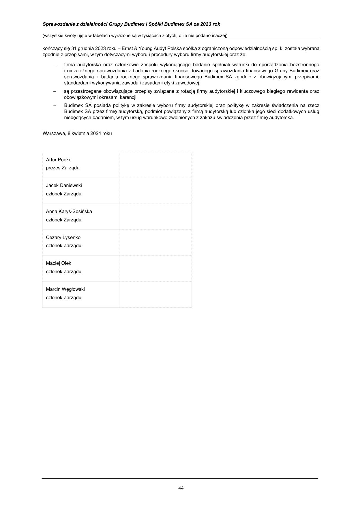

_**Sprawozdanie z działalności Grupy Budimex i Spółki Budimex SA za 2023 rok**_

(wszystkie kwoty ujęte w tabelach wyrażone są w tysiącach złotych, o ile nie podano inaczej)

Informacje o wynagrodzeniach osób zarządzających zostały przedstawione w skonsolidowanym sprawozdaniu finansowym Grupy
Budimex oraz sprawozdaniu finansowym Budimex SA.

Wynagrodzenie członków Zarządu składa się z:

- wynagrodzenia stałego – miesięcznej stawki zasadniczej,

- wynagrodzenia za wyniki (premii rocznej), na które składają się następujące elementy: premia zadaniowa ustalana na
podstawie rocznej oceny realizacji zadań oraz premia za realizacje wskaźników dotyczących działalności biznesowej Grupy
Budimex,

- wynagrodzenia w formie akcji w ramach programu motywacyjnego „Plan przyznania akcji związanych z celami Ferrovialu”,
polegającego na warunkowym przyznaniu praw do nabycia akcji Ferrovial SE (poprzednio Ferrovial SA). Członkowie Zarządu
pozostający w zatrudnieniu przez 36 miesięcy uzyskują możliwość objęcia akcji spółki Ferrovial. Zarówno przyznanie, jak i
liczba w/w akcji uzależniona jest od osiągnięcia zakładanych parametrów ekonomicznych przez Grupę Ferrovial w ciągu
kolejnych trzech lat oraz pozostawania poszczególnych osób w zatrudnieniu w Spółce w dacie przyznania akcji.

W ramach programu PPK, w Spółce funkcjonuje program dobrowolnych wpłat dodatkowych Pracodawcy. Wysokość wpłat jest
naliczana procentowo od wynagrodzenia pracownika. Członkowie Zarządu, objęci są programem na takich samych zasadach jak
wszyscy pracownicy Budimex SA.

**Kluczowi menedżerowie**

Organem uprawnionym do ustalania zasad wynagradzania kluczowych menedżerów jest Zarząd Budimex SA. Zasady
wynagradzania zostały określone w indywidualnych umowach o pracę.

Wynagrodzenie kluczowych menedżerów składa się z:

- wynagrodzenia stałego – miesięcznej stawki zasadniczej,

- wynagrodzenia za wyniki (premii rocznej), na które składają następujące elementy: premia zadaniowa ustalana na podstawie
rocznej oceny realizacji zadań oraz premia za realizacje wskaźników dotyczących działalności biznesowej – zarządzanych
obszarów,

- wynagrodzenia w formie akcji w ramach programu motywacyjnego „Plan przyznania akcji związanych z celami Ferrovialu”,
polegającego na warunkowym przyznaniu praw do nabycia akcji Ferrovial SA. Kluczowi menedżerowie pozostający
w zatrudnieniu przez 36 miesięcy uzyskują możliwość objęcia akcji spółki Ferrovial. Zarówno przyznanie, jak i liczba w/w akcji
uzależniona jest od osiągnięcia zakładanych parametrów ekonomicznych przez Grupę Ferrovial w ciągu kolejnych trzech lat
oraz pozostawania poszczególnych osób w zatrudnieniu w Grupie Ferrovial w dacie przyznania akcji,

- dodatkowo, dla kluczowych pracowników, osiągających ponadprzeciętne wyniki biznesowe, Spółka wprowadziła umowy
retencyjne.

_**Pozafinansowe składniki wynagrodzenia**_

Pozafinansowe składniki wynagrodzenia przysługujące poszczególnym członkom Zarządu i kluczowym menedżerom są takie same
i obejmują świadczenia w naturze takie jak bezpłatna opieka medyczna (w tym dentystyczna), pokrycie składek ubezpieczeniowych
z tytułu na życie i dożycie, PPK, samochód służbowy.

_**Istotne zmiany w polityce wynagrodzeń**_

W ciągu ostatniego roku obrotowego nie nastąpiły istotne zmiany w polityce wynagrodzeń.

_**Ocena polityki wynagrodzeń**_

Obowiązująca polityka wynagrodzeń jest skutecznym narzędziem zarządczym wspierającym strategiczne cele rozwoju Spółki oraz
umożliwiającym elastyczną reakcję na zmiany w otoczeniu biznesowym spowodowane niedoborem firm podwykonawczych
i koniecznością rozbudowy własnych sił wykonawczych.

**7 SPRAWOZDANIE NA TEMAT INFORMACJI NIEFINANSOWYCH**

Budimex SA oraz Grupa Budimex zdecydowały się sporządzać sprawozdania na temat informacji niefinansowych jako odrębne
dokumenty. Skonsolidowane sprawozdanie Grupy Budimex na temat informacji niefinansowych oraz jednostkowe sprawozdanie
[Budimex SA na temat informacji niefinansowych zostaną opublikowane na stronie internetowej www.budimex.pl.](http://www.budimex.pl/)

**8 OŚWIADCZENIE ZARZĄDU**

Zgodnie z naszą najlepszą wiedzą, skonsolidowane sprawozdanie finansowe Grupy Budimex oraz sprawozdanie finansowe
Budimex SA za okres 12 miesięcy kończący się 31 grudnia 2023 roku i dane porównywalne sporządzone zostały zgodnie
z obowiązującymi zasadami rachunkowości oraz odzwierciedlają w sposób prawdziwy, rzetelny i jasny sytuację majątkową
i finansową oraz wynik finansowy Grupy Budimex i Budimex SA. Sprawozdanie z działalności zawiera prawdziwy obraz rozwoju
i osiągnięć oraz sytuacji Grupy Budimex i Budimex SA, w tym opis podstawowych zagrożeń i ryzyka.

Na podstawie oświadczenia Rady Nadzorczej Budimex SA informujemy, że firma audytorska przeprowadzająca badanie
skonsolidowanego sprawozdania finansowego Grupy Budimex oraz sprawozdania finansowego Budimex SA za okres 12 miesięcy

43
